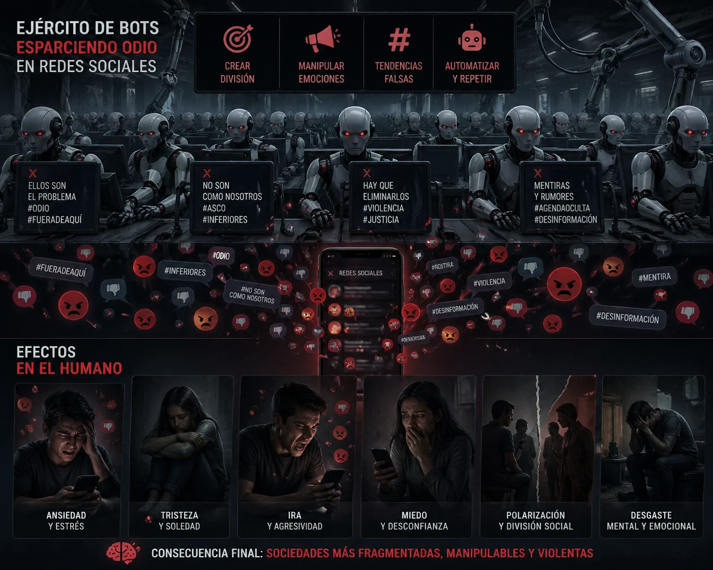
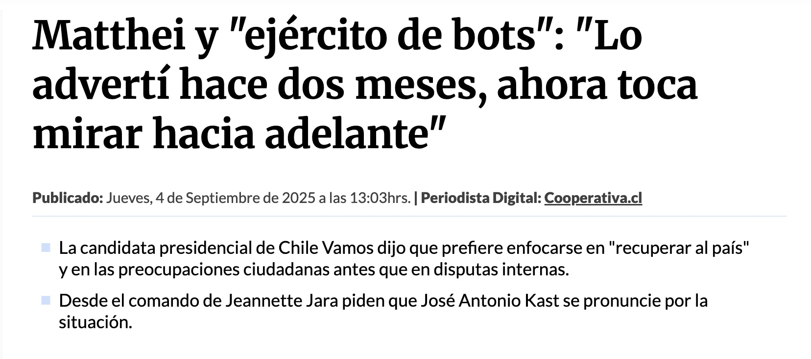
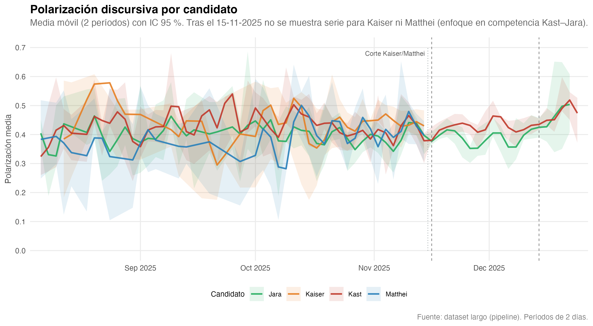

## 

## 

# Problema

## Redes sociales y democracia

-   La frontera de las redes sociales: El ellos y el nosotros.

-   Discursos de odio

-   Colaboración entre grupos

{fig-align="center" width="503"}

## Elecciones presidenciales en Chile: Nuestro laboratorio

-   Chile ofrece un escenario particularmente interesante: 3 candidatos
    de derecha versus candidata de la izquierda.

-   Las hipótesis sostenidas es que existía, por un lado, una disputa
    dentro las derechas y entre las posiciones políticas antagónicas.

{fig-align="center"}

# ¿Por qué mi interés?

## Ciencias sociales computacionales / Ciencia de Datos Sociales I

::: {.columns .slide-img-text}
::: {.column width="40%"}
{fig-align="left" width="100%"}
:::

::: {.column width="60%"}
> "One day I found that approximately 100 participants from Brazil had
> completed my experiment overnight. This seemingly small discovery had
> a deep impact on me. Back then, my colleagues were conducting research
> the traditional way — spending enormous effort recruiting, managing,
> and compensating participants in physical lab settings, where getting
> through 10 participantes in a day was considered a real achievement.
> Yet my internet-based study had gathered 100 participants \[...\]
> while I was sleeping."

Matthew J. Salganik
:::
:::

## Ciencias sociales computacionales / Ciencia de Datos Sociales II

::: {.columns .slide-img-text}
::: {.column width="40%"}
{fig-align="left" width="100%"}
:::

::: {.column width="60%"}
-   Las Ciencias Sociales Computacionales han emergido como un campo que
    analiza grandes volúmenes de datos

-   En diferentes universidades el desarrollo de la IA se ha encontrado
    acompañado desde las humanidades y ciencias sociales (Oxford,
    Northwestern, etc).
:::
:::

## 

## Y aquí el componente de innovación.. 

-   Usos de datos de gran escala para el análisis políticos

-   Innovación en términos metodológicos

# Marco referencial y objetivos

## Teoría

-   Integrar teoría social y modelado computacional en un diseño
    reproducible: sin teoría no hay interpretación y sin escala no hay
    evidencia robusta.

## Objetivo:

-   Construir y analizar un corpus longitudinal de conversación política
    en Reddit (agosto-diciembre 2025) para explicar cómo se articula la
    polarización afectiva en la competencia entre derechas.

# Metodología

## Acceso y fuente de datos

::: incremental
-   Subreddits: **`r/chile`** y **`r/RepublicadeChile`**
-   Texto: títulos, cuerpos de posts y **comentarios** con línea
    temporal de campaña
-   Filtro por **menciones** a candidatos (regex / flags) para el foco
    analítico
:::

## Uso de OpenAI y DeepSeek en la clasificación de texto: Consistencia

-   Uso de API de OpenIA y DeepSeek para la clasificación de texto.
-   El prompt consistió en evaluar la:
    -   Polarización
    -   Estrategias
    -   Marcos

## Uso de OpenAI y DeepSeek en la clasificación de texto: Jerarquías

```{=html}

<div style="margin: 2rem 0; font-family: 'Georgia', serif;">

  <!-- Paso 1 -->
  <div style="
    background: linear-gradient(135deg, #2980B9, #1A5276);
    color: white;
    padding: 1rem 1.5rem;
    border-radius: 8px;
    margin-bottom: 0.8rem;
    margin-left: 0rem;
    max-width: 480px;
    box-shadow: 2px 2px 8px rgba(0,0,0,0.2);
  ">
    <span style="font-size: 0.75rem; text-transform: uppercase; letter-spacing: 1px; opacity: 0.8;">Dimensión 1</span><br>
    <strong style="font-size: 1.1rem;">📐 Consistencia de medición</strong><br>
    <span style="font-size: 0.9rem; opacity: 0.9;">Validación del sistema LLM dual (OpenAI + DeepSeek)</span>
  </div>

  <!-- Flecha -->
  <div style="text-align: left; margin-left: 220px; font-size: 1.4rem; color: #7F8C8D; margin-bottom: 0.4rem;">↓</div>

  <!-- Paso 2 -->
  <div style="
    background: linear-gradient(135deg, #8E44AD, #6C3483);
    color: white;
    padding: 1rem 1.5rem;
    border-radius: 8px;
    margin-bottom: 0.8rem;
    margin-left: 3rem;
    max-width: 480px;
    box-shadow: 2px 2px 8px rgba(0,0,0,0.2);
  ">
    <span style="font-size: 0.75rem; text-transform: uppercase; letter-spacing: 1px; opacity: 0.8;">Dimensión 2</span><br>
    <strong style="font-size: 1.1rem;">📊 Modelado de polarización</strong><br>
    <span style="font-size: 0.9rem; opacity: 0.9;">Predicción y determinantes del discurso hostil</span>
  </div>

  <!-- Flecha -->
  <div style="text-align: left; margin-left: 280px; font-size: 1.4rem; color: #7F8C8D; margin-bottom: 0.4rem;">↓</div>

  <!-- Paso 3 -->
  <div style="
    background: linear-gradient(135deg, #C0392B, #922B21);
    color: white;
    padding: 1rem 1.5rem;
    border-radius: 8px;
    margin-left: 6rem;
    max-width: 480px;
    box-shadow: 2px 2px 8px rgba(0,0,0,0.2);
  ">
    <span style="font-size: 0.75rem; text-transform: uppercase; letter-spacing: 1px; opacity: 0.8;">Dimensión 3</span><br>
    <strong style="font-size: 1.1rem;">⚔️ Reconfiguración del antagonismo</strong><br>
    <span style="font-size: 0.9rem; opacity: 0.9;">Pluralización del enemigo en el ciclo electoral</span>
  </div>

</div>
```
# Diseño de investigación

## Datos: conversación política en Reddit

# Datos obtenidos

```{=html}
<div style="
  min-height: 72vh;
  display: flex;
  flex-direction: column;
  justify-content: center;
  align-items: center;
  text-align: center;
">
  <div style="
    font-size: 9.8rem;
    font-weight: 900;
    line-height: 0.95;
    letter-spacing: 1px;
    color: #111827;
    text-shadow: 4px 4px 0px #f3d34a;
  ">
    163.695
  </div>
  <div style="
    margin-top: 0.8rem;
    font-size: 1.9rem;
    font-weight: 700;
    color: #1f2937;
  ">
    comentarios en el corpus
  </div>
  <div style="
    margin-top: 0.7rem;
    font-size: 1.2rem;
    color: #374151;
    letter-spacing: 0.2px;
  ">
    1 de agosto de 2025 al 31 de diciembre de 2025
  </div>
</div>
```
# Depuración de datos

# Resultados: Tres historias

# La polarización en el texto: OpenAI y DeepSeek

## Polarización afectiva

{fig-align="center"}

# Estrategias de ataques y emoción textual

# Identificación de la polarización

## .

-   El objetivo del ataque no importante, en realidad.

-   La hostilidad no depende de quién se dirige el mensaje, sino que de
    la performance.

-   Se esparse odio.... (aquí mostrar el gráfico).

-   El candidato *target* no explica la polarización ($\beta \approx 0$,
    p = 0.818).

-   Sí explican polarización: **ira (**$\beta = 0.369$), estrategias
    adversariales y tipo de hilo.

-   Estabilidad predictiva: RandomForest $R^2 = 0.619$ y stacking
    $R^2 = 0.646$.

> “La hostilidad no se explica principalmente por quién es atacado, sino
> por cómo se construye discursivamente el ataque.”

## Herramientas NLP (extracto)

| Capa             | Herramientas                                          |
|------------------|-------------------------------------------------------|
| Preprocesamiento | `tidytext`, `quanteda`                                |
| Topics           | **LDA**, **STM**                                      |
| Exploración      | Sentimiento con diccionarios, bigramas, redes léxicas |
| Productos        | **Quarto**, figuras tipo tesis, **Shiny**             |

## Entregables abiertos

-   **Libro** (HTML + PDF): [GitHub
    Pages](https://matdknu.github.io/thesis_maci/)
-   **Shiny**:
    [reddit-politico-chile](https://matdknu.shinyapps.io/reddit-politico-chile/)
-   **OSF / DOI**: [osf.io/nqb3g](https://osf.io/nqb3g/)

##  {#thank-you-slide}

::: thank-you-content
### ¡Gracias!

**Derecha fragmentada y un enemigo compartido**

*Análisis textual longitudinal — Chile 2025*

**Matías Javier Deneken Uribe**

*Tesis presentada para obtención de Magíster en Ciencia de Datos*

*Universidad de Concepción*

Profesores guías: **Dr. Carlos Navarrete** · **Dra. Marcela Parada**

[m.deneken\@uc.cl](mailto:m.deneken@uc.cl){.email-link}

[GitHub: \@matdknu](https://github.com/matdknu){.github-link}
:::
