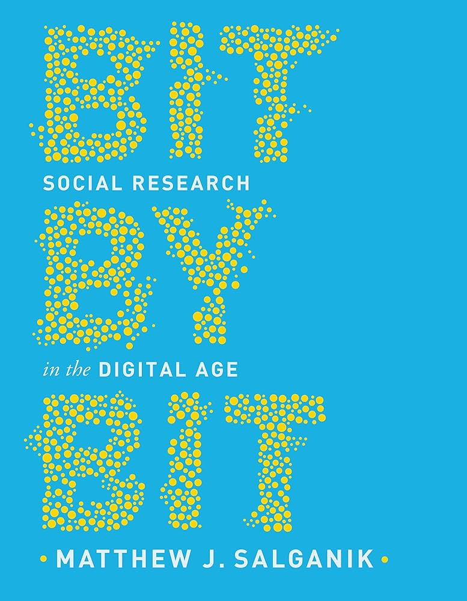
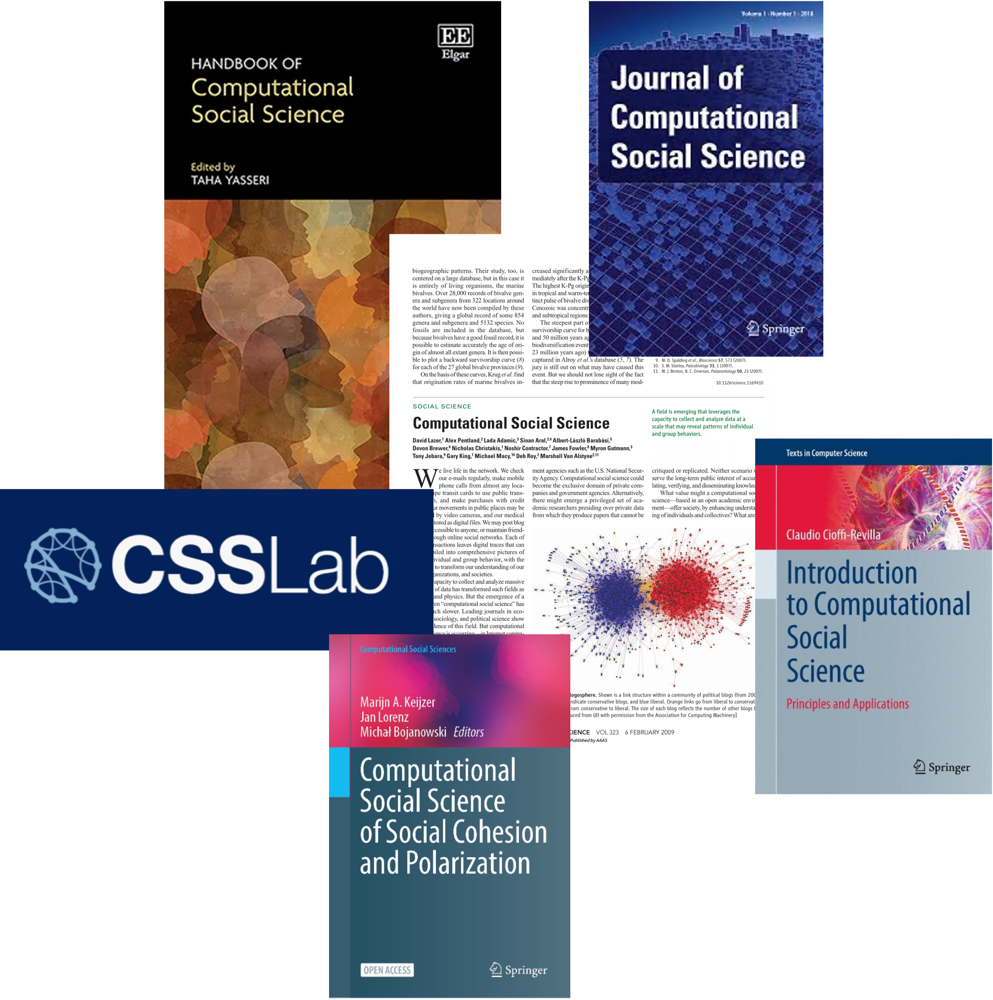
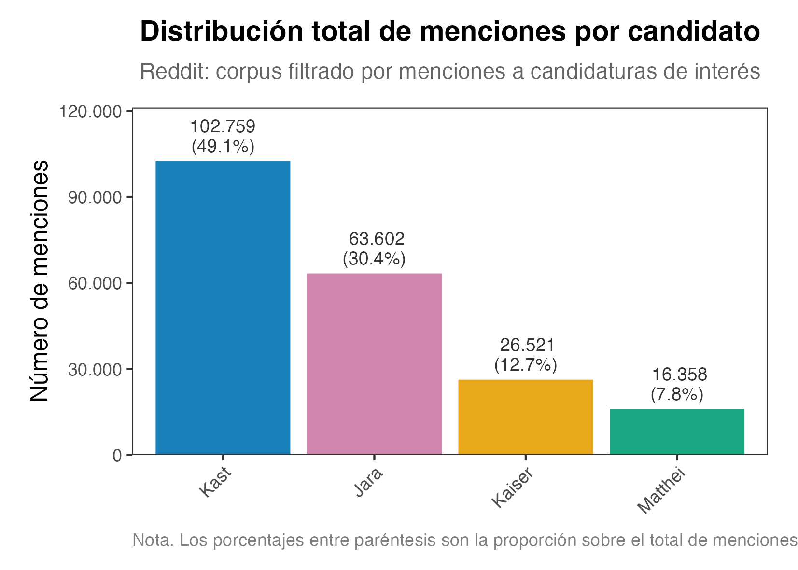
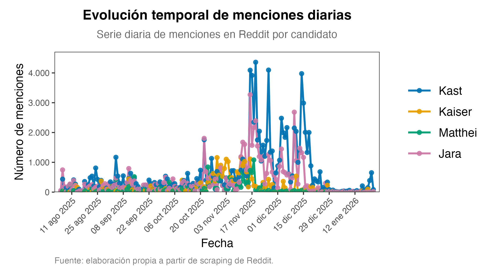
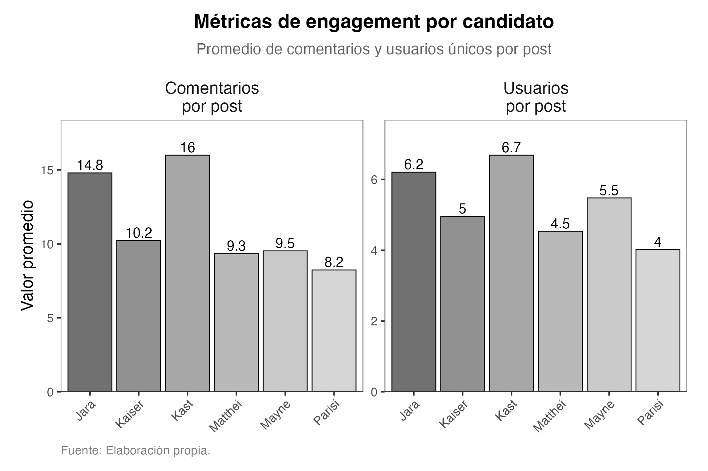

## 

## 

# Problema

## Elecciones presidenciales en Chile I

## Elecciones presidenciales en Chile II

# ¿Por qué mi interés?

## Ciencias sociales computacionales / Ciencia de Datos Sociales I

:::: {.columns .slide-img-text}
::: {.column width="40%"}
{fig-align="left" width="100%"}
:::

::: {.column width="60%"}
> "One day I found that approximately 100 participants from Brazil had completed my experiment overnight. This seemingly small discovery had a deep impact on me. Back then, my colleagues were conducting research the traditional way — spending enormous effort recruiting, managing, and compensating participants in physical lab settings, where getting through 10 participantes in a day was considered a real achievement. Yet my internet-based study had gathered 100 participants \[...\] while I was sleeping."

Matthew J. Salganik


:::
::::

## Ciencias sociales computacionales / Ciencia de Datos Sociales II

::: {.columns .slide-img-text}
::: {.column width="40%"}
{fig-align="left" width="100%"}
:::

::: {.column width="60%"}
hola locoooo
:::
:::

# Teoría

## Relaciones intergrupales, redes sociales y debate político I

## Relaciones intergrupales, redes sociales y debate político II


# Sello de innovación 

# Diseño de investigación


## Datos: conversación política en Reddit

::: incremental
-   Subreddits: **`r/chile`** y **`r/RepublicadeChile`**
-   Texto: títulos, cuerpos de posts y **comentarios** con línea temporal de campaña
-   Filtro por **menciones** a candidatos (regex / flags) para el foco analítico
:::

## Objetivo:....

## Técnicas de análisis II: Uso de OpenAI y DeepSeek en la clasificación de texto
```{=html}

<div style="margin: 2rem 0; font-family: 'Georgia', serif;">

  <!-- Paso 1 -->
  <div style="
    background: linear-gradient(135deg, #2980B9, #1A5276);
    color: white;
    padding: 1rem 1.5rem;
    border-radius: 8px;
    margin-bottom: 0.8rem;
    margin-left: 0rem;
    max-width: 480px;
    box-shadow: 2px 2px 8px rgba(0,0,0,0.2);
  ">
    <span style="font-size: 0.75rem; text-transform: uppercase; letter-spacing: 1px; opacity: 0.8;">Dimensión 1</span><br>
    <strong style="font-size: 1.1rem;">📐 Consistencia de medición</strong><br>
    <span style="font-size: 0.9rem; opacity: 0.9;">Validación del sistema LLM dual (OpenAI + DeepSeek)</span>
  </div>

  <!-- Flecha -->
  <div style="text-align: left; margin-left: 220px; font-size: 1.4rem; color: #7F8C8D; margin-bottom: 0.4rem;">↓</div>

  <!-- Paso 2 -->
  <div style="
    background: linear-gradient(135deg, #8E44AD, #6C3483);
    color: white;
    padding: 1rem 1.5rem;
    border-radius: 8px;
    margin-bottom: 0.8rem;
    margin-left: 3rem;
    max-width: 480px;
    box-shadow: 2px 2px 8px rgba(0,0,0,0.2);
  ">
    <span style="font-size: 0.75rem; text-transform: uppercase; letter-spacing: 1px; opacity: 0.8;">Dimensión 2</span><br>
    <strong style="font-size: 1.1rem;">📊 Modelado de polarización</strong><br>
    <span style="font-size: 0.9rem; opacity: 0.9;">Predicción y determinantes del discurso hostil</span>
  </div>

  <!-- Flecha -->
  <div style="text-align: left; margin-left: 280px; font-size: 1.4rem; color: #7F8C8D; margin-bottom: 0.4rem;">↓</div>

  <!-- Paso 3 -->
  <div style="
    background: linear-gradient(135deg, #C0392B, #922B21);
    color: white;
    padding: 1rem 1.5rem;
    border-radius: 8px;
    margin-left: 6rem;
    max-width: 480px;
    box-shadow: 2px 2px 8px rgba(0,0,0,0.2);
  ">
    <span style="font-size: 0.75rem; text-transform: uppercase; letter-spacing: 1px; opacity: 0.8;">Dimensión 3</span><br>
    <strong style="font-size: 1.1rem;">⚔️ Reconfiguración del antagonismo</strong><br>
    <span style="font-size: 0.9rem; opacity: 0.9;">Pluralización del enemigo en el ciclo electoral</span>
  </div>

</div>


```         


# Depuración de datos


# Evidencia


# Resultados


## Menciones agregadas por candidato

{.r-stretch fig-align="center"}

## Evolución temporal de menciones

{.r-stretch fig-align="center"}

# Tres historias

## La polarización en el texto: OpenAI y DeepSeek
## Marcos interpretativos y predicción de la polarización
## Identificación de los polarizantes y uso de palabras.


## Actividad y polarización de uso (exploratorio)

{.r-stretch fig-align="center"}

## Herramientas NLP (extracto)

| Capa             | Herramientas                                          |
|------------------|-------------------------------------------------------|
| Preprocesamiento | `tidytext`, `quanteda`                                |
| Topics           | **LDA**, **STM**                                      |
| Exploración      | Sentimiento con diccionarios, bigramas, redes léxicas |
| Productos        | **Quarto**, figuras tipo tesis, **Shiny**             |

## Entregables abiertos

-   **Libro** (HTML + PDF): [GitHub Pages](https://matdknu.github.io/thesis_maci/)
-   **Shiny**: [reddit-politico-chile](https://matdknu.shinyapps.io/reddit-politico-chile/)
-   **OSF / DOI**: [osf.io/nqb3g](https://osf.io/nqb3g/)

##  {#thank-you-slide}

::: thank-you-content
### ¡Gracias!

**Derecha fragmentada y un enemigo compartido**

*Análisis textual longitudinal — Chile 2025*

**Matías Deneken**

*Tesis presentada para obtención de Magíster en Ciencia de Datos*

*Universidad de Concepción*

Profesores guías: **Dr. Carlos Navarrete** · **Dra. Marcela Parada**

[m.deneken\@uc.cl](mailto:m.deneken@uc.cl){.email-link}

[GitHub: \@matdknu](https://github.com/matdknu){.github-link}
:::
