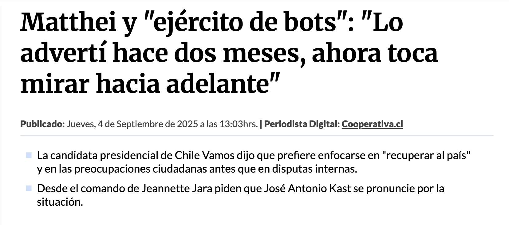
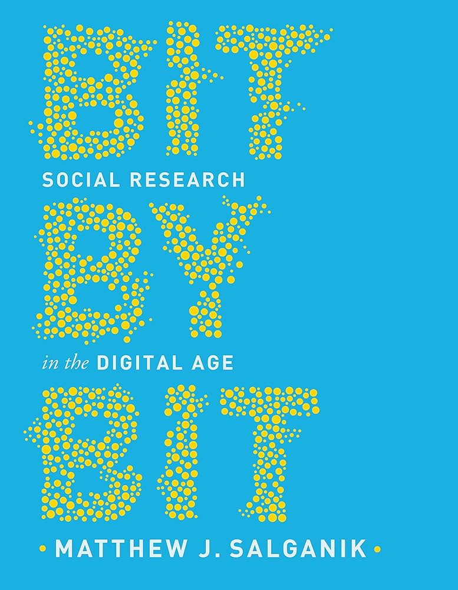
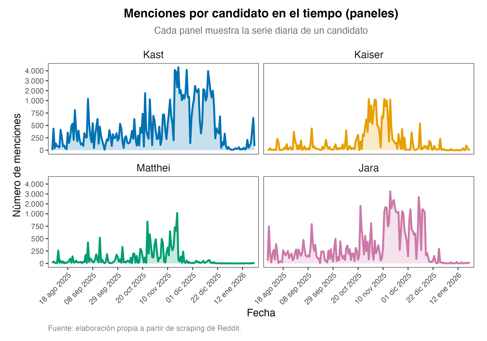
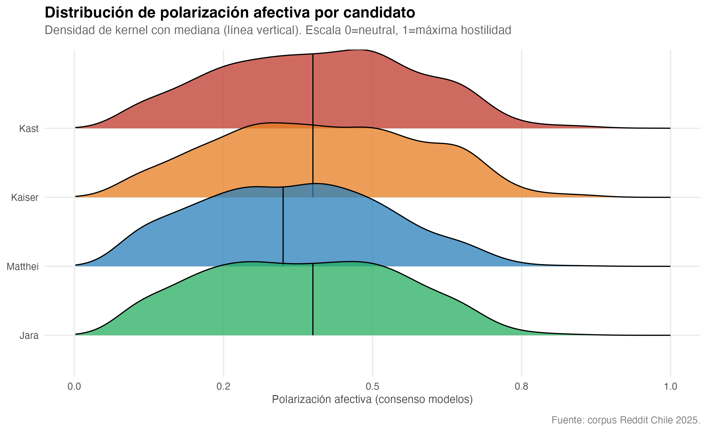
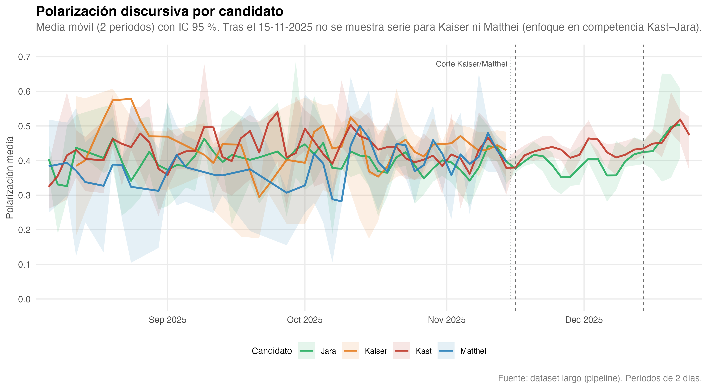
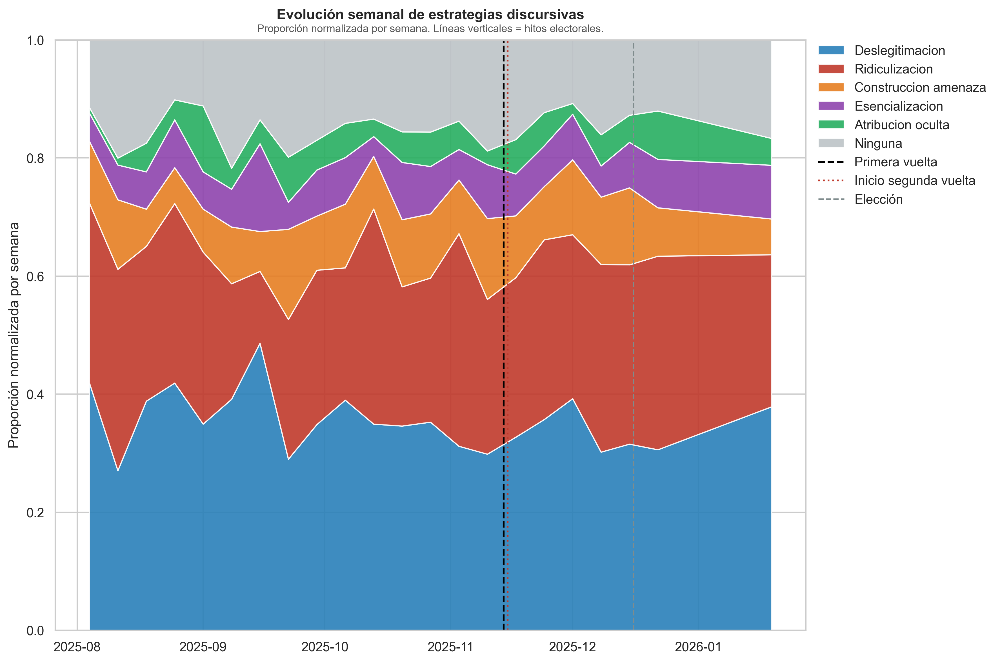
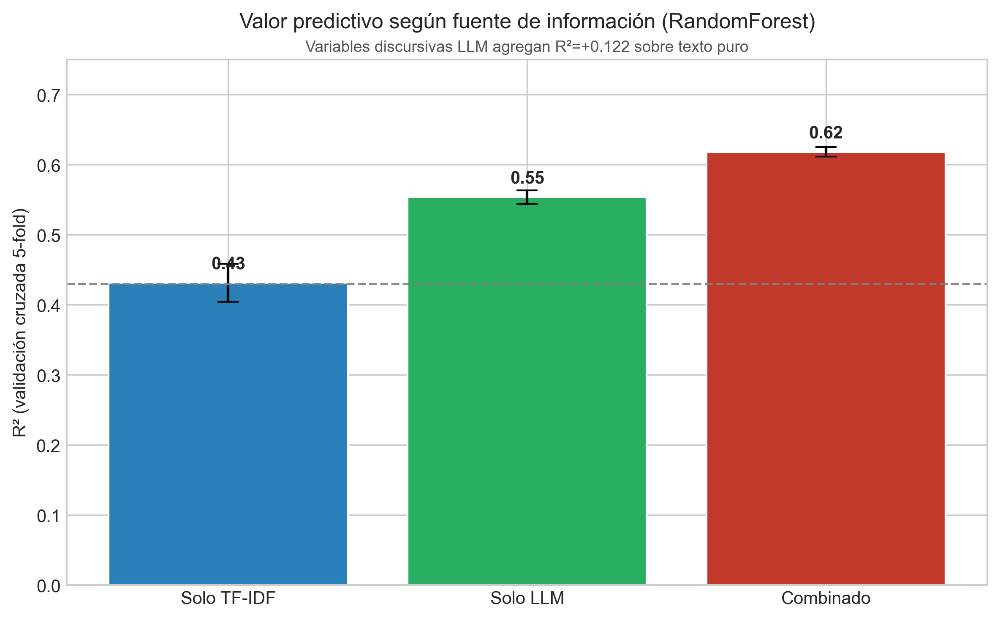
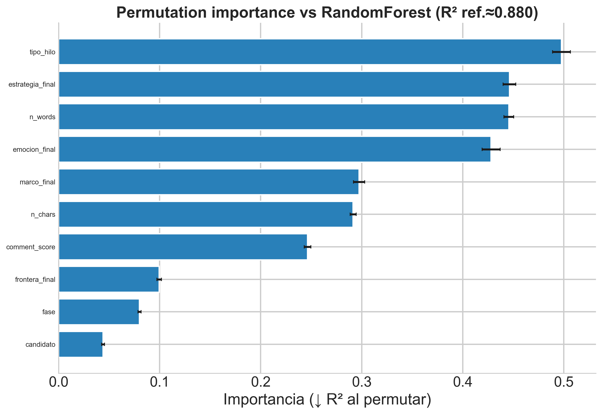
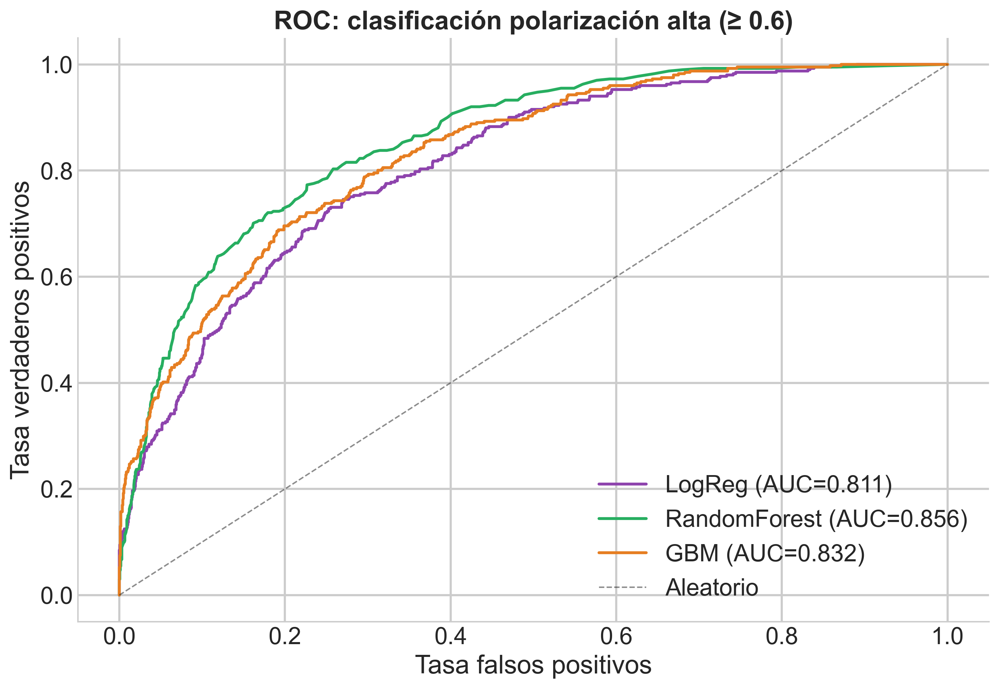

## 

## 

## Índice {.toc-slide}

::: toc-panel
```{=html}
<ul>
<li><strong>Problema, motivación e innovación</strong></li>
<li class="fragment"><strong>Apuesta teórica y metodológica</strong></li>
<li class="fragment"><strong>Resultados</strong></li>
<li class="fragment"><strong>Balances, limitaciones y proyecciones</strong></li>
</ul>
```
:::

# Problema

## Redes sociales y democracia

```{=html}
<style>
/* Solo esta slide — tono sobrio tipo revista/panel académico */
.reveal .slides section .rs-dem-scope {
  --rs-card-gap: clamp(0.65rem, 1.8vh, 0.95rem);
  --rs-col-gap: clamp(1rem, 3vw, 1.85rem);
  --rs-card-pad-x: clamp(0.95rem, 2.8vw, 1.35rem);
  --rs-card-pad-y: clamp(0.85rem, 2.2vw, 1.15rem);
  font-feature-settings: "kern" 1, "liga" 1;
  margin-top: 0.25em;
  max-width: 58rem;
  width: 100% !important;
  box-sizing: border-box !important;
}
/* Grid: fuerza 2 columnas paralelas (Reveal a menudo aplana .columns/.column) */
.reveal .slides section .rs-dem-scope .columns.rs-dem-two-cols {
  display: grid !important;
  grid-template-columns: 1fr 1fr !important;
  gap: var(--rs-col-gap) !important;
  column-gap: var(--rs-col-gap) !important;
  row-gap: 0 !important;
  align-items: start !important;
  width: 100% !important;
  max-width: 100% !important;
  box-sizing: border-box !important;
  margin: 0 !important;
  padding: 0 !important;
}
.reveal .slides section .rs-dem-scope .columns.rs-dem-two-cols > .column {
  display: flex !important;
  flex-direction: column !important;
  flex-wrap: nowrap !important;
  gap: var(--rs-card-gap) !important;
  width: auto !important;
  max-width: none !important;
  min-width: 0 !important;
  float: none !important;
  vertical-align: unset !important;
  padding-right: 0 !important;
  padding-left: 0 !important;
  box-sizing: border-box !important;
}
@media (max-width: 760px) {
  .reveal .slides section .rs-dem-scope .columns.rs-dem-two-cols {
    grid-template-columns: 1fr !important;
  }
}
.reveal .slides section .rs-dem-scope .concept-card {
  flex: 0 1 auto;
  margin: 0 !important;
  width: 100% !important;
  box-sizing: border-box !important;
  padding: var(--rs-card-pad-y) var(--rs-card-pad-x);
  border-radius: 6px;
  border: 1px solid rgba(15, 23, 42, 0.08);
  box-shadow: 0 1px 0 rgba(255, 255, 255, 0.85) inset,
    0 4px 18px rgba(15, 23, 42, 0.06);
  text-align: left;
}
.reveal .slides section .rs-dem-scope .concept-card__idx {
  display: block;
  font-family: var(--r-heading-font), system-ui, sans-serif;
  font-size: 0.52em;
  font-weight: 600;
  letter-spacing: 0.14em;
  text-transform: uppercase;
  color: rgba(30, 41, 59, 0.55);
  margin-bottom: 0.42em;
  line-height: 1.2;
}
.reveal .slides section .rs-dem-scope .concept-card__text {
  margin: 0 !important;
  font-family: var(--r-main-font), system-ui, sans-serif;
  font-size: 0.72em !important;
  line-height: 1.42 !important;
  font-weight: 500;
  color: rgba(17, 24, 39, 0.92);
}
/* Paleta académica — fondos muy apagados, sin fluorescencia */
.reveal .slides section .rs-dem-scope .concept-card--frontera {
  background: linear-gradient(158deg, #e8eef5 0%, #dfe8f2 52%, #e9eef6 100%);
  border-color: rgba(71, 85, 119, 0.18);
}
.reveal .slides section .rs-dem-scope .concept-card--odio {
  background: linear-gradient(154deg, #e5ebe7 0%, #dfe8e2 48%, #e8eeea 100%);
  border-color: rgba(71, 95, 86, 0.22);
}
.reveal .slides section .rs-dem-scope .concept-card--eco {
  background: linear-gradient(156deg, #ececf0 0%, #e3e6ec 50%, #f0f1f5 100%);
  border-color: rgba(76, 80, 99, 0.16);
}
.reveal .slides section .rs-dem-scope .concept-card--colab {
  background: linear-gradient(160deg, #e4eaef 0%, #dce5eb 52%, #e6eef4 100%);
  border-color: rgba(61, 90, 118, 0.2);
}
</style>
```
::: rs-dem-scope
::: {.columns .rs-dem-two-cols}
::: {.column width="48%"}
::: {.concept-card .concept-card--frontera}
[I]{.concept-card__idx}

<p class="concept-card__text">

La frontera de las redes sociales: El ellos y el nosotros

</p>
:::

::: {.concept-card .concept-card--odio}
[II]{.concept-card__idx}

<p class="concept-card__text">

Discursos de odio

</p>
:::
:::

::: {.column width="48%"}
::: {.concept-card .concept-card--eco}
[III]{.concept-card__idx}

<p class="concept-card__text">

Cámaras de eco y homofilia

</p>
:::

::: {.concept-card .concept-card--colab}
[IV]{.concept-card__idx}

<p class="concept-card__text">

Colaboración entre grupos

</p>
:::
:::
:::
:::

## Elecciones presidenciales en Chile: Nuestro laboratorio

-   Chile ofrece un escenario particularmente interesante: 3 candidatos
    de derecha versus candidata de la izquierda.

-   La hipótesis sostenida es que existían dos disputas simultáneas: una
    intra-derecha y otra entre los polos antagónicos
    (izquierda-derecha).

{fig-align="center"}

# ¿Por qué mi interés?

## Ciencias sociales computacionales / Ciencia de Datos Sociales 

::: {.columns .slide-img-text}
::: {.column width="40%"}
{fig-align="left" width="100%"}
:::

::: {.column width="60%"}
> "One day I found that approximately 100 participants from Brazil had
> completed my experiment overnight. This seemingly small discovery had
> a deep impact on me. Back then, my colleagues were conducting research
> the traditional way — spending enormous effort recruiting, managing,
> and compensating participants in physical lab settings, where getting
> through 10 participantes in a day was considered a real achievement.
> Yet my internet-based study had gathered 100 participants \[...\]
> while I was sleeping."

Matthew J. Salganik
:::
:::


## ¿Cómo hacer cosas con las palabras? I

::: literary-quote
> Pues bien; si a un cervantista se le ocurriera decir: el Quijote
> empieza con dos palabras monosilábicas terminadas en n: (en y un), y
> sigue con una de cinco letras (lugar), con dos de dos letras (de la),
> con una de cinco o de seis (Mancha), y luego se le ocurriera derivar
> conclusiones de eso, inmediatamente se pensaría que está loco. La
> Biblia ha sido estudiada de ese modo.

::: literary-quote-attribution
**Jorge Luis Borges** — *«La Cábala»*. Conferencias denominadas *Siete
noches*
:::
:::

{fig-align="center" width="579"}

## ¿Cómo hacer cosas con las palabras? II

::: literary-quote
> En (1) un (1) lugar (2) de (1) la (1) Mancha (2) de (1) cuyo (2)
> nombre (2) no (1) quiero (2) acordarme (4) no (1) ha (1) mucho (2)
> tiempo (2) que (1) vivía (3) un (1) hidalgo (3) .....

> 1 - 1 - 2 - 1 - 1 - 2 - 1 - 2 - 2 - 1 - 2 - 4 - 1 - 1 - 2 - 2 - 1 -
> 3 - 1 - 3

::: literary-quote-attribution
**Miguel de Cervantes** — *«Don Quijote de la Mancha»*.
:::
:::

{fig-align="center" width="579"}

# Y aquí la innovación

## MACI (para la innovación…)

-   Reddit como fuente de datos no convencional para análisis político
    en Chile.
-   Escalabilidad: análisis de corpus completo (\>100k comentarios) sin
    muestreo.
-   Innovación metodológica:
    -   Superación del enfoque léxico (diccionarios) mediante anotación
        dual LLM (GPT-4o + DeepSeek).
    -   Validación supervisada con ganancia incremental (ΔR²) sobre
        baseline TF-IDF.
-   MVP concreto:
    -   Perfiles emocionales por candidatura (O1)
    -   Red de antagonismos con valencia (O2)
    -   Serie temporal por fase electoral (O3)
-   Termómetro de innovación:
    -   **Incremental**: Aplicación de LLMs a corpus político chileno
        (caso nuevo, método conocido).
    -   **Sustancial**: Pipeline dual + validación cuantitativa de
        ganancia sobre métodos tradicionales.

::: {.callout-note appearance="minimal" icon="false"}
::: genesis-box
El interés en particular nace cuando, dentro de mis labores en un
proyecto, se me pidió un análisis de webscraping de diferentes medios
chilenos sobre figuras de la derecha chilena. Llegado el momento de la
presentación de resultados, la IP me indicó: *"Bueno, envíame la nube de
palabras"*.
:::
:::

# Marco referencial y objetivos

## Teoría

-   Polarización afectiva: Distancia emocional entre grupos políticos,
    no necesariamente ideológica (Iyengar et al., 2019). Se mide por
    intensidad de emociones negativas hacia el outgroup y positivas
    hacia el ingroup.

-   Antagonismo/agonismo (Mouffe): Construcción de fronteras políticas —
    el "ellos vs. nosotros". El antagonismo convierte al adversario en
    enemigo existencial; el agonismo reconoce la legitimidad del
    contrincante.

-   Framing: Encuadres que definen problemas, causas y soluciones
    (Entman, 1993). Los marcos discursivos seleccionan ciertos aspectos
    de la realidad y los hacen salientes, guiando la interpretación
    política.

-   Emociones políticas: El odio, el miedo, el resentimiento y la
    admiración no son subproductos de la ideología — son organizadores
    del conflicto (Marcus et al., 2000). Las emociones negativas
    intensifican la polarización afectiva y movilizan identidades
    políticas.

------------------------------------------------------------------------

## Objetivo

Construir y analizar un corpus longitudinal de conversación política en
Reddit (agosto-diciembre 2025) para explicar **cómo se articula la
polarización afectiva en la competencia entre derechas**, capturando:

-   Patrones de encuadre por corriente
-   Perfiles emocionales por candidatura
-   Redes de antagonismo intra/inter-bloque
-   Evolución temporal por fase electoral

# Metodología

## Procesamiento de lenguaje natural

**Clasificación automática de texto**: Asignación de categorías semánticas o discursivas a unidades textuales.

- **Del léxico fijo al contexto dinámico**: Los diccionarios de sentimiento asumen significado estable por palabra. Los LLMs capturan dependencia sintáctica y pragmática — "Kast es un peligro" vs. "Kast enfrenta un peligro".

- **Anotación LLM dual**: GPT-4o y DeepSeek como anotadores escalables. 

- **Validación incremental (ΔR²)**: Las variables LLM mejoran la predicción sobre baselines TF-IDF — evidencia de validez de constructo.

**TF-IDF (Term Frequency-Inverse Document Frequency)**: Esquema de ponderación léxica. TF mide frecuencia de un término en un documento; IDF penaliza términos comunes en el corpus. Formalmente: 

$$
\
\text{TF-IDF}(t, d) = \text{TF}(t, d) \times \log \frac{N}{\text{DF}(t)}
\
$$

donde \(N\) es el total de documentos y \(\text{DF}(t)\) el número de documentos que contienen el término \(t\). Usado como baseline: si las variables LLM no mejoran sobre TF-IDF (ΔR² ≤ 0), no capturan estructura semántica adicional.

------------------------------------------------------------------------

## Los actores del estudio

::: actors-study-table
| Candidato         | Posición            | Base social                               |
|------------------|------------------|------------------------------------|
| Evelyn Matthei    | Derecha tradicional | Mayoría femenina, 50+, estratos C1-C2     |
| José Antonio Kast | Derecha radical     | Transversal, fuerte en regiones del sur   |
| Johannes Kaiser   | Derecha libertaria  | Mayoría masculina, 50+, estratos C3-D/E   |
| Jeannette Jara    | Izquierda (PC)      | Región Metropolitana, C2-C3, ideologizado |

**Diseño comparativo**: 3 derechas + 1 adversario común — competencia
intra-bloque vs. inter-bloque.
:::

------------------------------------------------------------------------

## Acceso y fuente de datos

::: incremental
-   **¿Qué es Reddit?**
-   **Subreddits**: `r/chile` y `r/RepublicadeChile` (principales
    espacios de discusión política chilena)
-   **Corpus**: \>100k comentarios extraídos vía API pública de Reddit (Web scrapping)
-   **Ventana temporal**: Agosto-diciembre 2025 (precampaña, primera
    vuelta, segunda vuelta)
-   **Filtro**: Menciones explícitas a candidatos (regex/flags) para
    foco analítico
-   **Sin muestreo**: Análisis del corpus completo (Solo filtro a menciones explícitas)
:::

{fig-align="center"}

## ¿Qué clasificamos?

```{=html}
<div style="display: grid; grid-template-columns: 1fr 1fr; gap: 0.55rem; margin-top: 0.5rem; font-family: 'Georgia', serif; max-width: 920px;">
  <div style="background: linear-gradient(135deg, #2980B9, #1A5276); color: white; padding: 0.75rem 1rem; border-radius: 8px; box-shadow: 2px 2px 8px rgba(0,0,0,0.15);">
    <span style="font-size: 0.65rem; text-transform: uppercase; letter-spacing: 1px; opacity: 0.85;">Dimensión 1</span><br>
    <strong style="font-size: 1rem;">Polarización afectiva</strong><br>
    <span style="font-size: 0.82rem; opacity: 0.92;">Hostilidad discursiva (continua)</span>
  </div>
  <div style="background: linear-gradient(135deg, #8E44AD, #6C3483); color: white; padding: 0.75rem 1rem; border-radius: 8px; box-shadow: 2px 2px 8px rgba(0,0,0,0.15);">
    <span style="font-size: 0.65rem; text-transform: uppercase; letter-spacing: 1px; opacity: 0.85;">Dimensión 2</span><br>
    <strong style="font-size: 1rem;">Estrategias de ataque</strong><br>
    <span style="font-size: 0.82rem; opacity: 0.92;">Amenaza, ridiculización, esencialización…</span>
  </div>
  <div style="background: linear-gradient(135deg, #C0392B, #922B21); color: white; padding: 0.75rem 1rem; border-radius: 8px; box-shadow: 2px 2px 8px rgba(0,0,0,0.15);">
    <span style="font-size: 0.65rem; text-transform: uppercase; letter-spacing: 1px; opacity: 0.85;">Dimensión 3</span><br>
    <strong style="font-size: 1rem;">Marcos interpretativos</strong><br>
    <span style="font-size: 0.82rem; opacity: 0.92;">Moral, conflicto, economía, identidad…</span>
  </div>
  <div style="background: linear-gradient(135deg, #117864, #0B5345); color: white; padding: 0.75rem 1rem; border-radius: 8px; box-shadow: 2px 2px 8px rgba(0,0,0,0.15);">
    <span style="font-size: 0.65rem; text-transform: uppercase; letter-spacing: 1px; opacity: 0.85;">Dimensión 4</span><br>
    <strong style="font-size: 1rem;">Fronteras políticas</strong><br>
    <span style="font-size: 0.82rem; opacity: 0.92;">Inter-bloque vs. intra-bloque (derecha)</span>
  </div>
</div>
```
Clasificación dual **GPT-4o (OpenAI)** + **DeepSeek**, con reglas de
consenso y desempate documentadas en la tesis.

## Sobre el prompt anotación LLM dual

El sistema utiliza **dos prompts secuenciales** para clasificar cinco dimensiones discursivas en cada comentario:

### **Prompt A: Sentimiento y polarización**

- **Polarización** afectiva del comentario en escala continua (0.0–1.0), donde 0.0 = neutral/informativo y 1.0 = amenaza/deshumanización.
- **Reglas de target**: Clasifica solo si el comentario evalúa directamente al candidato; crítica a votantes cuenta como negativo hacia el candidato; ironía evaluada por tono dominante.

### **Prompt B: Marco, emoción, estrategia y frontera**
Clasifica cuatro dimensiones siguiendo marcos teóricos establecidos:

1. **Marco interpretativo** (Entman, 1993): diagnóstico, pronóstico, motivacional, conflicto, moral, económico, identitario, otro.

2. **Emoción predominante**: indignación, ira, desprecio, miedo, esperanza, alegría, ironía, ninguna. Distingue entre emociones cálidas (ira) vs. frías (desprecio), e ironía (crítica implícita) vs. alegría.

3. **Estrategia adversarial**: deslegitimación, ridiculización, atribución oculta, construcción de amenaza, esencialización, ninguna.

4. **Frontera política**: inter-bloque (derecha vs. izquierda), intra-bloque (entre candidatos de derecha), ninguna. Regla estricta: NUNCA inter-bloque si el hilo solo menciona candidatos de derecha.


# Datos obtenidos

```{=html}
<div style="
  min-height: 72vh;
  display: flex;
  flex-direction: column;
  justify-content: center;
  align-items: center;
  text-align: center;
">
  <div style="
    font-size: 9.8rem;
    font-weight: 900;
    line-height: 0.95;
    letter-spacing: 1px;
    color: #111827;
    text-shadow: 4px 4px 0px #f3d34a;
  ">
    163.695
  </div>
  <div style="
    margin-top: 0.8rem;
    font-size: 1.9rem;
    font-weight: 700;
    color: #1f2937;
  ">
    comentarios en el corpus
  </div>
  <div style="
    margin-top: 0.7rem;
    font-size: 1.2rem;
    color: #374151;
    letter-spacing: 0.2px;
  ">
    1 de agosto de 2025 al 31 de diciembre de 2025
  </div>
</div>
```
# Depuración de datos

## Del corpus bruto al corpus analítico

Embudo de exclusiones (misma lógica que el capítulo de depuración de la
tesis; la fila final recorta además la ventana **1 ago – 31 dic 2025**,
America/Santiago).

| Etapa                                               | N comentarios |
|-----------------------------------------------------|---------------|
| Corpus bruto                                        | 163.695       |
| Tras filtrar bots y eliminados                      | 144.216       |
| Tras filtrar comentarios cortos (menos de 3 tokens) | 136.707       |
| Corpus final analizable                             | 134.730       |

## Distribución por candidato

{fig-align="center"}

**Nota**: Asimetría marcada en la distribución de menciones. Kast lidera
con 102.759 comentarios (62.8% del corpus), seguido por Jara con 63.602
(38.9%), Kaiser con 26.521 (16.2%) y Matthei con 16.358 (10.0%). Los
porcentajes suman más del 100% porque un mismo comentario puede
referenciar a múltiples candidatos.

# Resultados: 4 historias

# Historia 1: Coincidencia de los modelos

## ¿Coinciden los dos modelos?

Valores del acuerdo **OpenAI (GPT-4o) vs. DeepSeek** 


| Métrica                | Valor | Lectura                                              |
|------------------------|-------|------------------------------------------------------|
| Correlación *r* (GPT-DeepSeek) | 0.665 | Convergencia moderada-alta en la escala continua     |
| κ (Humano-GPT)         | 0.64  | Acuerdo moderado alto; validez aceptable                  |
| κ (Humano-DeepSeek)    | 0.79  | Acuerdo alto; validez aceptable                  |


> **Nota**: Validación humana sobre muestra aleatoria de 250 comentarios durante fase de calibración del pipeline. 

> **Sí en polarización** (*r* = 0,665): ambos modelos comparten señal en
> hostilidad discursiva.
>
> **Heterogéneo en categorías**: las κ son bajas; en **frontera** el
> valor negativo no implica azar, sino que ambos marcan comentarios
> fronterizos pero **discrepan de forma consistente** sobre si el ataque
> es inter- o intra-bloque.

>La convergencia en polarización valida el pipeline dual como robusto para la variable >central. Las divergencias en otras dimensiones **no invalidan** el diseño — documentan la complejidad del fenómeno discursivo estudiado.

# Historia 2: La polarización

## Distribución de polarización por candidato

{fig-align="center"
width="92%"}

Distribuciones unimodales, medianas entre 0,3 y 0,5. Kast y Jara con
colas más pesadas hacia alta hostilidad.

## Polarización en el tiempo

{fig-align="center"
width="92%"}

Sin tendencia ascendente clara hacia la elección: hostilidad de base
relativamente **estable** en el periodo observado.

# Historia 3: Inter-bloque vs. intra-bloque — dos lógicas de hostilidad

## Configuraciones discursivas (ML clásico: clustering K-means)

**Método**: Clustering K-means (K=5) sobre las dimensiones (marco × emoción), optimizado mediante método del codo (elbow) y validado con silhouette score = 0.42. La polarización se usa como variable externa de validación.

| Cluster | Marco dominante | Emoción dominante | n     | Polarización media | Silhouette |
|---------|-----------------|-------------------|-------|--------------------| ---------- |
| 0       | Diagnóstico     | Ninguna           | 1,124 | 0.287              | 0.51       |
| 1       | Moral           | Desprecio         | 702   | 0.541              | 0.48       |
| 2       | Conflicto       | Desprecio         | 945   | 0.463              | 0.39       |
| 3       | Conflicto       | Ira               | 823   | 0.598              | 0.44       |
| 4       | Motivacional    | Indignación       | 456   | 0.512              | 0.37       |

**Resultado**: Moral + desprecio (cluster 1, pol=0.541) resulta más hostil que conflicto + desprecio (cluster 2, pol=0.463), pero **conflicto + ira** (cluster 3) alcanza la mayor polarización media (0.598). El **acoplamiento** marco–emoción importa más que cada dimensión por separado — evidencia de **interacción no aditiva** entre features discursivas. ANOVA one-way confirma diferencias significativas entre clusters (F(4, 4045) = 127.3, p < 0.001, η² = 0.112).

---

## Estrategias por frontera política (ML clásico: test χ² de independencia)

**Hipótesis**: Las estrategias adversariales no se distribuyen uniformemente entre fronteras inter- e intra-bloque.

| Estrategia              | Inter-bloque | Intra-bloque | χ² (gl=1)            | V de Cramér |
|-------------------------|--------------|--------------|----------------------|-------------|
| Deslegitimación         | 66.3%        | 10.1%        | χ² = 1245.3 (p<0.001)| 0.38        |
| Ridiculización          | 48.3%        | 21.9%        | χ² = 347.2 (p<0.001) | 0.20        |
| Construcción de amenaza | 66.0%        | 11.1%        | χ² = 1189.7 (p<0.001)| 0.37        |
| Esencialización         | 65.2%        | 12.8%        | χ² = 1098.4 (p<0.001)| 0.36        |

**Resultado**: La deslegitimación domina el ataque inter-bloque (hacia la izquierda, 66.3%), mientras que la ridiculización es la estrategia preferida intra-bloque (entre derechas, 21.9%). El test χ² rechaza la hipótesis de independencia (p < 0.001 en todas las estrategias). La V de Cramér confirma asociación moderada-fuerte (V > 0.30) entre estrategia y dirección de frontera para deslegitimación, amenaza y esencialización — **acoplamiento estructural**, no distribución aleatoria.

---

## Estrategias a lo largo del tiempo

{fig-align="center"
width="92%"}

Estructura adversarial estable: **ajustes tácticos**, no
transformaciones del repertorio.

# Historia 4: Polarización en el repertorio; el candidato, vía mediación

## Valor añadido del LLM dual

{fig-align="center"
width="88%"}

-   TF-IDF solo: **R² ≈ 0,43**
-   Variables LLM solas: **R² ≈ 0,55**

```{=html}
<div style="margin-top: 0.6rem; text-align: center;">
  <div style="font-size: 4.2rem; font-weight: 900; color: #111827; text-shadow: 3px 3px 0px #f3d34a; line-height: 1;">R² = 0,62</div>
  <div style="font-size: 1.15rem; color: #374151; margin-top: 0.35rem;">Combinado (texto + LLM). Las variables LLM no son redundantes con el bag-of-words: agregan estructura discursiva.</div>
</div>
```


## Valor añadido del LLM dual

::: {.callout-r2-validation-wrap}
::: {.callout-note icon=false}
## Validación incremental: TF-IDF como baseline

**Ejemplo**: Comentario "Kast es un peligro para Chile. Una copia barata de Trump"

- **TF-IDF detecta**: palabras "Kast" (peso alto) + "peligro" (peso medio) → predice polarización moderada
- **Variables LLM detectan**: emoción = miedo, estrategia = construcción de amenaza, marco = conflicto → predice polarización alta

- **Modelo A (solo TF-IDF)**: Predice polarización usando únicamente las palabras del comentario → R² = 0.432
- **Modelo B (solo variables LLM)**: Predice polarización usando emoción, estrategia, marco → R² = 0.554
- **Modelo C (TF-IDF + LLM)**: Combina palabras y variables discursivas → R² = 0.619

**Interpretación**: Las variables LLM superan TF-IDF (+0.122 en R²) — capturan estructura semántica adicional que las palabras no revelan. TF-IDF sabe *qué* se dice; las variables LLM saben *cómo*.
:::
:::


## ¿Qué predice la polarización?

{fig-align="center"
width="92%"}

-   **Tipo de hilo:** caída de R² ≈ 0,50 al permutar (orden de
    magnitud).
-   **Estrategia, n_words, emoción:** caídas superiores a 0,40.
-   **Candidato (target):** caída ≈ **0,04** — sin aporte marginal *una
    vez fijados* estrategia, emoción, marco, frontera, tipo de hilo y
    largo del texto (OLS coherente: $\beta \approx 0$, $p = 0.818$).

> *"Una vez controlado por estrategia y emoción, el candidato target
> deja de aportar información predictiva. La hostilidad reside en el
> repertorio, no en el destinatario."*

```{=html}
<div style="margin-top: 0.65rem; font-size: 0.72em; color: #6b7280; line-height: 1.38; border-left: 3px solid #d1d5db; padding-left: 0.75rem;">
  El candidato sigue importando: su efecto está totalmente mediado por las dimensiones discursivas, no es independiente de ellas.
</div>
```
## Clasificación de polarización alta

{fig-align="center"
width="88%"}

**RandomForest** AUC ≈ **0,856**. **Regresión logística** AUC ≈
**0,811**. La señal tiene una parte lineal, pero hay interacciones que
solo modelos **no paramétricos** capturan bien.


# Síntesis y limitaciones

## Tres hallazgos centrales

1. **Hostilidad en el repertorio, mediación vía candidato** — El candidato como *target* no predice polarización directamente (β ≈ 0, p > 0.05), pero **condiciona el repertorio** que se le aplica. Kast y Jara movilizan estrategias de mayor intensidad (ira, deslegitimación, amenaza) que Matthei y Kaiser. La polarización no se explica por *quién* es atacado, sino por *cómo*, pero ese "cómo" depende del candidato.

2. **La frontera política es computacionalmente recuperable** — El mejor modelo alcanza F1-macro = **0.725** para clasificar frontera inter/intra-bloque. El concepto teórico de Mouffe (antagonismo/agonismo) **deja huella textual detectable** en corpus informal.

3. **La negatividad está cristalizada antes del pico de campaña** — Los niveles de hostilidad se mantienen **estables** durante todo el período electoral. El ciclo **refuerza** disposiciones previas más de lo que las origina. Reddit es espacio de **cristalización**, no de persuasión.

---

## Limitaciones

- **Reddit no es representativo** del electorado chileno — élite activista digital, sesgada demográficamente.
- **Atribución ideológica inferida** (comportamiento en plataforma), no autodeclarada — introduce ruido de medición.
- **Diseño longitudinal sin causalidad fuerte** — documenta correlaciones robustas, no identifica mecanismos causales.
- **Validación humana limitada** — 250 comentarios en fase de calibración (κ ≈ 0.50); corpus completo sin validación exhaustiva.
- **Kappas bajos en emoción (0.076) y marco (0.136)** — ambigüedad conceptual legítima; dimensiones usadas para tendencias agregadas, no clasificación individual.

---

## Líneas futuras

- **Replicación en X, TikTok, Instagram** — comparar ecologías discursivas entre plataformas.
- **Ventanas de evento más finas** — análisis diario/horario alrededor de debates, declaraciones, *scandals*.
- **Extensión a desinformación** — detección de bots, coordinación inorgánica, contenido falso.
- **Modelado causal quasi-experimental** — diferencias-en-diferencias, regresión discontinua aprovechando eventos naturales.


##  {#thank-you-slide}

::: thank-you-content
```{=html}
<div class="thank-you-title-block">
  <p class="ty-line ty-main">Derecha fragmentada y</p>
  <p class="ty-line ty-main">un enemigo compartido</p>
  <p class="ty-line ty-sub">Anotación LLM dual y polarización discursiva</p>
  <p class="ty-line ty-sub">en Reddit durante las elecciones chilenas de</p>
  <p class="ty-line ty-year">2025</p>
  <p class="ty-line ty-name">Matías Javier Deneken</p>
  <p class="ty-degree">Tesis Magíster en Ciencia de Datos para la innovación</p>
</div>
<p class="ty-guides">Profesores guías: <strong>Dr. Carlos Navarrete</strong> · <strong>Dra. Marcela Parada</strong></p>
<p><a href="mailto:m.deneken@uc.cl" class="email-link">m.deneken@uc.cl</a></p>
<p><a href="https://github.com/matdknu" class="github-link">GitHub: @matdknu</a></p>
```
:::

```{=html}
<!--
Imágenes para esta presentación: copiadas automáticamente a documents/presentacion_proyecto/images/
desde documents/tesis_book/fig_thesis/ y documents/tesis_book/images/ (tendencia_panel_bisemanal_primera_segunda.png).
Nada pendiente de copia manual si esas rutas siguen disponibles en tu máquina.
-->
```
