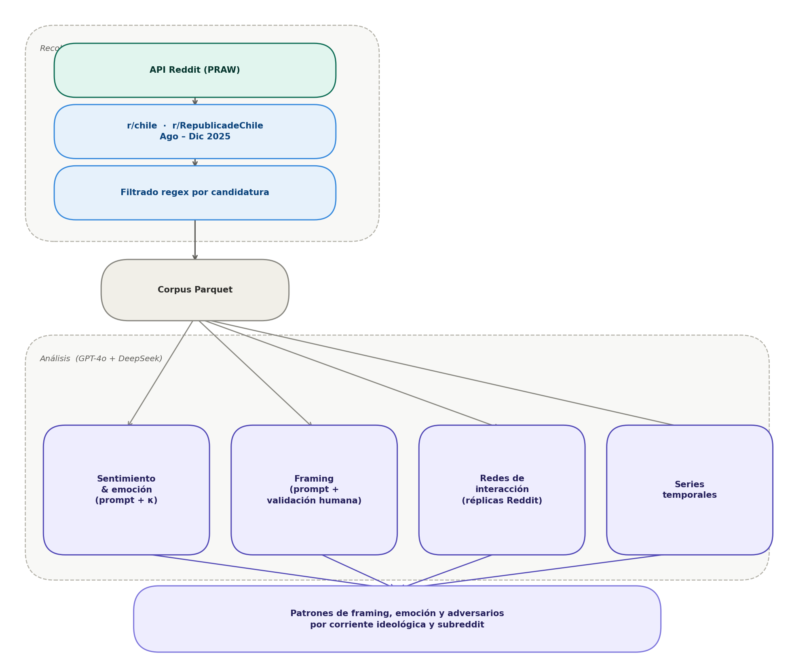

```{r setup, include=FALSE}
knitr::opts_chunk$set(
  echo = FALSE,
  warning = FALSE,
  message = FALSE,
  fig.width = 7,
  fig.height = 5
)
```

## Diseño de investigación {#sec-diseno}

Toda la evidencia presentada a partir de los capítulos de exploración y
resultados se apoya en un **mismo cuerpo de datos digital**: comentarios
y publicaciones **extraídos de Reddit mediante su API pública** en el
**período electoral de la campaña presidencial de Chile en 2025**
 concretamente **del 1 de agosto al 31 de diciembre de 2025**, con
cobertura de las fases de precampaña, campaña y segunda vuelta, tal como
se detalla en las secciones que siguen. Este anclaje temporal y de
**fuente** no es un detalle técnico: deja claro qué sostiene el
argumento (discurso observable en plataforma, no otra medición
paralela) y por qué el diseño aporta rigor: se observa el debate
político mientras se desarrolla el proceso electoral, con trazabilidad
desde la plataforma hasta el análisis.

En paralelo, la investigación adopta un **diseño longitudinal
observacional** basado en *user-generated content*. Ese carácter
longitudinal permite capturar la evolución del debate a lo largo del
ciclo electoral, identificando tendencias, puntos de inflexión y
dinámicas de cambio. El carácter observacional preserva las propiedades
naturales de la interacción en Reddit, sin intervención experimental.

Metodológicamente, se inscribe en la **ciencia social computacional** [@lazer2009ComputationalSocialScience; @salganik2018BitBitSocial; @edelmann2020ComputationalSocialScience; @keuschnigg2018AnalyticalSociologyComputational]: integra técnicas de procesamiento de datos a gran escala con marcos teóricos y preguntas sustantivas de las ciencias sociales. El diseño combina componentes **descriptivos** —caracterizar la conversación política en Reddit en la ventana de campaña 2025— con componentes **explicativos**, orientados a identificar factores y mecanismos que den cuenta de los patrones observados.

## Reddit como plataforma de análisis

Reddit es una plataforma de agregación de contenido y discusión organizada en comunidades temáticas denominadas *subreddits*, cada una con sus propias normas, moderadores y cultura discursiva. A diferencia de plataformas organizadas en torno a redes de seguidores o amistades, Reddit estructura la participación en torno a intereses y temas compartidos, lo que favorece conversaciones más extensas y argumentadas que en otros entornos digitales.

Su arquitectura de **comentarios anidados** (*threaded discussions*) permite seguir el desarrollo de argumentos y contraargumentos en múltiples niveles, haciendo visible la estructura deliberativa del debate. Los usuarios operan bajo seudónimos no vinculados a su identidad real, lo que puede facilitar la expresión de posiciones polémicas. Las comunidades son autogobernadas: cada subreddit define sus propias reglas de participación, generando culturas discursivas distintivas que hacen de la comparación entre comunidades un ejercicio analíticamente valioso.

En el contexto chileno, dos subreddits concentran la discusión política nacional:

-   **r/chile**: Comunidad generalista sobre temas chilenos, con mayor volumen de usuarios y diversidad temática. Ha tendido históricamente hacia posiciones de centro-izquierda, aunque con presencia de voces diversas.
-   **r/RepublicadeChile**: Comunidad surgida como escisión de r/chile, con políticas de moderación más permisivas y una composición ideológica tendiente a la derecha. Tolera discursos más confrontacionales y concentra usuarios críticos de la moderación de r/chile.

Esta dualidad constituye un caso comparativo de valor: permite examinar cómo una misma controversia política es procesada de manera diferenciada según la cultura discursiva de la comunidad.

## Recolección de datos mediante la API de Reddit

### Procedimiento técnico

Los datos fueron extraídos mediante la API pública de Reddit utilizando la librería PRAW (*Python Reddit API Wrapper*). Esta aproximación —distinta del *web scraping* no autorizado— accede de forma estructurada a contenido público respetando los límites de uso establecidos por la plataforma y garantizando la trazabilidad y reproducibilidad del proceso.

### Período de recolección y fases del ciclo electoral

La recolección abarcó **cinco meses**, del **1 de agosto al 31 de diciembre de 2025**, cubriendo las siguientes fases del ciclo electoral:

| Período                    | Fase electoral                                                                           |
|----------------------------|------------------------------------------------------------------------------------------|
| Agosto – octubre 2025      | Emergencia de candidaturas, posicionamiento inicial, primeras definiciones programáticas |
| Noviembre – diciembre 2025 | Escalamiento de campaña, consolidación electoral, estructuración del debate público      |

### Estrategia de extracción incremental

El proceso fue **incremental y acumulativo**, ejecutado en múltiples iteraciones que: (1) recuperaban los posts más recientes de cada subreddit (250–1.000 posts por ejecución); (2) descargaban el árbol completo de comentarios para capturar todos los niveles de anidación; (3) integraban nuevos datos con extracciones previas en archivos Parquet; y (4) eliminaban duplicados mediante el identificador único nativo de Reddit (`post_id`), que garantiza unicidad por diseño de la plataforma.

### Contenido extraído y filtrado temático

Para cada publicación dentro del rango temporal se extrajeron dos niveles:

**Posts**: título, cuerpo (*selftext*), autor, fecha, puntuación, número de comentarios y flair temático.

**Comentarios**: cuerpo del comentario, autor, fecha, puntuación e identificador del comentario al que responde.

El filtrado temático se realizó mediante **expresiones regulares** que detectan menciones de las cuatro candidaturas de interés, manejando variaciones ortográficas (acentuación, nombres completos vs. apellidos, apodos y errores tipográficos frecuentes):

| Candidatura       | Corriente ideológica         | Patrones de búsqueda               |
|-------------------|------------------------------|------------------------------------|
| Evelyn Matthei    | Derecha tradicional          | `matthei`, `matei`, `evelyn`       |
| José Antonio Kast | Derecha radical-conservadora | `kast`, `jose antonio kast`, `jak` |
| Johannes Kaiser   | Derecha libertaria           | `kaiser`, `johannes`, `jkaiser`    |
| Jeannette Jara    | Izquierda-PC                 | `jara`, `jeannette`, `jeanette`    |

: Candidaturas objetivo y patrones de detección. {#tbl-candidaturas}

Esta selección permite analizar tanto la **competencia intra-derecha** entre tres corrientes como la **convergencia discursiva** frente al adversario ideológico común (ver @tbl-candidaturas).

## Consideraciones éticas

La investigación se rige por principios establecidos para la investigación con datos digitales [@salganik2018BitBitSocial]:

**Datos públicos**: Todo el contenido recolectado proviene de espacios públicos de Reddit. No se accedió a mensajes privados ni a información restringida.

**Privacidad**: El análisis no reporta identificadores individuales ni busca vincular cuentas con identidades reales. Los ejemplos citados son anonimizados cuando resulta pertinente.

**No intervención**: La investigación no actúa sobre las comunidades estudiadas ni expone a sus miembros a riesgos adicionales; el foco es el análisis de dinámicas colectivas.

**Reproducibilidad**: Los scripts de recolección y procesamiento están documentados para permitir la replicación del estudio respetando los términos de uso de la API.

## Técnicas de Análisis

El estudio combina **modelos de lenguaje (GPT-4o y DeepSeek)** [@ali2025SocialMediaPolarization; @arslan2025PoliticalRAGUsingGenerative] con **validación humana sistemática** para analizar discursos políticos en Reddit. Las clasificaciones automáticas (sentimiento, emociones, marcos y estrategias) se realizan mediante prompts estructurados y luego se **validan con codificación manual** usando métricas de acuerdo (kappa de Cohen, $\kappa$) [@ajala2022CombiningArtificialIntelligence] antes de escalar al corpus completo.

Se analizan cuatro dimensiones principales:

-   **Sentimiento y emociones** (polaridad, intensidad y emoción predominante)

-   **Marcos interpretativos** (económico, seguridad, identitario, institucional, medioambiental)

-   **Interacciones** (redes de respuesta entre usuarios para detectar comunidades y polarización)

-   **Evolución temporal** (cambios en tono, temas y volumen a lo largo del tiempo)

El pipeline incluye técnicas de **procesamiento de texto (TF-IDF, bigramas)** [@hirschbergAdvancesNaturalLanguage], codificación de variables y modelos supervisados como **Regresión Logística, SVM, Random Forest y Gradient Boosting**, evaluados con validación cruzada. También se aplican métodos de **reducción de dimensionalidad (SVD y PCA)** para visualización.

Los desacuerdos entre modelos se utilizan como señal de ambigüedad y se resuelven mediante revisión humana o criterios adicionales. El corpus final incluye publicaciones y comentarios de r/chile y r/RepublicadeChile durante todo el ciclo electoral, permitiendo análisis **longitudinales, relacionales y discursivos integrados**

{#fig-pipeline-datos fig-align="center" width="81%"}
