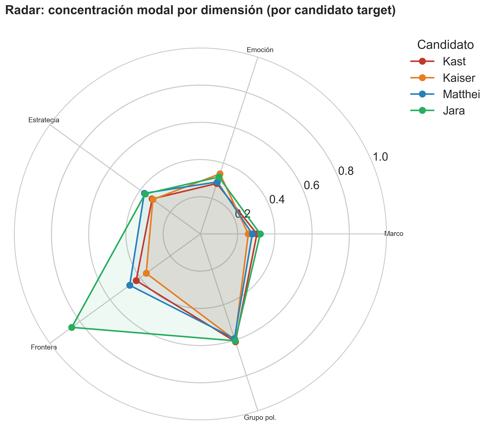
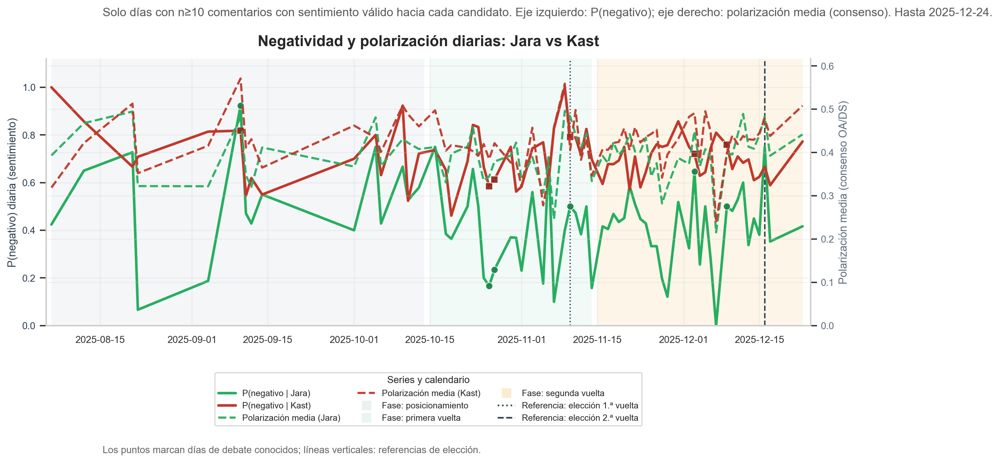

```{r setup-exploracion, include=FALSE}
knitr::opts_chunk$set(
  echo = FALSE,
  warning = FALSE,
  message = FALSE,
  cache = FALSE,
  fig.width = 10,
  fig.height = 6,
  fig.align = "center"
)
base_out <- "fig_thesis"
base_dir <- normalizePath(file.path(base_out, ".."), winslash = "/", mustWork = FALSE)
# Misma ruta que el script Python: filename = "outputs_ml/serie_polarizacion_candidatos.png"
repo_root <- normalizePath(file.path(base_dir, "..", ".."), winslash = "/", mustWork = FALSE)
base_ml <- file.path(repo_root, "outputs_ml")
```

Este capítulo ofrece una vista **exploratoria** del corpus antes del modelado formal: volumen de comentarios por candidato, cruces entre **estrategia discursiva y frontera política**, **densidad** de la polarización por candidato, **perfiles** comparados mediante un radar (concentración modal por dimensión) y las **trayectorias** de polarización en el tiempo (serie por candidato y negatividad diaria Jara–Kast).

## Volumen de comentarios por candidato

```{r fig-count-facet}
#| results: asis
#| echo: false
if (file.exists(file.path(base_out, "fig_count_facet_candidatos.png"))) {
  cat('{#fig-count-facet-cand fig-align="center" width="92%"}\n')
}
```

## Estrategia discursiva y frontera política

Relación exploratoria entre tipo de **estrategia** (eje horizontal) y **frontera política** (facetas), por candidato. Figura producida con `scripts/analisis/03_visualizacion-modelado.R`.

```{r fig4-estrategia-frontera}
#| results: asis
#| echo: false
if (file.exists(file.path(base_out, "fig4_estrategia_frontera.png"))) {
  cat('{#fig-explor-estrategia-frontera fig-align="center" width="100%"}\n')
}
```

## Densidad de polarización por candidato

Distribución de la **polarización** (consenso) condicionada al candidato comentado; visualización tipo densidad/ridges. Misma fuente R que la figura anterior.

```{r fig7-densidad-polarizacion}
#| results: asis
#| echo: false
if (file.exists(file.path(base_out, "fig7_densidad_polarizacion.png"))) {
  cat('{#fig-explor-densidad-pol fig-align="center" width="92%"}\n')
}
```

## Perfiles discursivos: radar por candidato

Cada eje del radar muestra la **concentración de la categoría modal** en esa dimensión (proporción de la categoría más frecuente, 0–1), calculada **solo sobre los comentarios cuyo target es ese candidato**. El quinto eje corresponde al **grupo de polarización** (baja / media / alta) en lugar del eje «candidato», que sería trivial dentro de cada submuestra. La @fig-radar-candidatos permite comparar en un mismo gráfico a Kast, Kaiser, Matthei y Jara.

```{r fig-radar-candidatos}
#| results: asis
#| echo: false
if (file.exists(file.path(base_out, "radar_candidatos_cuatro.png"))) {
  cat('{#fig-radar-candidatos fig-align="center" width="88%"}\n')
}
```

Figura generada con `scripts/analisis/09_ml_avanzado.py` (función `run_radar_por_candidato`). Tabla numérica: `radar_concentracion_modal_candidatos.csv` en `outputs_ml/` y copia en `fig_thesis/` cuando se ejecuta el script.

## Polarización en el tiempo

Las series siguientes utilizan el mismo calendario electoral y la polarización por consenso entre anotadores que en el capítulo de modelado; aquí sirven como **contexto exploratorio** de la evolución agregada.

```{r fig-explor-pol-bi2d}
#| results: asis
#| echo: false
# Misma ruta que en Python: filename = "outputs_ml/serie_polarizacion_candidatos.png"
pol_ml <- file.path(base_ml, "serie_polarizacion_candidatos.png")
pol_ft <- file.path(base_out, "serie_polarizacion_candidatos.png")
pol_alt_ml <- file.path(base_ml, "serie_polarizacion_cada_2_dias_candidatos.png")
pol_alt_ft <- file.path(base_out, "serie_polarizacion_cada_2_dias_candidatos.png")
ft1 <- file.path(base_dir, "fig_thesis", "serie_polarizacion_candidatos.png")
ft2 <- file.path(base_dir, "fig_thesis", "serie_polarizacion_cada_2_dias_candidatos.png")
img <- if (file.exists(pol_ml) || file.exists(pol_ft) || file.exists(ft1)) {
  "fig_thesis/serie_polarizacion_candidatos.png"
} else if (file.exists(pol_alt_ml) || file.exists(pol_alt_ft) || file.exists(ft2)) {
  "fig_thesis/serie_polarizacion_cada_2_dias_candidatos.png"
} else {
  NA_character_
}
if (!is.na(img)) {
  cat(paste0(
    "{#fig-explor-pol-bi2d fig-align=\"center\" width=\"100%\"}\n"
  ))
}
```

```{r fig-explor-neg-jk}
#| results: asis
#| echo: false
if (file.exists(file.path(base_out, "serie_diaria_negatividad_jara_kast.png"))) {
  cat('{#fig-explor-neg-jk fig-align="center" width="100%"}\n')
}
```

Fuentes: `scripts/analisis/07_pipeline_completo.py` (guarda `outputs_ml/serie_polarizacion_candidatos.png`, mismo contenido que la serie bisegmentada cada 2 días) y `scripts/analisis/08_transiciones_sentimiento_derecha_jara.py`.
