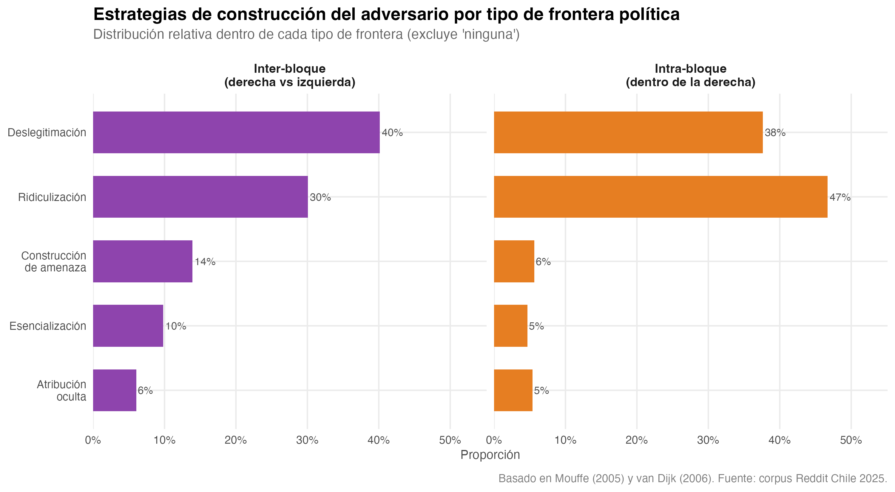
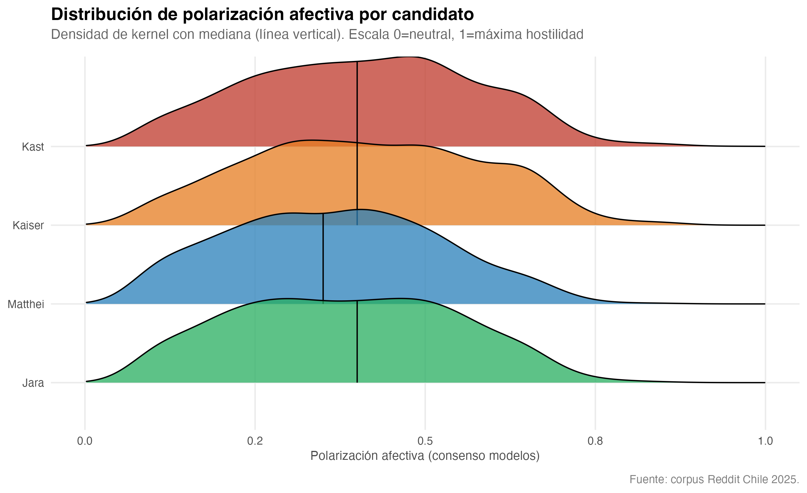
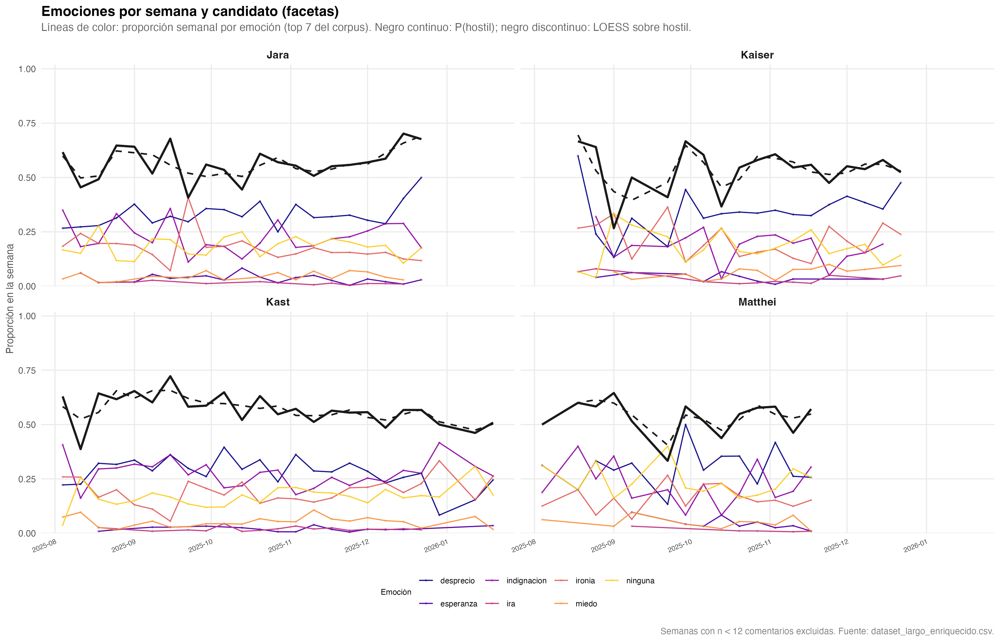
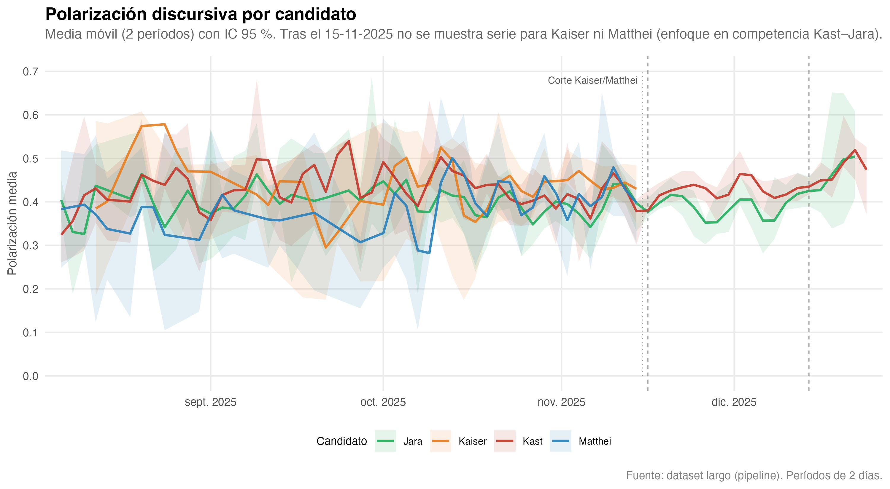

```{r setup-exploracion, include=FALSE}
knitr::opts_chunk$set(
  echo = FALSE,
  warning = FALSE,
  message = FALSE,
  cache = FALSE,
  fig.width = 10,
  fig.height = 6,
  fig.align = "center"
)
base_out <- "fig_thesis"
base_dir <- normalizePath(file.path(base_out, ".."), winslash = "/", mustWork = FALSE)
repo_root <- normalizePath(file.path(base_dir, "..", ".."), winslash = "/", mustWork = FALSE)
base_ml <- file.path(repo_root, "outputs_ml")
img_dir <- "images"
```

Este capítulo ofrece una vista exploratoria del corpus antes del modelado formal. El objetivo no es anticipar los resultados del análisis supervisado, sino identificar patrones descriptivos que orienten las decisiones de modelado y contextualicen los hallazgos posteriores.

## Volumen de comentarios por candidato

La @fig-count-facet-cand revela una asimetría marcada en la atención discursiva. Kast concentra el mayor volumen de menciones durante todo el período (62.8% del corpus), seguido por Jara (38.9%), mientras que Kaiser (16.2%) y Matthei (10.0%) ocupan posiciones considerablemente menores. El volumen de menciones de Jara se incrementa hacia el final del ciclo — coincidiendo con su paso a segunda vuelta —, mientras que Kaiser y Matthei declinan tras quedar fuera de la competencia. Esta distribución desbalanceada tiene una implicación metodológica directa: los indicadores agregados de polarización estarán dominados por los comentarios dirigidos a Kast y Jara, lo que se controla en el diseño del modelado del capítulo siguiente.

```{r fig-count-facet}
#| results: asis
#| echo: false
if (file.exists(file.path(base_out, "fig_count_facet_candidatos.png"))) {
  cat('{#fig-count-facet-cand fig-align="center" width="83%"}\n')
}
```


## Estrategia discursiva y frontera política


La @fig-explor-estrategia-frontera cruza estrategias de construcción del adversario con tipo de frontera política, separada por candidato. La deslegitimación y la ridiculización dominan en los cuatro candidatos, pero su distribución entre fronteras difiere: la confrontación inter-bloque (derecha vs. izquierda) concentra proporcionalmente más amenaza y esencialización — estrategias que presentan al adversario como peligro existencial —, mientras que la disputa intra-bloque (dentro de la derecha) se canaliza más a través de la ridiculización, un registro irónico y menos visceral. Esta diferenciación preliminar sugiere que la forma de la hostilidad varía según el tipo de adversario construido, una hipótesis que el capítulo 7 formaliza estadísticamente y el capítulo 8 desarrolla teóricamente.

```{r fig4-estrategia-frontera}
#| results: asis
#| echo: false
if (file.exists(file.path(base_out, "fig4_estrategia_frontera.png"))) {
  cat('{#fig-explor-estrategia-frontera fig-align="center" width="90%"}\n')
}
```


## Densidad de polarización por candidato

La @fig-explor-densidad-pol presenta la distribución de polarización condicionada al candidato comentado. Los cuatro candidatos muestran distribuciones unimodales con medianas entre 0.3 y 0.5, pero con diferencias en dispersión. Kast y Jara exhiben colas derechas más pesadas — mayor proporción de comentarios en valores altos de polarización —, mientras que Kaiser y Matthei se concentran en rangos moderados. Esta diferencia es consistente con la mayor carga adversarial que reciben los dos candidatos que disputaron la segunda vuelta. Que ninguna distribución sea bimodal sugiere que la polarización no separa el corpus en dos grupos discretos (hostiles vs. no hostiles), sino que opera como un gradiente continuo donde la mayoría de los comentarios presenta niveles intermedios de hostilidad.

```{r fig7-densidad-polarizacion}
#| results: asis
#| echo: false
if (file.exists(file.path(base_out, "fig7_densidad_polarizacion.png"))) {
  cat('{#fig-explor-densidad-pol fig-align="center" width="83%"}\n')
}
```


## Emociones en el tiempo (facetas por candidato)

La @fig-emociones-candidato-tendencia muestra la proporción semanal de emociones por candidato. La línea negra continua representa la fracción de emociones hostiles (ira, desprecio, indignación); el trazo discontinuo, un suavizado LOESS sobre esa fracción. Dos patrones merecen atención. Primero, la proporción de hostilidad se mantiene relativamente estable para los cuatro candidatos a lo largo del ciclo: no hay un escalamiento progresivo hacia la elección, sino una hostilidad de base que fluctúa en torno a un nivel constante — un primer indicio de lo que el capítulo 8 interpreta como cristalización actitudinal. Segundo, el desprecio y la indignación alternan como emociones dominantes según el candidato y la semana, lo que anticipa la relevancia de las configuraciones discursivas (combinaciones marco × emoción) por sobre las emociones aisladas.

```{r fig-emociones-candidato-tendencia}
#| results: asis
#| echo: false
p1 <- file.path(img_dir, "emociones_candidato_semanal_facet_tendencia.png")
p2 <- file.path(base_out, "emociones_candidato_semanal_facet_tendencia.png")
if (file.exists(p1)) {
  cat('{#fig-emociones-candidato-tendencia fig-align="center" width="90%"}\n')
} else if (file.exists(p2)) {
  cat('{#fig-emociones-candidato-tendencia fig-align="center" width="90%"}\n')
}
```


## Polarización en el tiempo

La @fig-explor-pol-serie presenta la serie bisegmentada de polarización media por candidato con bandas de IC 95%. Las cuatro series oscilan entre 0.3 y 0.5 sin tendencia ascendente clara hacia la elección — la polarización no se intensifica con la campaña, sino que se mantiene en un rango estable. Kast y Jara registran los niveles más altos durante la mayor parte del período, con una convergencia notable a partir de noviembre cuando la competencia se reduce a estos dos candidatos. Las bandas de confianza se estrechan en semanas de mayor volumen y se ensanchan en períodos de baja actividad, reflejando variabilidad muestral más que cambios sustantivos en la hostilidad. En conjunto, la exploración temporal refuerza una lectura de estabilidad estructural de la polarización que el capítulo 7 formaliza mediante validación cruzada.

```{r fig-explor-pol-serie}
#| results: asis
#| echo: false
pol_img <- file.path(img_dir, "serie_polarizacion_candidatos.png")
pol_ml <- file.path(base_ml, "serie_polarizacion_candidatos.png")
pol_ft <- file.path(base_out, "serie_polarizacion_candidatos.png")
if (file.exists(pol_img)) {
  cat('{#fig-explor-pol-serie fig-align="center" width="90%"}\n')
} else if (file.exists(pol_ml) || file.exists(pol_ft)) {
  src <- if (file.exists(pol_ft)) "fig_thesis/serie_polarizacion_candidatos.png" else "fig_thesis/serie_polarizacion_cada_2_dias_candidatos.png"
  cat(paste0('{#fig-explor-pol-serie fig-align="center" width="90%"}\n'))
}
```


