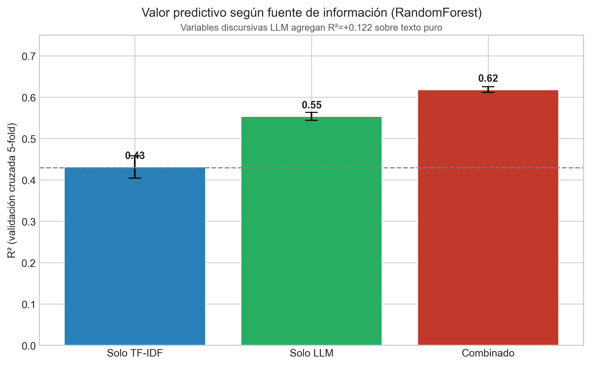
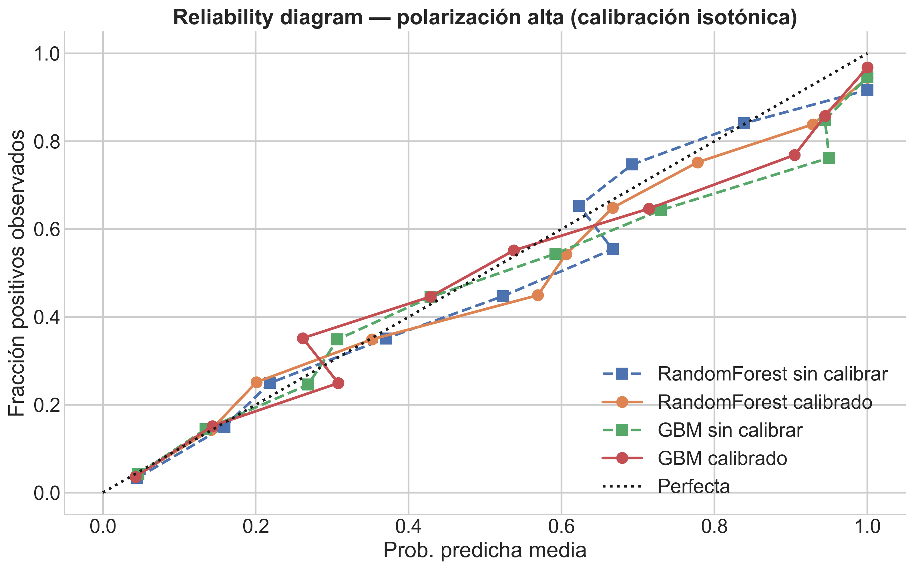
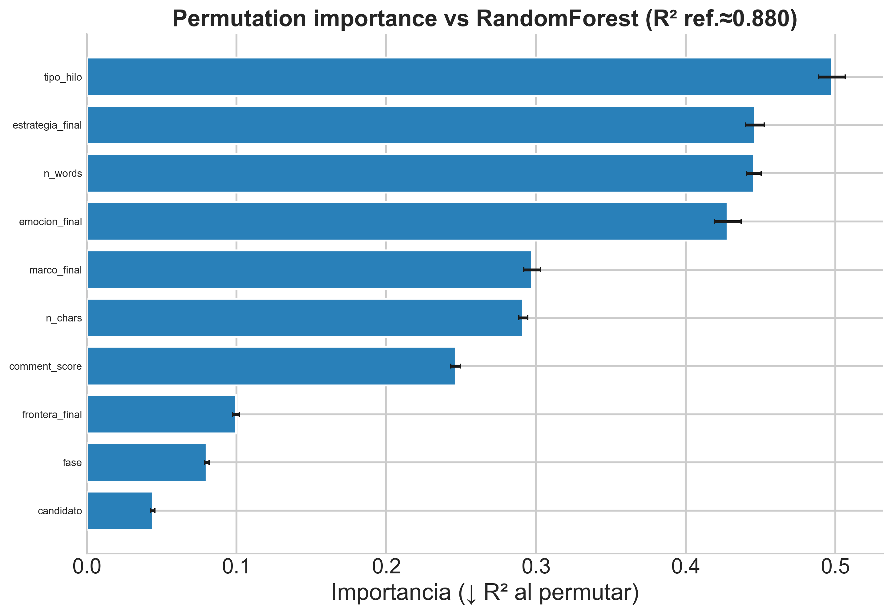
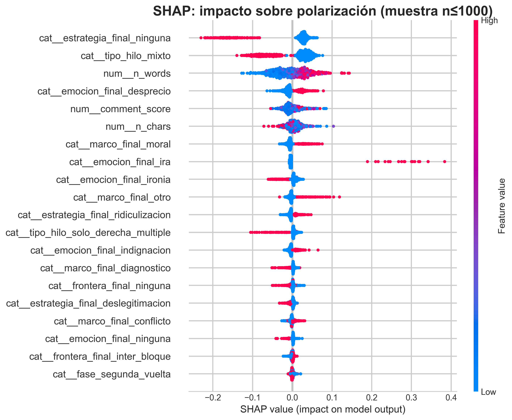
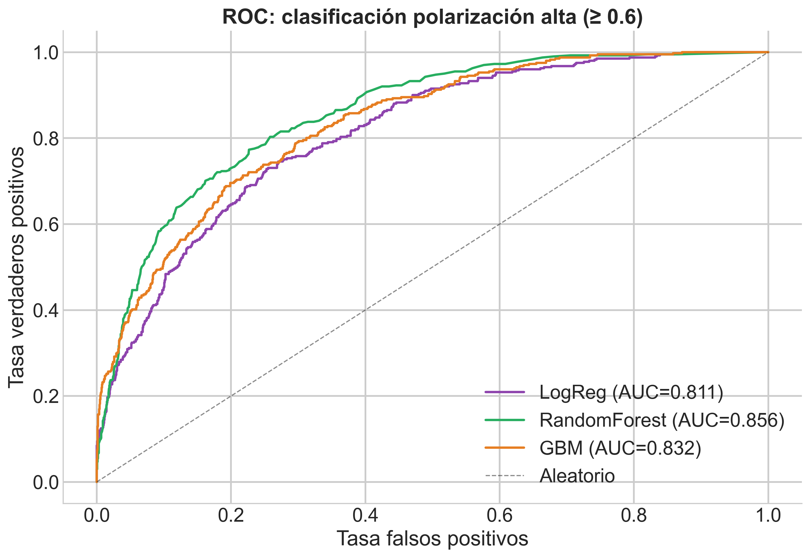

```{r setup-modelado, include=FALSE}
knitr::opts_chunk$set(
  echo = FALSE,
  warning = FALSE,
  message = FALSE,
  cache = FALSE,
  fig.width = 10,
  fig.height = 6,
  fig.align = "center"
)
base_out <- "fig_thesis"
base_dir <- normalizePath(file.path(base_out, ".."), winslash = "/", mustWork = FALSE)

.apa <- Sys.getenv("QUARTO_PROJECT_DIR", "")
if (nzchar(.apa) && file.exists(file.path(.apa, "includes", "apa_tables.R"))) {
  source(file.path(.apa, "includes", "apa_tables.R"), local = FALSE)
} else if (file.exists("includes/apa_tables.R")) {
  source("includes/apa_tables.R", local = FALSE)
} else {
  stop("Falta documents/tesis_book/includes/apa_tables.R")
}

cohen_kappa_simple <- function(x, y) {
  ok <- !is.na(x) & !is.na(y) & x != "" & y != ""
  x <- as.character(x[ok]); y <- as.character(y[ok])
  if (length(x) < 2) return(NA_real_)
  tab <- table(x, y)
  n <- sum(tab)
  po <- sum(diag(tab)) / n
  pe <- sum(rowSums(tab) * colSums(tab)) / (n^2)
  if ((1 - pe) == 0) return(NA_real_)
  (po - pe) / (1 - pe)
}

api_path <- file.path(base_dir, "data", "processed", "analisis_API_ajustado.csv")
if (!file.exists(api_path)) api_path <- file.path(base_dir, "data", "processed", "analisis_API.csv")
api_df <- read_or_empty(api_path)
```

Este capítulo traduce las dimensiones descriptivas del capítulo anterior en un ejercicio de modelado formal orientado por tres preguntas secuenciales. Primero, ¿son confiables las variables producidas por el sistema de anotación dual? Segundo, ¿qué capacidad predictiva tienen esas variables sobre la polarización discursiva? Tercero, ¿qué factores explican la intensidad de la hostilidad en los comentarios? Para responderlas, el capítulo se organiza en dos bloques: consistencia de medición, donde se evalúa el acuerdo entre anotadores, se modela el desacuerdo y se cuantifica el valor añadido de las variables LLM, y el modelado de polarización, donde se comparan estrategias de regresión y clasificación, se inspecciona la importancia de cada predictor y se identifican los perfiles discursivos que estructuran el corpus.

## Consistencia de medición

### Acuerdo entre anotadores automáticos

Antes de utilizar las variables discursivas como predictores, es necesario establecer en qué medida los dos sistemas de clasificación automática, OpenAI (OA) y DeepSeek (DS), producen resultados convergentes. Si el acuerdo entre ambos fuera sistemáticamente bajo, las variables resultantes podrían reflejar idiosincrasias del modelo más que propiedades del texto. La siguiente tabla resume el acuerdo por dimensión.


```{r tab-acuerdo-anotadores}
agreement <- data.frame()
if (nrow(api_df)) {
  agreement <- rbind(
    data.frame(
      dimension = "polarizacion",
      n = sum(!is.na(api_df$oa_polarizacion) & !is.na(api_df$ds_polarizacion)),
      metrica = "correlacion_pearson",
      valor = suppressWarnings(cor(api_df$oa_polarizacion, api_df$ds_polarizacion, use = "complete.obs")),
      acuerdo_exacto = NA_real_
    ),
    data.frame(
      dimension = "marco",
      n = sum(!is.na(api_df$oa_marco) & !is.na(api_df$ds_marco)),
      metrica = "kappa",
      valor = cohen_kappa_simple(api_df$oa_marco, api_df$ds_marco),
      acuerdo_exacto = mean(api_df$oa_marco == api_df$ds_marco, na.rm = TRUE)
    ),
    data.frame(
      dimension = "emocion",
      n = sum(!is.na(api_df$oa_emocion) & !is.na(api_df$ds_emocion)),
      metrica = "kappa",
      valor = cohen_kappa_simple(api_df$oa_emocion, api_df$ds_emocion),
      acuerdo_exacto = mean(api_df$oa_emocion == api_df$ds_emocion, na.rm = TRUE)
    ),
    data.frame(
      dimension = "estrategia",
      n = sum(!is.na(api_df$oa_estrategia) & !is.na(api_df$ds_estrategia)),
      metrica = "kappa",
      valor = cohen_kappa_simple(api_df$oa_estrategia, api_df$ds_estrategia),
      acuerdo_exacto = mean(api_df$oa_estrategia == api_df$ds_estrategia, na.rm = TRUE)
    ),
    data.frame(
      dimension = "frontera",
      n = sum(!is.na(api_df$oa_frontera) & !is.na(api_df$ds_frontera)),
      metrica = "kappa",
      valor = cohen_kappa_simple(api_df$oa_frontera, api_df$ds_frontera),
      acuerdo_exacto = mean(api_df$oa_frontera == api_df$ds_frontera, na.rm = TRUE)
    )
  )
  agreement <- round_df(agreement, 3)
  agreement$dimension <- c("Polarización", "Marco", "Emoción", "Estrategia", "Frontera")
  agreement$Valor <- ifelse(
    agreement$dimension == "Polarización",
    sprintf("r = %.3f", agreement$valor),
    sprintf("$\\kappa = %.3f$", agreement$valor)
  )
  agreement$Coincidencia <- ifelse(
    is.na(agreement$acuerdo_exacto),
    "",
    sprintf("%.3f", agreement$acuerdo_exacto)
  )
  agreement <- agreement[, c("dimension", "n", "Valor", "Coincidencia")]
  rownames(agreement) <- NULL
  names(agreement) <- c("Dim.", "N", "Est.", "Coinc.")
  kable_apa(
    agreement,
    caption = "Acuerdo entre sistemas de anotación por dimensión.",
    align = "lrrr",
    scale_down = knitr::is_latex_output()
  )
}
```

La polarización alcanza r = 0.665, lo que indica una convergencia moderada a alta entre ambos sistemas en la dimensión continua. Si bien esta correlación no es directamente comparable con estudios de acuerdo entre anotadores humanos, que operan bajo condiciones de instrucción y contexto distintas, el nivel de convergencia sugiere que ambos modelos capturan una señal compartida en la evaluación de hostilidad discursiva.

Para las dimensiones categóricas el panorama es más heterogéneo. Estrategia presenta la coincidencia bruta más alta (61.2%) pero un kappa bajo ($\kappa = 0.126$), lo cual refleja una distribución desbalanceada donde la categoría mayoritaria infla la coincidencia sin elevar el acuerdo ajustado por azar. Frontera muestra un kappa negativo ($\kappa = -0.146$), un resultado que puede parecer paradójico pero que se explica por la estructura del desacuerdo: ambos sistemas tienden a identificar los mismos comentarios como fronterizos, pero discrepan de manera sistemática sobre la dirección de esa frontera (entre bloques frente al interior del bloque), lo que genera un patrón de desacuerdo no aleatorio que el estadístico kappa penaliza con valores negativos. Marco y emoción registran los acuerdos más bajos ($\kappa = 0.136$ y $\kappa = 0.076$, respectivamente), consistente con la mayor ambigüedad inherente a estas categorías: un mismo comentario admite lecturas legítimas en más de una categoría (por ejemplo, como indignación o desprecio, o encuadrado en un marco de conflicto o diagnóstico), sin que ninguna de las dos lecturas sea incorrecta.

Estos valores de kappa no invalidan el sistema de medición, pero sí delimitan su alcance interpretativo. La estrategia adoptada en esta tesis es el desempate por consenso (v5.1), donde la etiqueta final se asigna por acuerdo entre modelos y, en caso de discrepancia, se prioriza la clasificación del modelo con mayor karma acumulado en la dimensión correspondiente. Las dimensiones con bajo acuerdo entre modelos no se descartan, sino que se incorporan con la cautela analítica que su nivel de estabilidad exige.

### Modelo de desacuerdo

Para caracterizar las condiciones bajo las cuales ambos sistemas discrepan, se entrenó un clasificador binario (acuerdo vs. desacuerdo) usando rasgos del comentario como predictores. Los resultados (Anexo A, @tbl-anexo-desacuerdo) muestran que el desacuerdo es parcialmente predecible: RandomForest alcanza un accuracy de 0.680, lo que sugiere que ciertas propiedades del texto, como la brevedad, la ambigüedad tonal o la baja densidad de marcadores explícitos, aumentan sistemáticamente la probabilidad de discrepancia entre los anotadores automáticos.

### Valor añadido de las variables discursivas

La tabla comparativa de configuraciones (solo TF-IDF, solo variables LLM, combinado) figura en el Anexo A (@tbl-anexo-config-features). La @fig-r2-configuraciones sintetiza el resultado principal.

{#fig-r2-configuraciones
fig-align="center" width="76%"}


Este resultado constituye el argumento técnico central del capítulo. Si las variables LLM fueran redundantes respecto del texto crudo, el bloque discursivo no debería superar al TF-IDF. Sin embargo, las variables LLM por sí solas alcanzan un $R^2$ superior (0.554 vs. 0.432), y en combinación con TF-IDF el rendimiento sube a $R^2 = 0.618$, es decir, un incremento de +0.187 sobre el texto puro. Esto sugiere que el sistema no solo recodifica la información ya presente en el texto, sino que recupera estructura discursiva adicional que las representaciones de bolsa de palabras no capturan.

### Calibración de probabilidades

El diagrama de fiabilidad (@fig-reliability) muestra que tanto RandomForest como GBM se aproximan a la diagonal de calibración perfecta. RandomForest sin calibrar ya presenta un ajuste razonable, mientras que GBM mejora marginalmente en el rango medio tras la corrección isotónica. Esto confirma que el pipeline produce probabilidades suficientemente confiables sin requerir un procesamiento posterior fuerte. Las métricas numéricas (Brier, log loss) se detallan en el Anexo A (@tbl-anexo-calibracion).

```{r fig-reliability}
#| results: asis
#| echo: false
if (file.exists(file.path(base_out, "reliability_diagram_calibracion.png"))) {
  cat('{#fig-reliability fig-align="center" width="74%"}\n')
}
```

Establecida esta base de consistencia y valor añadido, la siguiente sección examina hasta qué punto estas variables permiten modelar la polarización de manera robusta fuera de muestra.

## Modelado de polarización

### Evolución temporal (calendario electoral)

El núcleo interpretativo combina **dos lecturas complementarias** sobre el mismo corpus: la trayectoria del **tono negativo** hacia los dos candidatos de la segunda vuelta (Jara y Kast) y la trayectoria de la **polarización discursiva** (consenso entre anotadores) tanto en esa comparación diaria como en la serie bisegmentada por candidato. Las figuras se recortan al calendario de la tesis (tres bloques de campaña: posicionamiento, primera vuelta, segunda vuelta), incluyen **referencias de elección** (primera y segunda vuelta) y **cierran el 24 de diciembre**, de modo que el postelectoral inmediato quede visible sin extender la ventana más allá de ese corte.


### Comparación de modelos y estabilidad fuera de muestra

La @tbl-cv-regresion compara cuatro estrategias de regresión evaluadas
mediante validación cruzada de cinco pliegues. RandomForest obtiene el
mejor desempeño ($R^2 = 0.619$, MAE = 0.084) con la menor variabilidad
entre folds, lo que indica que la señal capturada es estable y no
artefacto de una partición particular. Ridge ofrece un ajuste
competitivo pero inferior, mientras que GBM muestra mayor inestabilidad
(sd = 0.011). El ensamble por stacking eleva el techo predictivo a $R^2 =
0.646$; no obstante, se adopta RandomForest como modelo de referencia
para el resto del capítulo por su combinación de rendimiento,
estabilidad e interpretabilidad.

```{r tbl-cv-regresion}
cv <- read_or_empty(file.path(base_out, "validacion_cruzada_resumen.csv"))
stack <- read_or_empty(file.path(base_out, "resultados_stacking.csv"))
if (nrow(cv)) {
  reg <- cv[cv$tarea == "regresión polarización", ]
  reg_w <- reshape(
    reg[, c("modelo", "metrica", "mean", "std")],
    idvar = "modelo",
    timevar = "metrica",
    direction = "wide"
  )
  names(reg_w) <- gsub("mean\\.", "", names(reg_w))
  names(reg_w) <- gsub("std\\.", "sd_", names(reg_w))
  reg_w$MAE_CV <- sprintf("%.3f ± %.3f", reg_w$MAE, reg_w$sd_MAE)
  reg_w$R2_CV  <- sprintf("%.3f ± %.3f", reg_w$R2, reg_w$sd_R2)
  reg_w <- reg_w[, c("modelo", "MAE_CV", "R2_CV")]
  if (nrow(stack)) {
    st <- stack[stack$tarea == "regresión" & stack$modelo == "Stacking", ]
    if (nrow(st)) {
      reg_w <- rbind(reg_w, data.frame(modelo = "Stacking", MAE_CV = "", R2_CV = round(st$valor[1], 3)))
    }
  }
  names(reg_w) <- c("Modelo", "MAE (CV)", "R$^2$ (CV)")
  kable_apa(
    reg_w,
    caption = "Modelos de regresión para polarización.",
    scale_down = knitr::is_latex_output()
  )
}
```

### OLS interpretable

El OLS no compite con RandomForest en capacidad predictiva, pero cumple una función complementaria de interpretabilidad: permite inspeccionar la dirección y magnitud de cada efecto. La tabla de los 15 coeficientes significativos de mayor magnitud y el coefplot figuran en el Anexo A (@tbl-anexo-ols-polarizacion y @fig-anexo-coefplot-ols).

El resultado más relevante es la jerarquía de efectos. La ira domina el modelo ($\beta = 0.369$), seguida por las estrategias adversariales (ridiculización, amenaza, esencialización y deslegitimación), todas con coeficientes positivos entre 0.12 y 0.17. El candidato como target, en cambio, no aparece entre los 15 predictores más fuertes: su efecto es estadísticamente nulo ($\beta \approx 0$, $p = 0.818$). Esto sugiere que la hostilidad se explica por el *cómo* del discurso (qué emoción lo sostiene, qué estrategia lo articula, en qué tipo de hilo ocurre) y no por el *quién* es atacado. Se trata de un resultado con implicaciones teóricas directas para la discusión sobre polarización afectiva, que se desarrolla en el capítulo siguiente.


### Importancia por permutación y explicación local

La @fig-perm confirma desde una perspectiva no paramétrica lo que el OLS sugiere. El tipo de hilo es la variable con mayor importancia (caída de $R^2 \approx 0.50$ al permutarla), seguida por estrategia, número de palabras y emoción, todas con caídas superiores a 0.40. El candidato, en cambio, ocupa el último lugar con una caída marginal ($\approx 0.04$), lo que refuerza la interpretación de que el target del ataque resulta prácticamente irrelevante para explicar la intensidad de la polarización. Notablemente, rasgos textuales brutos como el largo del comentario (n_words, n_chars) ocupan posiciones altas, lo que contribuye a explicar por qué el modelo combinado supera al puramente discursivo: la extensión del texto captura información que las etiquetas categóricas no recogen.


```{r fig-perm}
#| results: asis
#| echo: false
if (file.exists(file.path(base_out, "permutation_importance_polarizacion.png"))) {
  cat('{#fig-perm fig-align="center" width="74%"}\n')
}
```

```{r fig-shap}
#| results: asis
#| eval: false
#| echo: false
if (file.exists(file.path(base_out, "shap_summary_polarizacion.png"))) {
  cat('{#fig-shap fig-align="center" width="74%"}\n')
}
```

### Clasificación de polarización alta

Para complementar el análisis de regresión, se discretizó la polarización en un problema binario (umbral $\geq 0.6$) y se evaluaron tres clasificadores. Las curvas ROC (@fig-roc) muestran que todos superan ampliamente la línea aleatoria, con AUCs entre 0.811 (LogReg) y 0.856 (RandomForest). Que un modelo lineal alcance un AUC de 0.81 indica que buena parte de la señal de hostilidad es linealmente separable: las emociones y estrategias adversariales, por sí solas, trazan una frontera razonable entre comentarios de alta y baja polarización. El incremento adicional de RandomForest (+0.045) sugiere que existen interacciones no aditivas entre variables discursivas; por ejemplo, la combinación de ira con ridiculización en hilos mixtos podría producir niveles de polarización que no se explican por la suma de sus efectos individuales. GBM queda en una posición intermedia (AUC = 0.832), consistente con su menor estabilidad observada en la regresión. En conjunto, estos resultados indican que la polarización alta es un fenómeno clasificable con precisión moderada a alta, pero cuya estructura heterogénea se beneficia de modelos capaces de capturar no linealidades. Los valores AUC por modelo se detallan en el Anexo A (@tbl-anexo-auc).


```{r fig-roc}
#| results: asis
#| echo: false
if (file.exists(file.path(base_out, "roc_curves_polarizacion_alta.png"))) {
  cat('{#fig-roc fig-align="center" width="74%"}\n')
}
```


### Estrategia, frontera, perfiles y errores

Las tablas completas de clasificación multiclase de estrategia (@tbl-anexo-estrategia-resumen y @tbl-anexo-estrategia-clases), frontera política (@tbl-anexo-frontera-resumen y @tbl-anexo-frontera-clases), perfiles K-means (@tbl-anexo-perfiles-kmeans) y análisis de errores (@tbl-anexo-errores-sistematicos) se detallan en el Anexo A. Aquí se sintetizan los tres resultados principales.

Primero, estos resultados indican que la frontera política es parcialmente recuperable desde texto corto y ruidoso ($\mbox{F1-macro} = 0.725$ en el mejor modelo), lo que sugiere que el concepto teórico de Mouffe [@mouffe2005OnThePolitical] deja una huella textual detectable, aunque con las limitaciones propias de un corpus informal y no curado.

Segundo, los perfiles K-means (K = 3) revelan que la hostilidad no se distribuye como un continuo homogéneo, sino que se organiza en configuraciones discursivas diferenciadas: el cluster 0 agrupa comentarios de baja polarización con marcos diagnósticos y sin estrategia adversarial; el cluster 1 combina deslegitimación con desprecio en hilos sobre Jara; y el cluster 2 concentra ridiculización con desprecio dirigida a Kast.

Tercero, el análisis de errores muestra que los falsos negativos presentan polarización real alta (0.685) pero textos más breves que los verdaderos positivos, delimitando las condiciones bajo las cuales el pipeline pierde sensibilidad: comentarios hostiles pero concisos, donde la señal discursiva es insuficiente para superar el umbral de clasificación.