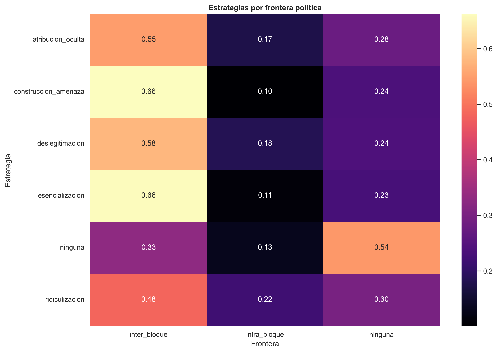
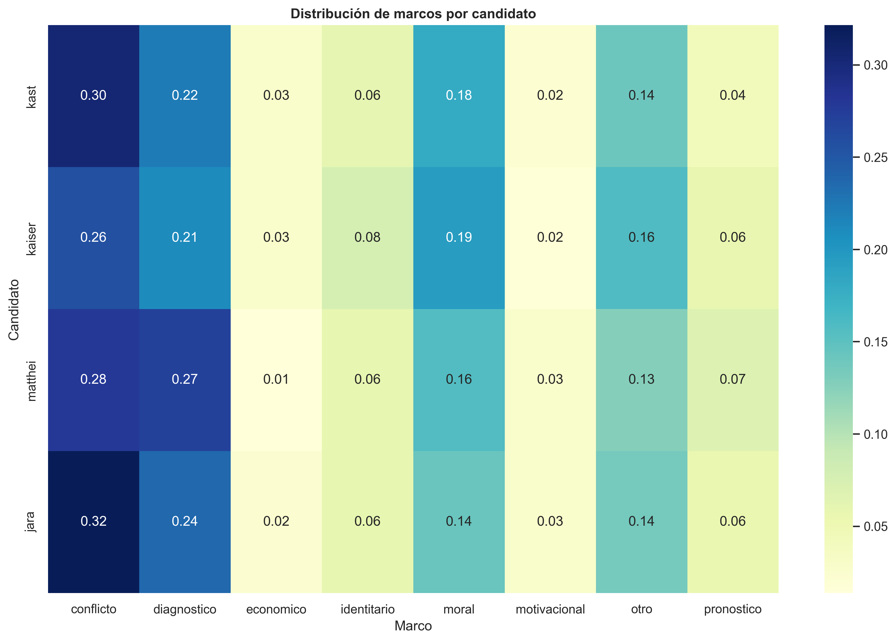
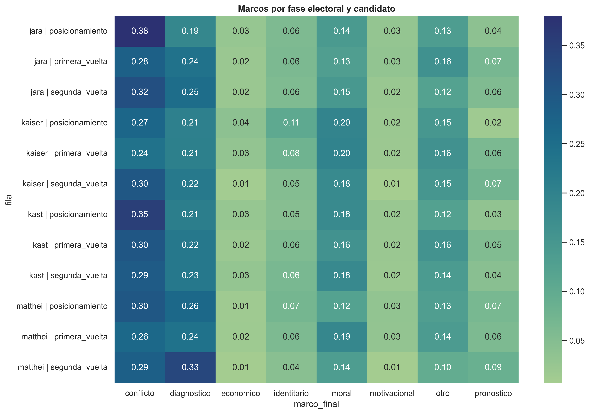

```{r setup-interpretacion, include=FALSE}
knitr::opts_chunk$set(
  echo = FALSE,
  warning = FALSE,
  message = FALSE,
  cache = FALSE,
  fig.width = 10,
  fig.height = 6,
  fig.align = "center"
)
base_out <- "fig_thesis"

.apa <- Sys.getenv("QUARTO_PROJECT_DIR", "")
if (nzchar(.apa) && file.exists(file.path(.apa, "includes", "apa_tables.R"))) {
  source(file.path(.apa, "includes", "apa_tables.R"), local = FALSE)
} else if (file.exists("includes/apa_tables.R")) {
  source("includes/apa_tables.R", local = FALSE)
} else {
  stop("Falta documents/tesis_book/includes/apa_tables.R")
}
```

Este capítulo toma el output del pipeline ya validado y lo traduce en
una pregunta sustantiva: **cómo se reconfigura el antagonismo político
en la conversación digital de derechas**. En esta sección el objetivo no
es volver a demostrar que el modelo predice bien, sino mostrar **qué
estructura discursiva revela** cuando se observan marcos, emociones,
estrategias, fronteras, temporalidad y espacios semánticos.

## Reconfiguración del antagonismo: estrategias, marcos y fronteras

### Estrategias por candidato

La distribución de estrategias por frontera política
(@tbl-estrategia-frontera y @fig-estrategia-frontera) revela un patrón
que merece atención: la lógica del antagonismo no se distribuye
homogéneamente. Las estrategias de mayor carga adversarial —
construcción de amenaza (66.3% inter-bloque) y esencialización (66.0%) —
se concentran abrumadoramente en la confrontación entre bloques
ideológicos, mientras que la ridiculización presenta una distribución
más equilibrada (48.3% inter, 21.9% intra). Esto sugiere que la
hostilidad no opera como un fenómeno unitario: su forma cambia según la
arquitectura del adversario que el comentario construye. Cuando el
enemigo es externo al bloque, se recurre a estrategias que lo presentan
como amenaza esencial; cuando la disputa es interna, predomina un
registro más irónico y deslegitimador.

```{r fig-estrategias-candidato}
#| results: asis
#| echo: false
if (file.exists(file.path(base_out, "distribucion_estrategias_candidato.png"))) {
  cat('{#fig-estrategias-candidato fig-align="center" width="82%"}\n')
}
```

```{r tbl-estrategia-frontera}
ef <- read_or_empty(file.path(base_out, "estrategia_por_frontera.csv"))
if (nrow(ef)) {
  ef <- data.frame(
    Estrategia = c(
      "Atribución oculta",
      "Construcción de amenaza",
      "Deslegitimación",
      "Esencialización",
      "Ninguna",
      "Ridiculización"
    ),
    Inter = c(0.548, 0.663, 0.578, 0.660, 0.329, 0.483),
    Intra = c(0.175, 0.101, 0.183, 0.111, 0.130, 0.219),
    `Sin frontera` = c(0.277, 0.236, 0.239, 0.229, 0.540, 0.298)
  )
  kable_apa(
    ef,
    caption = "Distribución de estrategias discursivas según tipo de frontera política.",
    note = NULL,
    align = "lrrr",
    landscape = FALSE,
    scale_down = FALSE
  )
}
```

```{r fig-estrategia-frontera}
#| results: asis
#| echo: false
if (file.exists(file.path(base_out, "estrategia_por_frontera.png"))) {
  cat('{#fig-estrategia-frontera fig-align="center" width="82%"}\n')
}
```

### Marcos por candidato y por fase

Los contrastes de independencia marco × fase por candidato
(chi-cuadrado, *p*, V de Cramér) figuran en el Anexo A
(@tbl-anexo-marcos-fase-candidato).

```{r fig-marcos-candidato}
#| results: asis
#| echo: false
if (file.exists(file.path(base_out, "distribucion_marcos_candidato.png"))) {
  cat('{#fig-marcos-candidato fig-align="center" width="82%"}\n')
}
```

```{r fig-marcos-fase}
#| results: asis
#| echo: false
if (file.exists(file.path(base_out, "marcos_por_fase_candidato.png"))) {
  cat('{#fig-marcos-fase fig-align="center" width="82%"}\n')
}
```

El repertorio de marcos no es estable entre candidatos ni entre fases
electorales. La @fig-marcos-candidato muestra que cada candidato activa
un perfil temático diferenciado, mientras que la @fig-marcos-fase revela
desplazamientos temporales en el encuadre dominante. Esta heterogeneidad
sugiere que la polarización no se activa sobre un único relato, sino
sobre una combinación variable de conflicto, identidad, moralidad y
diagnóstico coyuntural. El antagonismo, en este sentido, no es solo una
cuestión de intensidad emocional: también involucra una disputa por el
encuadre del problema, consistente con la tradición de *framing*
político que se discutió en el marco teórico.

## Combinaciones discursivas y dinámica temporal

### Marco × emoción

Las combinaciones entre marco y emoción (@tbl-marco-emocion-top y
@fig-marco-emocion) permiten ir más allá de las distribuciones
marginales y observar cómo se acoplan ambas dimensiones. No toda emoción
hostil se acopla del mismo modo al conflicto. Las combinaciones más
frecuentes — conflicto + desprecio (n = 945) y diagnóstico + indignación
(n = 844) — presentan niveles de polarización moderados (0.46 y 0.43
respectivamente). En cambio, combinaciones menos frecuentes como moral +
desprecio (n = 702, pol. = 0.541) y otro + desprecio (n = 528, pol. =
0.544) empujan la polarización a niveles notablemente más altos. Este
patrón sugiere que el desprecio acoplado a marcos morales constituye una
configuración discursiva particularmente hostil, más que el conflicto
explícito por sí solo.

```{r tbl-marco-emocion-top}
me <- read_or_empty(file.path(base_out, "combinaciones_marco_emocion.csv"))
if (nrow(me)) {
  top_me <- data.frame(
    Marco = c(
      "Conflicto",
      "Diagnóstico",
      "Conflicto",
      "Conflicto",
      "Moral",
      "Moral",
      "Diagnóstico",
      "Otro",
      "Diagnóstico",
      "Otro"
    ),
    Emoción = c(
      "Desprecio",
      "Indignación",
      "Indignación",
      "Ironía",
      "Desprecio",
      "Indignación",
      "Desprecio",
      "Desprecio",
      "Ninguna",
      "Ninguna"
    ),
    n = c(945, 844, 758, 724, 702, 627, 591, 528, 463, 435),
    Prop. = c(0.092, 0.082, 0.074, 0.071, 0.069, 0.061, 0.058, 0.052, 0.045, 0.042),
    `Pol. med.` = c(0.463, 0.430, 0.448, 0.386, 0.541, 0.503, 0.438, 0.544, 0.261, 0.296)
  )
  kable_apa(
    top_me,
    caption = "Diez combinaciones marco × emoción más frecuentes en el corpus.",
    note = NULL,
    align = "llrrr",
    landscape = FALSE,
    scale_down = FALSE
  )
}
```

```{r fig-marco-emocion}
#| results: asis
#| echo: false
if (file.exists(file.path(base_out, "combinaciones_marco_emocion.png"))) {
  cat('{#fig-marco-emocion fig-align="center" width="82%"}\n')
}
```

### Estrategias en el tiempo

La serie temporal de estrategias (@fig-estrategias-temporal) permite
observar si la arquitectura del adversario cambia en momentos
electorales clave. La deslegitimación se mantiene como la estrategia más
estable durante todo el ciclo, lo que sugiere un repertorio adversarial
de base que no responde a la coyuntura. La ridiculización, en cambio,
presenta mayor variabilidad y un peak notable antes de primera vuelta,
consistente con un uso más reactivo y oportunista vinculado a la
dinámica de campaña. En este punto interesa menos la fluctuación semanal
y más la dirección general: la estructura adversarial del debate se
mantiene fundamentalmente estable, con ajustes tácticos más que
transformaciones de fondo.

{#fig-estrategias-temporal
fig-align="center" width="100%"}

## Autores, persistencia y estructura del conflicto

### Persistencia de negatividad hacia Kast

El análisis de autores introduce una dimensión que los modelos de texto
no capturan: la estabilidad temporal de las posiciones individuales. De
los 215 autores inicialmente negativos hacia Kast, 188 (87.4%) mantienen
esa posición a lo largo de todo el ciclo electoral. Solo 6 transitan
hacia un tono positivo (2.8%) y 21 hacia neutralidad (9.8%). Este nivel
de persistencia indica cristalización actitudinal más que escalamiento
reactivo: la negatividad hacia Kast no se construye progresivamente
durante la campaña, sino que se presenta como una disposición previa que
el ciclo electoral refuerza pero no origina. La tabla con la distribución
porcentual completa figura en el Anexo A (@tbl-anexo-kast-transiciones).

### Cruces de tono entre candidatos (posicionamiento → segunda vuelta hacia Kast o Jara)

En la segunda vuelta solo compiten **Kast** y **Jara**; el destino del cruce
es siempre el tono hacia uno de esos dos en esa fase. Se utiliza la misma
agregación por autor que en el resto del capítulo (`scripts/analisis/08_transiciones_sentimiento_derecha_jara.py`):
tono en posicionamiento hacia el candidato **de origen** del par y tono en
segunda vuelta hacia el candidato **de destino**, entre autores con actividad
en ambas fases respecto a ambos. La @tbl-cruce-sentimiento-pares-sv **excluye
el tono neutro** en origen y en destino y **renormaliza** los porcentajes
dentro de cada bloque (solo positivo y negativo restantes), de modo que la
lectura se centre en polaridad clara sin diluir con neutralidad. La tabla
completa de cruces con **grupos emocionales** (mismo criterio: exclusión de
«sin emoción» y porcentajes renormalizados) está en el Anexo A
(@tbl-anexo-cruce-emocion-sin-se-pares-sv).

La @fig-alluvial-emocion-sv resume en formato **diagrama de flujo** los mismos
cruces que la @tbl-anexo-cruce-emocion-sin-se-pares-sv (grupos emocionales, sin
«sin emoción»; renormalización en la tabla; aquí el área es proporcional al
número de autores y, por grupo a la izquierda, las franjas suman el total de
autores con ese grupo hacia el candidato de origen al agregar Kast y Jara como
destinos de segunda vuelta).

```{r fig-alluvial-emocion-sv}
#| results: asis
#| echo: false
if (file.exists(file.path(base_out, "alluvial_emocion_segunda_vuelta_por_candidato_origen_sin_sin_emocion.png"))) {
  cat('{#fig-alluvial-emocion-sv fig-align="center" width="92%"}\n')
}
```


Con este corte (sin neutro), el patrón es claro. **Origen negativo:** hacia
Kast, la mayoría de los autores que en posicionamiento eran negativos hacia
Jara, Kaiser o Matthei permanece en negativo hacia Kast (p. ej. Jara → Kast
97 % negativo frente a 3 % positivo hacia Kast entre los no neutros). Hacia
Jara, quienes eran negativos hacia Kaiser o Matthei también concentran el
negativo hacia Jara (con frecuencias del orden de 86–100 % en los parciales
observados); hacia Kast negativos en posicionamiento, el flujo Kast → Jara
muestra aún **algo de positividad** hacia Jara (cerca de 8 % en la muestra),
algo más que en los cruces hacia Kast. **Origen positivo:** en todos los pares
donde hay autores positivos hacia el candidato de origen y destino en {Kast,
Jara}, el tono hacia el **destino** en segunda vuelta es **negativo** en el
100 % de los casos (Jara → Kast, Kaiser → Jara, Kaiser → Kast, Kast → Jara,
Matthei → Jara, Matthei → Kast). Es decir, la positividad hacia un candidato
del bloque **no se transfiere** al adversario de la segunda vuelta: al cambiar
el *target* discursivo, el registro se recompone en rechazo, en línea con una
polarización ligada al **marco** del duelo más que a trayectorias individuales
estables de simpatía.

La @fig-alluvial-cruces-sv resume en formato **Sankey** los mismos cruces
(sentimiento por autor-fase; datos en `cruce_posicionamiento_segunda_vuelta_pares_candidatos.csv`),
con un panel por **candidato de origen** (Kaiser, Matthei, Jara, Kast): a la
izquierda el tono en posicionamiento hacia ese candidato y a la derecha el tono
hacia Kast o Jara en segunda vuelta; el grosor del flujo es el **porcentaje** del
total de autores con ese tono hacia el candidato de origen (los enlaces que salen
de un mismo nodo izquierdo suman 100 %).

### Actividad de autores y polarización

La lectura de autores permite evaluar si la hostilidad está concentrada
en hiperactivos o distribuida en la masa de usuarios. Este punto es
teóricamente relevante porque distingue una polarización sostenida por
pocos actores intensivos de una polarización más difusa y ambiental.

La hostilidad discursiva en Reddit Chile durante la campaña presidencial
de 2025 no está concentrada en un pequeño grupo de usuarios
hiperactivos. Los autores clasificados como hiperactivos (más de 20
comentarios) presentan una polarización media similar a la de los
usuarios esporádicos, con una tendencia levemente decreciente a medida
que aumenta el número de comentarios, visible en la línea LOESS de la
Figura 8.9. Esto sugiere que la hostilidad tiene carácter ambiental y
difuso: no es producto de trolls coordinados sino de una cultura
discursiva generalizada donde la crítica hostil es el modo dominante de
participación política. Como resume la @tbl-anexo-kast-transiciones, la gran
mayoría de quienes partieron negativos **permanece** en negativo; solo
una minoría pasa a tono positivo o neutro, lo que sugiere cristalización
actitudinal más que escalamiento reactivo.


```{r fig-autores-violin}
#| results: asis
#| echo: false
if (file.exists(file.path(base_out, "polarizacion_por_tipo_autor.png"))) {
  cat('{#fig-autores-violin fig-align="center" width="82%"}\n')
}
```

```{r fig-autores-scatter}
#| results: asis
#| echo: false
if (file.exists(file.path(base_out, "scatter_actividad_polarizacion_autores.png"))) {
  cat('{#fig-autores-scatter fig-align="center" width="82%"}\n')
}
```


## Espacios semánticos acoplados

El atlas (@fig-3d-atlas-global-v1) ofrece una prueba visual de
convergencia con los hallazgos estadísticos de los capítulos anteriores,
pero también permite una lectura teórica que las tablas por sí solas no
facilitan.

El panel de candidatos (superior derecho) muestra una superposición casi
completa de los cuatro colores en el espacio semántico: no existen
regiones exclusivas de Kast, Jara, Kaiser o Matthei. Desde la
perspectiva de Mouffe, esto sugiere que la frontera política no se traza
*entre* vocabularios diferenciados por candidato, sino *a través* de un
repertorio léxico compartido. Los mismos recursos discursivos — las
mismas palabras, las mismas estructuras argumentativas — se despliegan
contra distintos adversarios, lo que refuerza la interpretación de que
la polarización es una propiedad del discurso, no del target.

El panel de emociones (inferior derecho), en cambio, sí presenta
agrupaciones parciales reconocibles. La ira y el desprecio tienden a
ocupar zonas distintas del espacio, lo que indica que estas emociones se
vehiculizan a través de vocabularios diferenciados. Este contraste con
el panel de candidatos es teóricamente significativo: la dimensión
emocional organiza el espacio discursivo con mayor poder que la
dimensión política del adversario, consistente con la literatura sobre
polarización afectiva que enfatiza el componente emocional por sobre el
ideológico (Iyengar, 2019).

El panel de polarización (inferior izquierdo) completa la lectura. La
hostilidad no se concentra en un cluster específico, sino que se
distribuye de manera difusa a lo largo de todo el espacio, con
gradientes que atraviesan temas y candidatos por igual. Esta dispersión
espacial constituye la representación geométrica del hallazgo más
robusto de la tesis: la hostilidad es ambiental, no focalizada;
estructural, no episódica.

::: column-page
```{r fig-3d-atlas-global-v1}
#| results: asis
#| echo: false
path_atlas_global <- file.path(base_out, "3d_atlas_v1_globales.png")
if (file.exists(path_atlas_global)) {
  cat('{#fig-3d-atlas-global-v1 fig-align="center" width="100%" .column-page}\n')
} else {
  cat("_(Ejecutar `scripts/analisis/12_make_global_3d_atlas.py` para generar `3d_atlas_v1_globales.png`.)_\n")
}
```
:::


