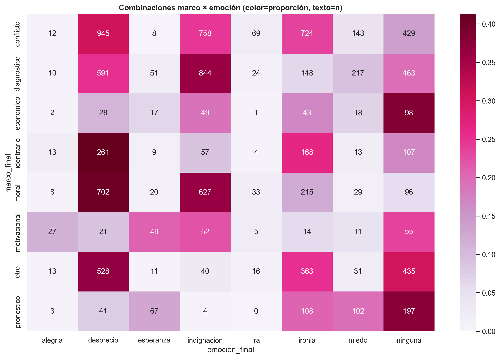
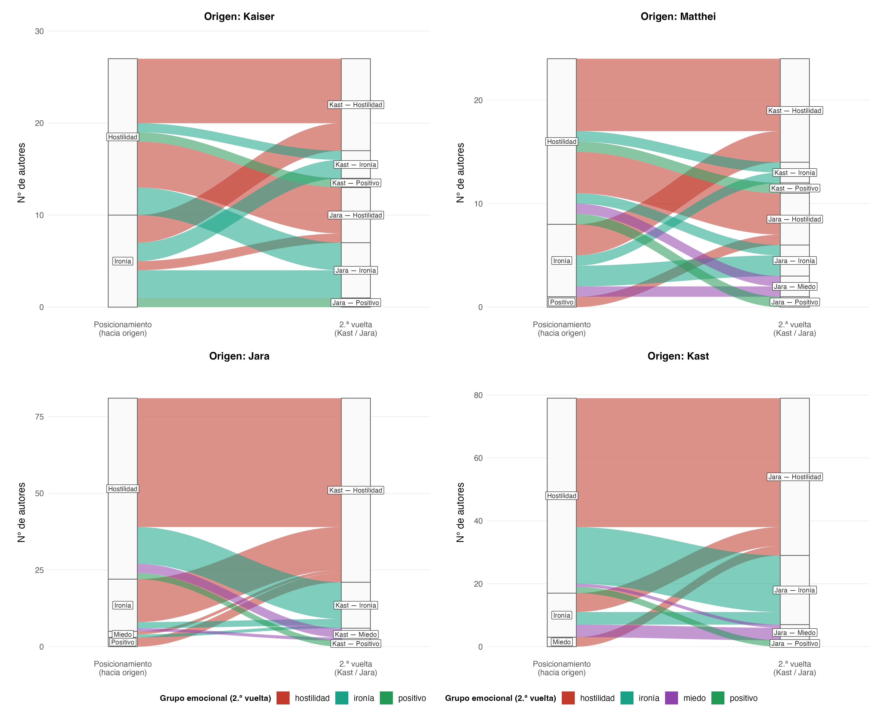
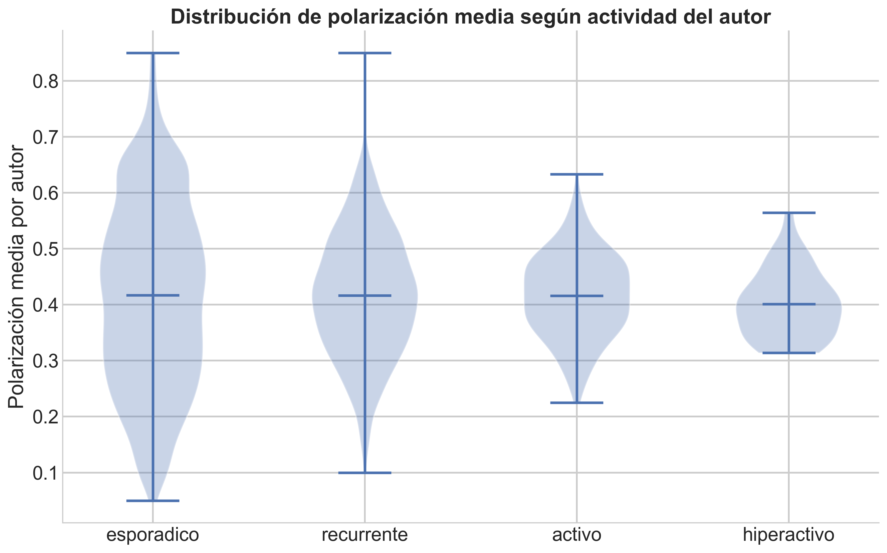
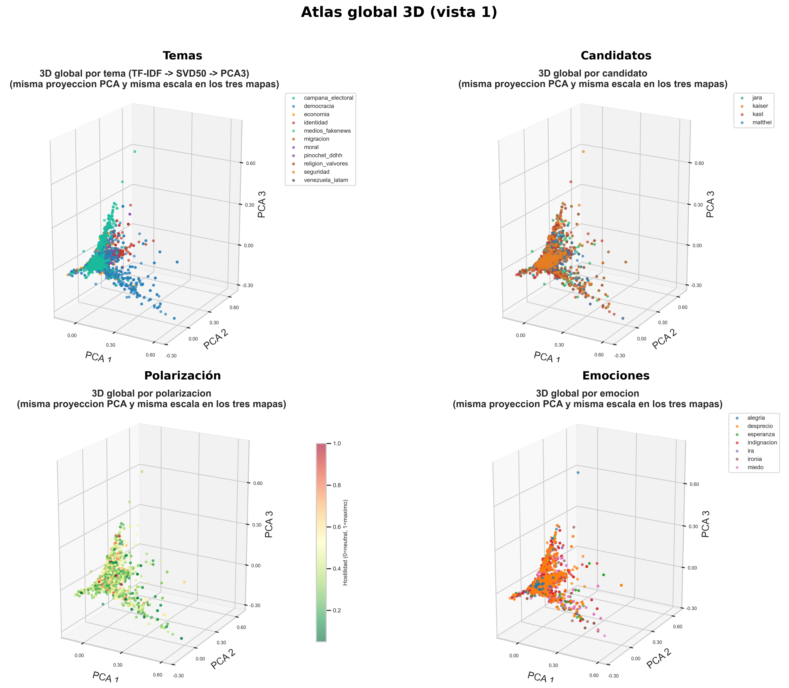

```{r setup-interpretacion, include=FALSE}
knitr::opts_chunk$set(
  echo = FALSE,
  warning = FALSE,
  message = FALSE,
  cache = FALSE,
  fig.width = 10,
  fig.height = 6,
  fig.align = "center"
)
base_out <- "fig_thesis"

.apa <- Sys.getenv("QUARTO_PROJECT_DIR", "")
if (nzchar(.apa) && file.exists(file.path(.apa, "includes", "apa_tables.R"))) {
  source(file.path(.apa, "includes", "apa_tables.R"), local = FALSE)
} else if (file.exists("includes/apa_tables.R")) {
  source("includes/apa_tables.R", local = FALSE)
} else {
  stop("Falta documents/tesis_book/includes/apa_tables.R")
}
```

## Reconfiguración del antagonismo: estrategias, marcos y fronteras

### Estrategias por candidato

En este apartado conviene distinguir dos agregaciones: la frontera
política del comentario (entre bloques, al interior del bloque o sin
frontera) y el candidato objetivo al que se dirige el mensaje. La
@tbl-estrategia-frontera cuantifica la primera: proporción de cada
estrategia discursiva según tipo de frontera. La distribución por
candidato se incluye en el Anexo A (@fig-anexo-estrategias-candidato).

Esa lectura por frontera revela un patrón que merece atención: la lógica
del antagonismo no se distribuye homogéneamente. Las estrategias de
mayor carga adversarial, esto es, construcción de amenaza (66.3% en la
frontera entre bloques) y esencialización (66.0%), se concentran
abrumadoramente en la confrontación entre bloques ideológicos, mientras
que la ridiculización presenta una distribución más equilibrada (48.3%
en la frontera entre bloques, 21.9% al interior del bloque). Esto
sugiere que la hostilidad no opera como un fenómeno unitario: su forma
cambia según la arquitectura del adversario que el comentario construye.
Cuando el enemigo es externo al bloque, se recurre a estrategias que lo
presentan como amenaza esencial; cuando la disputa es interna, predomina
un registro más irónico y deslegitimador.

```{r tbl-estrategia-frontera}
ef <- read_or_empty(file.path(base_out, "estrategia_por_frontera.csv"))
if (nrow(ef)) {
  ef <- data.frame(
    Estrategia = c(
      "Atribución oculta",
      "Construcción de amenaza",
      "Deslegitimación",
      "Esencialización",
      "Ninguna",
      "Ridiculización"
    ),
    Inter = c(0.548, 0.663, 0.578, 0.660, 0.329, 0.483),
    Intra = c(0.175, 0.101, 0.183, 0.111, 0.130, 0.219),
    `Sin frontera` = c(0.277, 0.236, 0.239, 0.229, 0.540, 0.298)
  )
  kable_apa(
    ef,
    caption = "Estrategias discursivas por tipo de frontera política.",
    align = "lrrr",
    landscape = FALSE,
    scale_down = FALSE
  )
}
```

## Combinaciones discursivas y dinámica temporal

### Marco × emoción

Las combinaciones entre marco y emoción (valores numéricos en el Anexo
A, @tbl-anexo-marco-emocion-top; visualización en @fig-marco-emocion)
permiten ir más allá de las distribuciones marginales y observar cómo se
acoplan ambas dimensiones. No toda emoción hostil se acopla del mismo
modo al conflicto. Las combinaciones más frecuentes (conflicto +
desprecio, n = 945; y diagnóstico + indignación, n = 844) presentan
niveles de polarización moderados (0.46 y 0.43 respectivamente). En
cambio, combinaciones menos frecuentes como moral + desprecio (n = 702,
pol. = 0.541) y otro + desprecio (n = 528, pol. = 0.544) empujan la
polarización a niveles notablemente más altos. Este patrón sugiere que
el desprecio acoplado a marcos morales constituye una configuración
discursiva particularmente hostil, más que el conflicto explícito por sí
solo.

```{r fig-marco-emocion}
#| results: asis
#| echo: false
if (file.exists(file.path(base_out, "combinaciones_marco_emocion.png"))) {
  cat('{#fig-marco-emocion fig-align="center" width="74%"}\n')
}
```

### Estrategias en el tiempo

La serie temporal de estrategias (@fig-estrategias-temporal) permite
observar si la arquitectura del adversario cambia en momentos
electorales clave. La deslegitimación se mantiene como la estrategia más
estable durante todo el ciclo, lo que sugiere un repertorio adversarial
de base que no responde a la coyuntura. La ridiculización, en cambio,
presenta mayor variabilidad y un peak notable antes de primera vuelta,
consistente con un uso más reactivo y oportunista vinculado a la
dinámica de campaña. En este punto interesa menos la fluctuación semanal
y más la dirección general: la estructura adversarial del debate se
mantiene fundamentalmente estable, con ajustes tácticos más que
transformaciones de fondo.

{#fig-estrategias-temporal
fig-align="center" width="90%"}

## Autores, persistencia y estructura del conflicto

### Persistencia de negatividad hacia Kast

El análisis de autores introduce una dimensión que los modelos de texto
no capturan: la estabilidad temporal de las posiciones individuales. De
los 215 autores inicialmente negativos hacia Kast, 188 (87.4%) mantienen
esa posición a lo largo de todo el ciclo electoral. Solo 6 transitan
hacia un tono positivo (2.8%) y 21 hacia neutralidad (9.8%). Este nivel
de persistencia indica cristalización actitudinal más que escalamiento
reactivo: la negatividad hacia Kast no se construye progresivamente
durante la campaña, sino que se presenta como una disposición previa que
el ciclo electoral refuerza pero no origina. La tabla con la
distribución porcentual completa figura en el Anexo A
(@tbl-anexo-kast-transiciones).

Este patrón de cristalización actitudinal es coherente con la
trayectoria de las encuestas presidenciales documentada en el capítulo
exploratorio (@fig-encuestas-presidenciales): las preferencias por Kast
se mantuvieron relativamente estables durante toda la campaña y solo se
consolidaron de forma pronunciada tras el inicio de la segunda vuelta.
La estabilidad observada en las encuestas y la estabilidad observada en
el tono de los comentarios no son fenómenos independientes; ambas
apuntan a que las posiciones hacia este candidato estaban fijadas antes
del arranque formal de la campaña.

### Cruces de tono entre candidatos (posicionamiento → segunda vuelta hacia Kast o Jara)

En la segunda vuelta solo compiten Kast y Jara, por lo que el destino
del cruce es siempre el tono hacia uno de ellos en esa fase. La tabla de
cruces de tono (sin neutro) figura en el Anexo A
(@tbl-anexo-cruce-sentimiento-pares-sv). La tabla de cruces emocionales
figura en el Anexo A (@tbl-anexo-cruce-emocion-sin-se-pares-sv). La
@fig-alluvial-emocion-sv resume los flujos en formato diagrama.

```{r fig-alluvial-emocion-sv}
#| results: asis
#| echo: false
if (file.exists(file.path(base_out, "alluvial_emocion_segunda_vuelta_por_candidato_origen_sin_sin_emocion.png"))) {
  cat('{#fig-alluvial-emocion-sv fig-align="center" width="85%"}\n')
}
```

El patrón es nítido. Los autores negativos hacia cualquier candidato en
posicionamiento permanecen negativos al transitar hacia Kast (97% en
Jara → Kast) o hacia Jara (86–100% según el par). Más revelador aún: en
todos los pares observados, los autores positivos hacia un candidato se
vuelven negativos al cambiar de target: la positividad no sobrevive al
cruce adversarial. La polarización aparece así ligada al marco del duelo
electoral más que a trayectorias individuales de simpatía.

### Actividad de autores y polarización

La lectura de autores permite evaluar si la hostilidad está concentrada
en hiperactivos o distribuida en la masa de usuarios. Este punto es
teóricamente relevante porque distingue una polarización sostenida por
pocos actores intensivos de una polarización más difusa y ambiental.

La hostilidad discursiva en Reddit Chile durante la campaña presidencial
de 2025 no está concentrada en un pequeño grupo de usuarios
hiperactivos. Los autores clasificados como hiperactivos (más de 20
comentarios) presentan una polarización media similar a la de los
usuarios esporádicos, con una tendencia levemente decreciente a medida
que aumenta el número de comentarios, visible en la línea LOESS de
@fig-anexo-autores-scatter (ubicada en el anexo). Esto sugiere que la
hostilidad tiene carácter ambiental y difuso: no es producto de trolls
coordinados sino de una cultura discursiva generalizada donde la crítica
hostil es el modo dominante de participación política. Como resume la
@tbl-anexo-kast-transiciones, la gran mayoría de quienes partieron
negativos permanece en negativo; solo una minoría pasa a tono positivo o
neutro, lo que sugiere cristalización actitudinal más que escalamiento
reactivo [@efstratiou2023NonpolarOppositesAnalyzing].

```{r fig-autores-violin}
#| results: asis
#| echo: false
if (file.exists(file.path(base_out, "polarizacion_por_tipo_autor.png"))) {
  cat('{#fig-autores-violin fig-align="center" width="74%"}\n')
}
```

## Espacios semánticos acoplados

El atlas (@fig-3d-atlas-global-v1) ofrece una lectura visual que
complementa los hallazgos estadísticos anteriores. El panel de
candidatos (superior derecho) muestra una superposición casi completa de
los cuatro colores: no existen regiones exclusivas por candidato
[@defranciscimorales2021NoEchoChambers]. Desde la perspectiva de Mouffe
[@mouffe2005OnThePolitical], esto sugiere que la frontera política no se
traza entre vocabularios diferenciados, sino a través de un repertorio
léxico compartido: la polarización es una propiedad del discurso, no del
target.

El panel de emociones (inferior derecho), en cambio, presenta
agrupaciones parciales reconocibles: la ira y el desprecio ocupan zonas
distintas del espacio, indicando que se vehiculizan a través de
vocabularios diferenciados. La dimensión emocional organiza el espacio
discursivo con mayor poder que la dimensión del adversario, consistente
con la literatura sobre polarización afectiva
[@iyengar2019OriginsConsequencesAffectivePolarization].

El panel de polarización (inferior izquierdo) completa la lectura: la
hostilidad se distribuye de manera difusa a lo largo de todo el espacio,
sin concentrarse en un cluster específico. Esta dispersión constituye la
representación geométrica del hallazgo central de la tesis: la
hostilidad es ambiental, no focalizada.

```{r fig-3d-atlas-global-v1}
#| results: asis
#| echo: false
path_atlas_global <- file.path(base_out, "3d_atlas_v1_globales.png")
if (file.exists(path_atlas_global)) {
  cat('{#fig-3d-atlas-global-v1 fig-align="center" width="81%"}\n')
} else {
  cat("_(Ejecutar `scripts/analisis/12_make_global_3d_atlas.py` para generar `3d_atlas_v1_globales.png`.)_\n")
}
```
