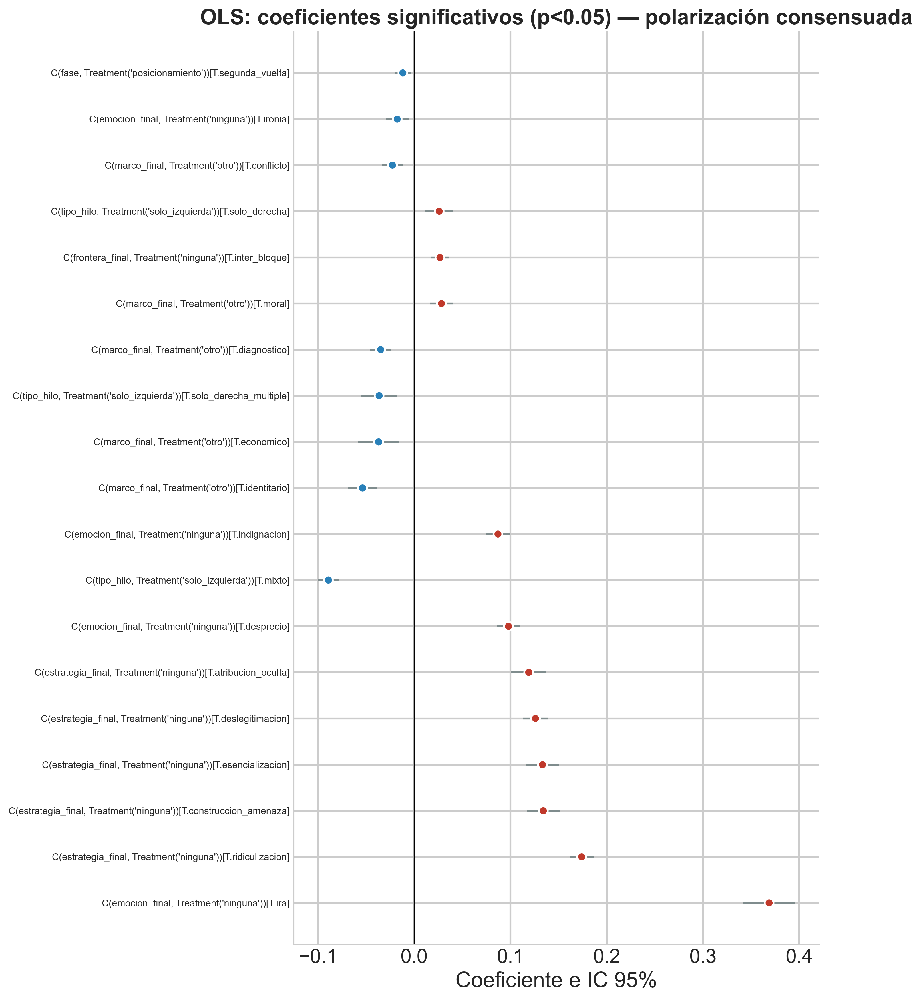
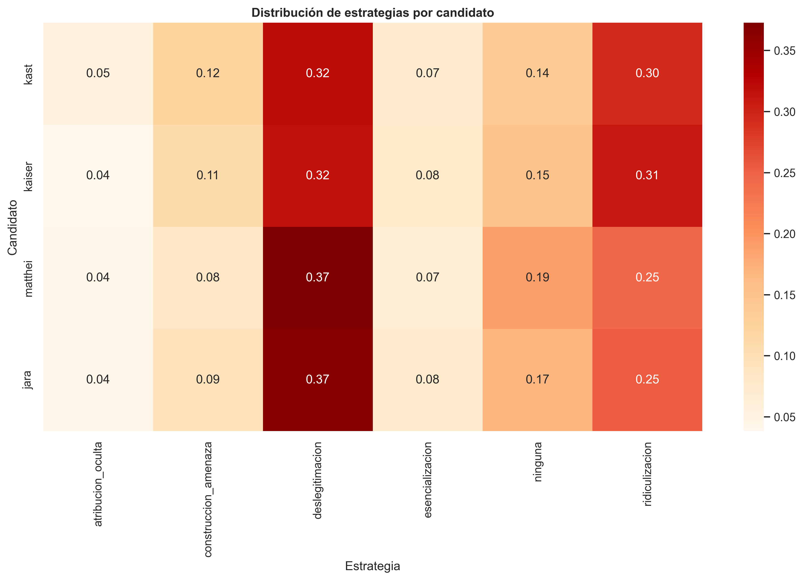
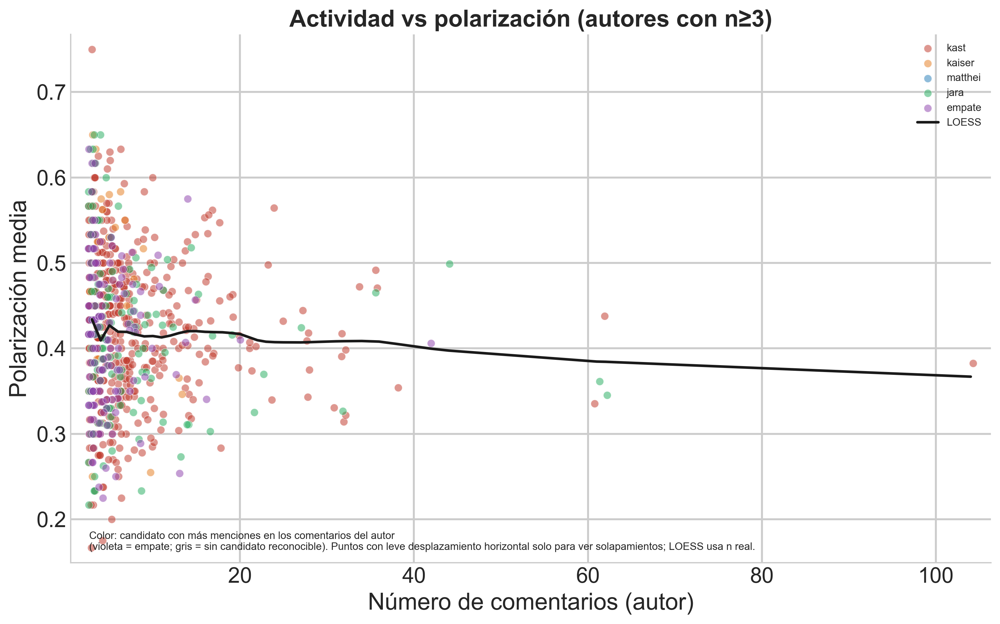

```{r setup-anexo-tablas, include=FALSE}
knitr::opts_chunk$set(
  echo = FALSE,
  warning = FALSE,
  message = FALSE,
  cache = FALSE,
  fig.width = 10,
  fig.height = 6,
  fig.align = "center"
)
base_out <- "fig_thesis"

.apa <- Sys.getenv("QUARTO_PROJECT_DIR", "")
if (nzchar(.apa) && file.exists(file.path(.apa, "includes", "apa_tables.R"))) {
  source(file.path(.apa, "includes", "apa_tables.R"), local = FALSE)
} else if (file.exists("includes/apa_tables.R")) {
  source("includes/apa_tables.R", local = FALSE)
} else {
  stop("Falta documents/tesis_book/includes/apa_tables.R")
}
```

Este anexo reúne las tablas detalladas del modelado supervisado y de la interpretación discursiva que, por su extensión o número de columnas, no cabían en el cuerpo principal (incluidas la tabla y el coefplot del modelo OLS de polarización del capítulo 7, el listado de las diez combinaciones marco × emoción más frecuentes del capítulo 8, y las de cruces electorales por autor y la persistencia de tono hacia Kast). En el PDF, las tablas anchas se **escalan al ancho de página** (orientación vertical en todas las páginas). En el cuerpo de los capítulos 7 y 8 se conservan solo las tablas imprescindibles para la línea argumental; el resto se referencia desde allí.

**A.1 Modelado de datos (capítulo 7)**

**A.1.1 Desacuerdo entre anotadores**

```{r tbl-anexo-desacuerdo}
#| tbl-cap: "Modelo de desacuerdo (OA vs. DS)."
path_d <- file.path(base_out, "resultados_desacuerdo.csv")
if (file.exists(path_d)) {
  d <- round_df(read.csv(path_d, stringsAsFactors = FALSE), 3)
  kable_apa_anexo(
    d,
    caption = NULL
  )
}
```

**A.1.2 Comparación de configuraciones de características (texto, LLM, combinado)**

```{r tbl-anexo-config-features}
#| tbl-cap: "Comparación de configuraciones de variables."
cfg <- read_or_empty(file.path(base_out, "comparacion_configuraciones_features.csv"))
if (nrow(cfg)) {
  cfg <- round_df(cfg, 4)
  cfg$delta_vs_texto <- round(cfg$R2_mean - cfg$R2_mean[cfg$config == "A_TF-IDF"][1], 4)
  kable_apa_anexo(
    cfg,
    caption = NULL,
    note = "delta_vs_texto: incremento de R² medio respecto de la configuración solo TF-IDF."
  )
}
```

**A.1.3 Calibración de probabilidades (polarización alta)**

```{r tbl-anexo-calibracion}
#| tbl-cap: "Calibración: Brier y log-loss."
cal <- read_or_empty(file.path(base_out, "metricas_calibracion.csv"))
if (nrow(cal)) {
  cal <- round_df(cal, 4)
  kable_apa_anexo(cal, caption = NULL)
}
```

**A.1.4 AUC para clasificación de polarización alta**

```{r tbl-anexo-auc}
#| tbl-cap: "AUC para polarización alta."
auc_tab <- read_or_empty(file.path(base_out, "auc_comparacion_modelos.csv"))
if (nrow(auc_tab)) {
  kable_apa_anexo(
    round_df(auc_tab, 4),
    caption = NULL
  )
}
```

**A.1.5 Clasificación multiclase de estrategia discursiva**

```{r tbl-anexo-estrategia-resumen}
#| tbl-cap: "Estrategia (multiclase): exactitud y F1 macro."
est <- read_or_empty(file.path(base_out, "resultados_clasificacion_estrategia.csv"))
if (nrow(est)) {
  est_main <- est[est$clase == "" | is.na(est$clase), c("modelo", "accuracy", "f1_macro")]
  kable_apa_anexo(
    round_df(est_main, 3),
    caption = NULL
  )
}
```

```{r tbl-anexo-estrategia-clases}
#| tbl-cap: "Estrategia (multiclase): F1 por clase."
est <- read_or_empty(file.path(base_out, "resultados_clasificacion_estrategia.csv"))
if (nrow(est)) {
  est_cls <- est[!(est$clase %in% c("", "macro avg", "weighted avg") | is.na(est$clase)), c("modelo", "clase", "f1_clase")]
  kable_apa_anexo(
    round_df(est_cls, 3),
    caption = NULL
  )
}
```

**A.1.6 Clasificación de frontera política**

```{r tbl-anexo-frontera-resumen}
#| tbl-cap: "Frontera política: exactitud y F1 macro."
front <- read_or_empty(file.path(base_out, "resultados_clasificacion_frontera.csv"))
if (nrow(front)) {
  front_main <- front[front$clase == "" | is.na(front$clase), c("modelo", "accuracy", "f1_macro")]
  kable_apa_anexo(
    round_df(front_main, 3),
    caption = NULL
  )
}
```

```{r tbl-anexo-frontera-clases}
#| tbl-cap: "Frontera política: F1 por clase."
front <- read_or_empty(file.path(base_out, "resultados_clasificacion_frontera.csv"))
if (nrow(front)) {
  front_cls <- front[!(front$clase %in% c("", "macro avg", "weighted avg") | is.na(front$clase)), c("modelo", "clase", "f1")]
  kable_apa_anexo(
    round_df(front_cls, 3),
    caption = NULL
  )
}
```

**A.1.7 Perfiles discursivos (K-means)**

```{r tbl-anexo-perfiles-kmeans}
#| tbl-cap: "Perfiles discursivos (K-means)."
perfiles <- read_or_empty(file.path(base_out, "perfiles_discursivos_kmeans.csv"))
if (nrow(perfiles)) {
  kable_apa_anexo(
    round_df(perfiles, 3),
    caption = NULL
  )
}
```

**A.1.8 Errores sistemáticos del clasificador de polarización alta**

```{r tbl-anexo-errores-sistematicos}
#| tbl-cap: "Errores de clasificación en polarización alta."
err <- read_or_empty(file.path(base_out, "errores_sistematicos_resumen.csv"))
if (nrow(err)) {
  kable_apa_anexo(
    round_df(err, 3),
    caption = NULL
  )
}
```

**A.1.9 Modelo OLS (polarización): coeficientes y coefplot**

```{r tbl-anexo-ols-polarizacion}
#| tbl-cap: "OLS de polarización: 15 coeficientes principales."
ols <- read_or_empty(file.path(base_out, "tabla_ols_polarizacion.csv"))
if (nrow(ols)) {
  compact_ols_parts <- function(x) {
    x0 <- gsub("^\"|\"$", "", as.character(x))
    if (!grepl("^C\\(", x0)) return(c("Otro", x0))
    variable <- sub("^C\\(([^,]+),.*", "\\1", x0)
    nivel <- sub(".*\\[T\\.([^]]+)\\].*", "\\1", x0)

    variable_map <- c(
      marco_final = "Marco",
      emocion_final = "Emoción",
      estrategia_final = "Estrategia",
      frontera_final = "Frontera",
      candidato = "Candidato",
      fase = "Fase",
      tipo_hilo = "Tipo de hilo"
    )
    nivel_map <- c(
      conflicto = "conflicto",
      diagnostico = "diagnóstico",
      economico = "económico",
      identitario = "identitario",
      moral = "moral",
      motivacional = "motivacional",
      pronostico = "pronóstico",
      alegria = "Alegría",
      desprecio = "Desprecio",
      esperanza = "Esperanza",
      indignacion = "Indignación",
      ira = "Ira",
      ironia = "Ironía",
      miedo = "Miedo",
      atribucion_oculta = "atrib. oculta",
      construccion_amenaza = "amenaza",
      deslegitimacion = "deslegitimación",
      esencializacion = "esencialización",
      ridiculizacion = "ridiculización",
      inter_bloque = "inter-bloque",
      intra_bloque = "intra-bloque",
      jara = "Jara",
      kaiser = "Kaiser",
      kast = "Kast",
      primera_vuelta = "primera vuelta",
      segunda_vuelta = "segunda vuelta",
      mixto = "mixto",
      solo_derecha = "solo derecha",
      solo_derecha_multiple = "derecha múltiple"
    )

    c(
      ifelse(variable %in% names(variable_map), unname(variable_map[variable]), variable),
      ifelse(nivel %in% names(nivel_map), unname(nivel_map[nivel]), nivel)
    )
  }

  ols_sig <- ols[as_signif_05(ols$signif_05) & ols$coeficiente != "Intercept", ]
  ols_sig$abs_coef <- abs(ols_sig$coef)
  ols_sig <- ols_sig[order(-ols_sig$abs_coef), ]
  ols_sig <- head(ols_sig, 15)
  n_obs <- ols_sig$n_obs[1]
  r2a <- ols_sig$r2_adj[1]
  ols_parts <- t(vapply(ols_sig$coeficiente, compact_ols_parts, character(2)))
  ols_parts[, 1] <- dplyr::recode(
    ols_parts[, 1],
    "Emoción" = "Emo.",
    "Estrategia" = "Estrat.",
    "Tipo de hilo" = "Hilo",
    "Frontera" = "Front.",
    .default = ols_parts[, 1]
  )
  ols_parts[, 2] <- dplyr::recode(
    ols_parts[, 2],
    "derecha múltiple" = "der. múltiple",
    "construcción de amenaza" = "amenaza",
    "atrib. oculta" = "atrib. oculta",
    .default = ols_parts[, 2]
  )
  ols_out <- data.frame(
    Grupo = ols_parts[, 1],
    Nivel = ols_parts[, 2],
    B = ols_sig$coef,
    IC95_inf = ols_sig$ci_low,
    IC95_sup = ols_sig$ci_high,
    p = format_p_apa(ols_sig$p_value),
    stringsAsFactors = FALSE
  )
  rownames(ols_out) <- NULL
  ols_out <- round_df(ols_out, 4)
  names(ols_out) <- c(
    "Grupo", "Nivel", "B", "IC95% inf.", "IC95% sup.", "p"
  )
  kable_apa_anexo(
    ols_out,
    caption = NULL,
    note = paste0(
      "Modelo OLS: polarización consensuada ~ marcos, emociones, estrategias, fronteras, candidato, fase electoral, tipo de hilo y karma (centrado). ",
      "Referencias: marco «otro», emoción «ninguna», estrategia «ninguna», frontera «ninguna», candidato Matthei, fase posicionamiento e hilo solo izquierda. ",
      "Se listan los 15 términos significativos con mayor |B|, excluido el intercepto. ",
      "N = ", format(n_obs, big.mark = "."), ", R² ajustado = ", round(r2a, 3), "."
    ),
    align = "llrrrr"
  )
}
```

```{r fig-anexo-coefplot-ols}
#| results: asis
#| echo: false
if (file.exists(file.path(base_out, "coefplot_ols_polarizacion.png"))) {
  cat('{#fig-anexo-coefplot-ols fig-align="center" width="74%"}\n')
}
```

**A.2 Interpretación de resultados (capítulo 8)**

**A.2.0 Diez combinaciones marco × emoción más frecuentes**

```{r tbl-anexo-marco-emocion-top}
#| tbl-cap: "Top 10 combinaciones marco × emoción."
me <- read_or_empty(file.path(base_out, "combinaciones_marco_emocion.csv"))
if (nrow(me)) {
  top_me <- data.frame(
    Marco = c(
      "Conflicto",
      "Diagnóstico",
      "Conflicto",
      "Conflicto",
      "Moral",
      "Moral",
      "Diagnóstico",
      "Otro",
      "Diagnóstico",
      "Otro"
    ),
    Emoción = c(
      "Desprecio",
      "Indignación",
      "Indignación",
      "Ironía",
      "Desprecio",
      "Indignación",
      "Desprecio",
      "Desprecio",
      "Ninguna",
      "Ninguna"
    ),
    n = c(945, 844, 758, 724, 702, 627, 591, 528, 463, 435),
    Prop. = c(0.092, 0.082, 0.074, 0.071, 0.069, 0.061, 0.058, 0.052, 0.045, 0.042),
    `Pol. med.` = c(0.463, 0.430, 0.448, 0.386, 0.541, 0.503, 0.438, 0.544, 0.261, 0.296)
  )
  kable_apa_anexo(
    top_me,
    caption = NULL,
    note = "Pol. med.: polarización consensuada media en esa combinación. Mismos valores que en el análisis del capítulo 8.",
    align = "llrrr"
  )
}
```

```{r fig-anexo-estrategias-candidato}
#| results: asis
#| echo: false
if (file.exists(file.path(base_out, "distribucion_estrategias_candidato.png"))) {
  cat('{#fig-anexo-estrategias-candidato fig-align="center" width="74%"}\n')
}
```

```{r fig-anexo-autores-scatter}
#| results: asis
#| echo: false
if (file.exists(file.path(base_out, "scatter_actividad_polarizacion_autores.png"))) {
  cat('{#fig-anexo-autores-scatter fig-align="center" width="74%"}\n')
}
```

**A.2.1 Asociación marco × fase por candidato**

```{r tbl-anexo-marcos-fase-candidato}
#| tbl-cap: "Marco × fase por candidato: chi-cuadrado y V de Cramér."
mfc <- read_or_empty(file.path(base_out, "marcos_por_fase_candidato.csv"))
if (nrow(mfc)) {
  mfc <- round_df(mfc, 3)
  mfc$p <- format_p_apa(mfc$p_value)
  mfc <- mfc[, c("candidato", "chi2", "p", "cramers_v", "n_total")]
  kable_apa_anexo(
    mfc,
    col.names = c("Candidato", "Chi-cuadrado", "p", "V de Cramér", "N"),
    caption = NULL,
    note = "p en formato APA. N = número de comentarios del candidato en el análisis."
  )
}
```

**A.2.2 Cruces de tono (posicionamiento → segunda vuelta; sin neutro)**

```{r tbl-anexo-cruce-sentimiento-pares-sv}
#| tbl-cap: "Cruces de tono por par de candidatos (sin neutro)."
sent_path <- file.path(base_out, "cruce_segunda_vuelta_sentimiento_kast_jara_pct_sin_neutro.csv")
if (file.exists(sent_path)) {
  sent <- utils::read.csv(sent_path, stringsAsFactors = FALSE, check.names = FALSE, encoding = "UTF-8")
  sent <- sent[order(sent[["Par"]], sent[[2]], sent[[3]]), ]
  kable_apa_anexo(
    sent,
    caption = NULL,
    note = NULL,
    align = "lllr"
  )
}
```

**A.2.3 Transiciones de tono hacia Kast (autores inicialmente negativos)**

```{r tbl-anexo-kast-transiciones}
#| tbl-cap: "Transiciones de tono hacia Kast (autores negativos iniciales)."
rk <- read_or_empty(file.path(base_out, "resumen_cambio_kast_desde_negativos.csv"))
if (nrow(rk)) {
  n <- as.numeric(rk$autores_negativos_pre[1])
  n_pos <- as.numeric(rk$autores_negativos_a_positivos_post[1])
  n_neu <- as.numeric(rk$autores_negativos_a_neutros_post[1])
  n_neg <- as.numeric(rk$autores_negativos_a_negativos_post[1])
  pct_of <- function(num) round(100 * num / n, 1)
  tab_kast <- data.frame(
    `Destino posterior (tono hacia Kast)` = c(
      "Positivo",
      "Neutro",
      "Negativo (persistencia)"
    ),
    `Porcentaje del total` = c(
      pct_of(n_pos),
      pct_of(n_neu),
      pct_of(n_neg)
    ),
    stringsAsFactors = FALSE,
    check.names = FALSE
  )
  kable_apa_anexo(
    tab_kast,
    caption = NULL,
    note = paste0(
      "Porcentajes calculados sobre el conjunto de autores con tono negativo hacia Kast en la fase inicial (N = ",
      format(n, big.mark = "."),
      "). La columna indica qué fracción pasó a cada destino."
    ),
    align = "lr"
  )
}
```

**A.2.4 Cruces emocionales (posicionamiento → segunda vuelta; sin «sin emoción»)**

```{r tbl-anexo-cruce-emocion-sin-se-pares-sv}
#| tbl-cap: "Cruces emocionales por par de candidatos (sin «sin emoción»)."
emo_path <- file.path(base_out, "cruce_segunda_vuelta_emocion_grupos_kast_jara_pct_sin_sin_emocion.csv")
if (file.exists(emo_path)) {
  emo <- utils::read.csv(emo_path, stringsAsFactors = FALSE, check.names = FALSE, encoding = "UTF-8")
  emo <- emo[order(emo[["Par"]], emo[[2]], emo[[3]]), ]
  kable_apa_anexo(
    emo,
    caption = NULL,
    note = NULL,
    align = "lllr"
  )
}
```

```{=latex}
\clearpage
```
