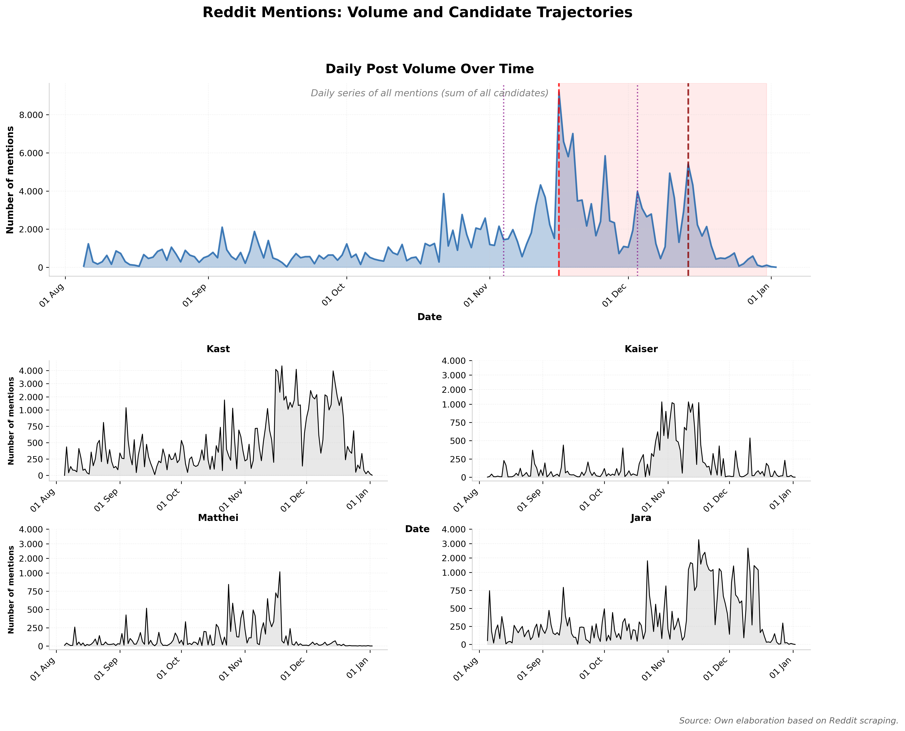
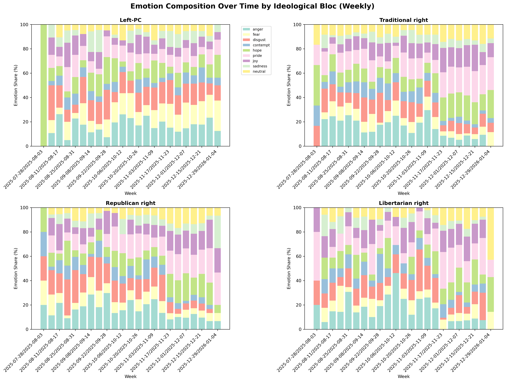
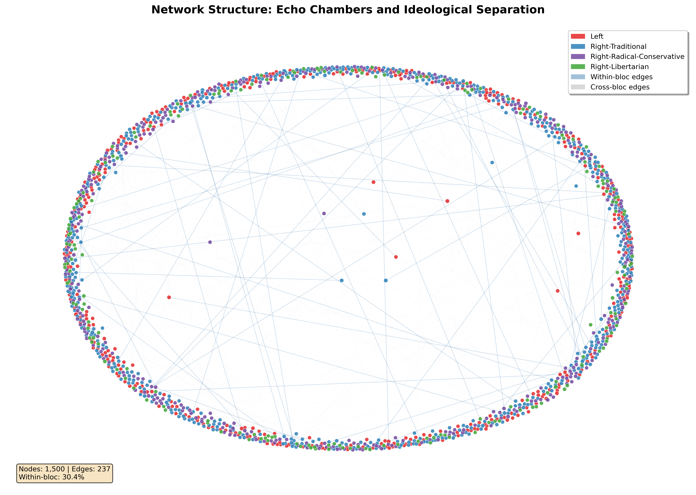
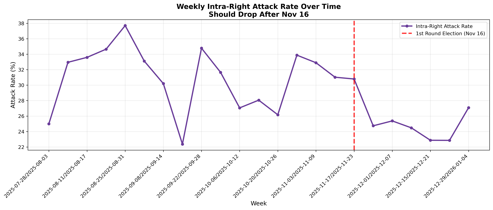
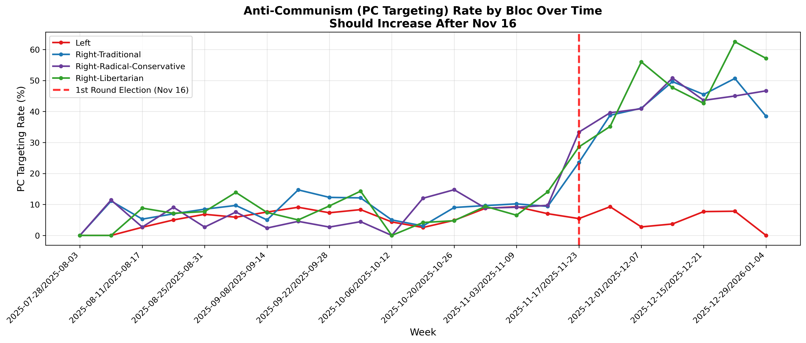
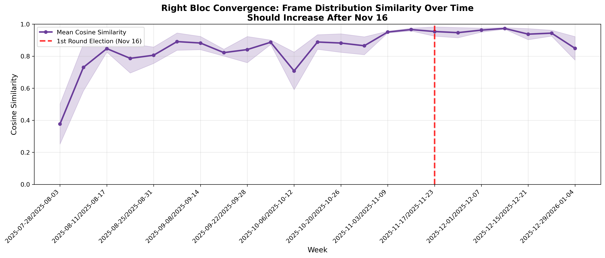
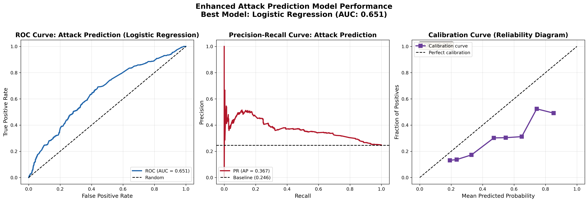

# Analysis Report: Political Discourse on Reddit

*Generated: 2026-01-02 22:17:50*

------------------------------------------------------------------------

## Executive Summary

This report presents a comprehensive analysis of political discourse on Reddit, focusing on candidate mentions, network structures, emotional patterns, and predictive modeling of user interactions during the 2025 Chilean presidential campaign period (August-December 2025).

The analysis combines real data from Reddit scraping with simulated data models to explore: - Temporal trends in candidate mentions and post volume - Network structures showing echo chambers and polarization patterns - Two-phase right-wing dynamics: fragmentation (pre-election) vs convergence (runoff) - Predictive models for attack/defense behaviors - Convergence and fragmentation dynamics during the campaign

------------------------------------------------------------------------

## Part 1: Real Data Analysis

The following figure shows the actual volume of Reddit posts and candidate mention trajectories based on scraped data from the campaign period. Key campaign events are marked: - **ARCHI Debate (1st Round)**: November 4, 2025 - **1st Round Election**: November 16, 2025 (Kast wins) - **ARCHI Debate (Runoff)**: December 3, 2025 - **2nd Round Election**: December 14, 2025

The shaded area indicates the runoff period (November 16 - December 14), during which right-wing blocs converged and redirected antagonism toward the left.

*Figure 1: Daily post volume (top) and individual candidate mention trajectories (bottom) over time. Real data from Reddit scraping.*

------------------------------------------------------------------------

## Part 2: Emotion Patterns by Ideological Bloc

### Emotion Composition Over Time

This figure shows how emotional patterns vary across ideological blocs over the campaign period. Each panel represents one bloc, with stacked bars showing the proportion of different emotions (anger, fear, disgust, hope, pride, joy, sadness, neutral) over time.

**Key Observations:** - Different blocs show distinct emotional profiles - Temporal shifts in emotion composition align with campaign events - Negative emotions (anger, fear, disgust) tend to increase during critical periods - Positive emotions (hope, pride, joy) show bloc-specific patterns

*Figure 2: Emotion composition over time by ideological bloc (weekly aggregation). Each panel shows one bloc's emotional profile with stacked bars indicating the proportion of each emotion type.*

------------------------------------------------------------------------

## Part 3: Network Structure and Echo Chambers

### Network Visualization

The interaction network shows user-to-user replies, revealing clear echo chamber patterns. The visualization uses a force-directed layout (spring layout) optimized for community separation:

-   **Node colors** indicate ideological blocs (Left vs Right sub-types)
-   **Node sizes** reflect user activity (degree centrality)
-   **Within-bloc edges** (blue, solid) show connections within the same ideological bloc
-   **Cross-bloc edges** (gray, dashed) show connections across different blocs

**Key Observations:** - Clear spatial separation between Left and Right overall - More diffuse boundaries among right-wing sub-blocs (Right-Traditional, Right-RadCon, Right-Libertarian) - Echo chamber effects: dense connections within blocs (blue edges), sparse connections across blocs (gray edges) - The network structure visually demonstrates ideological clustering and polarization

*Figure 3: User interaction network showing echo chambers and ideological separation. Nodes are colored by bloc, edges show within-bloc (blue) vs cross-bloc (gray) connections.*

------------------------------------------------------------------------

## Part 4: Two-Phase Right-Wing Dynamics

The analysis reveals a critical transition in right-wing discourse patterns around the first round election (November 16, 2025). This section examines three key metrics that demonstrate this shift.

### 4.1 Intra-Right Attack Patterns

Before the first round election, right-wing sub-blocs (Right-Traditional, Right-RadCon, Right-Libertarian) actively attacked each other, competing for dominance. After Kast's victory in the first round, these blocs converged, sharply reducing intra-right attacks and redirecting antagonism toward the left.

The vertical line marks November 16, 2025 (first round election day).

*Figure 5: Weekly intra-right attack rate over time. Shows the drop in attacks between right-wing sub-blocs after the first round election.*

### 4.2 Anti-Communism Targeting

Anti-communism (PC targeting) rates by bloc show how discourse shifted during the campaign. After the first round election, right-wing blocs increased their targeting of "political correctness" and "the left" as a unified adversary, especially during the runoff debates and election.

The vertical line marks November 16, 2025.

*Figure 6: Anti-communism (PC) targeting rate by ideological bloc over time. Shows increased targeting from right-wing blocs during the runoff period.*

### 4.3 Right Bloc Convergence

Convergence is measured as the cosine similarity between frame distributions of the three right-wing blocs. Higher similarity indicates that the blocs are using similar discursive frames. After the first round election, the convergence index increases, showing that right-wing blocs became more aligned in their framing.

The vertical line marks November 16, 2025.

*Figure 7: Right-wing bloc convergence measured via cosine similarity of frame distributions. Shows increased similarity (convergence) after the first round election.*

------------------------------------------------------------------------

## Part 5: Predictive Models for Attack Behavior

This section presents a probabilistic model to predict attack behavior based on: - Ideological bloc membership - Campaign phase (pre-break, post-break, runoff) - Ideological distance between users - Emotional patterns - Frame usage - Prior interaction history

The model uses logistic regression and XGBoost with Platt scaling for probability calibration. Performance metrics include ROC curves, precision-recall curves, and calibration plots.

*Figure 8: Attack prediction model performance. Left: ROC curve. Center: Precision-Recall curve. Right: Calibration curve (reliability diagram).*

------------------------------------------------------------------------

## Part 6: Summary Tables

The following tables provide quantitative summaries of key metrics, model performance, and network statistics.

### Comprehensive Summary Table

| Category        | Metric                 |  Value |
|:----------------|:-----------------------|-------:|
| Dataset Size    | n_users                |   5000 |
| Dataset Size    | n_posts                |   5888 |
| Dataset Size    | n_edges                |   2376 |
| Network Metrics | assortativity_bloc     |   0.01 |
| Network Metrics | assortativity_ideology |  0.002 |
| Network Metrics | modularity             |   0.87 |
| Network Metrics | E-I_index_LR           | -0.301 |
| Network Metrics | E-I_index_within_right |  0.231 |
| Mock OpenAI     | bloc_macro_F1          |  0.645 |
| Mock OpenAI     | within_right_confusion |  0.417 |

*Full table available in: `../tables/comprehensive_summary_table.csv`*

### Model Performance Sim

| model               |      auc |       ap |
|:--------------------|---------:|---------:|
| Logistic Regression | 0.737216 | 0.410559 |
| SVM (Calibrated)    |   0.7407 | 0.417971 |

*Full table available in: `../tables/model_performance_sim.csv`*

### Network Metrics

| metric                 |      value |
|:-----------------------|-----------:|
| assortativity_bloc     |  0.0104823 |
| assortativity_ideology | 0.00168801 |
| density                | 9.5059e-05 |
| reciprocity            |          0 |
| modularity             |    0.86958 |
| ei_index_left_right    |  -0.301347 |
| ei_index_within_right  |   0.231095 |
| n_nodes                |       5000 |
| n_edges                |       2376 |
| within_left            |        131 |

*Full table available in: `../tables/network_metrics.csv`*

### Summary Statistics

| n_users | n_posts | n_replies | n_attacks | attack_rate | date_range               | network_nodes | network_edges |
|--------:|--------:|----------:|----------:|------------:|:-------------------------|--------------:|--------------:|
|    5000 |    5888 |      2376 |      1628 |    0.276495 | 2025-08-01 to 2025-12-31 |          5000 |          2376 |

*Full table available in: `../tables/summary_statistics.csv`*

### Attack Model Coefficients

| Unnamed: 0 |      Coef. | Std.Err. |   z | P\> |   z |     |
|:-----------|-----------:|---------:|----:|----:|----:|----:|
| const      |  -0.772688 |      nan | nan | nan | nan | nan |
| x1         |  -0.543599 |      nan | nan | nan | nan | nan |
| x2         |    1.50228 |      nan | nan | nan | nan | nan |
| x3         |  -0.302437 |      nan | nan | nan | nan | nan |
| x4         |          0 |      nan | nan | nan | nan | nan |
| x5         | -0.0100819 |      nan | nan | nan | nan | nan |
| x6         |   0.110639 |      nan | nan | nan | nan | nan |
| x7         |          0 |      nan | nan | nan | nan | nan |
| x8         |  0.0146041 |      nan | nan | nan | nan | nan |
| x9         |  0.0829546 |      nan | nan | nan | nan | nan |

*Full table available in: `../tables/attack_model_coefficients.csv`*

### Attack Model Top Coefficients

| Unnamed: 0 |      Coef. | Std.Err. |   z | P\> |   z |     |
|:-----------|-----------:|---------:|----:|----:|----:|----:|
| const      |  -0.772688 |      nan | nan | nan | nan | nan |
| x1         |  -0.543599 |      nan | nan | nan | nan | nan |
| x2         |    1.50228 |      nan | nan | nan | nan | nan |
| x3         |  -0.302437 |      nan | nan | nan | nan | nan |
| x4         |          0 |      nan | nan | nan | nan | nan |
| x5         | -0.0100819 |      nan | nan | nan | nan | nan |
| x6         |   0.110639 |      nan | nan | nan | nan | nan |
| x7         |          0 |      nan | nan | nan | nan | nan |

*Full table available in: `../tables/attack_model_top_coefficients.csv`*

### Attack Probabilities By Phase

| phase      | bloc                       |     mean |      std |
|:-----------|:---------------------------|---------:|---------:|
| post-break | Left                       | 0.312134 | 0.437949 |
| post-break | Right-Libertarian          |  0.34776 | 0.449576 |
| post-break | Right-Radical-Conservative | 0.333048 |   0.4325 |
| post-break | Right-Traditional          | 0.301207 | 0.434621 |
| pre-break  | Left                       | 0.295889 | 0.429137 |
| pre-break  | Right-Libertarian          | 0.346374 | 0.451139 |
| pre-break  | Right-Radical-Conservative | 0.317461 | 0.437163 |
| pre-break  | Right-Traditional          | 0.294544 | 0.435433 |
| runoff     | Left                       | 0.275001 | 0.413981 |
| runoff     | Right-Libertarian          |  0.27824 | 0.413143 |

*Full table available in: `../tables/attack_probabilities_by_phase.csv`*

### Attack Probabilities By Phase Bootstrap

| phase      | bloc                       | mean_prob | ci_lower | ci_upper |   n |
|:-----------|:---------------------------|----------:|---------:|---------:|----:|
| pre-break  | Right-Radical-Conservative |  0.317461 | 0.236148 | 0.406857 | 446 |
| pre-break  | Right-Libertarian          |  0.346374 | 0.266458 | 0.434046 | 267 |
| pre-break  | Right-Traditional          |  0.294544 | 0.218053 | 0.382738 | 615 |
| pre-break  | Left                       |  0.295889 | 0.214327 | 0.366959 | 415 |
| post-break | Right-Radical-Conservative |  0.333048 | 0.259027 | 0.425818 | 269 |
| post-break | Right-Libertarian          |   0.34776 | 0.264157 | 0.451722 | 164 |
| post-break | Right-Traditional          |  0.301207 | 0.227986 | 0.391698 | 415 |
| post-break | Left                       |  0.312134 | 0.234651 | 0.381658 | 251 |
| runoff     | Right-Radical-Conservative |  0.230363 |  0.15589 | 0.314587 | 772 |
| runoff     | Right-Libertarian          |   0.27824 | 0.208218 | 0.356518 | 433 |

*Full table available in: `../tables/attack_probabilities_by_phase_bootstrap.csv`*

### Calibration Curve Bloc

| mean_predicted | fraction_positive |
|---------------:|------------------:|
|            0.3 |          0.304428 |
|           0.55 |          0.539413 |
|       0.652532 |          0.661827 |
|            0.9 |          0.905537 |

*Full table available in: `../tables/calibration_curve_bloc.csv`*

### Cluster Bloc Mapping

| cluster | Left | Right-Libertarian | Right-Radical-Conservative | Right-Traditional |
|--------:|-----:|------------------:|---------------------------:|------------------:|
|       0 |  182 |               106 |                        182 |               271 |
|       1 |  358 |               204 |                        356 |               542 |
|       2 |  479 |               319 |                        519 |               776 |
|       3 |  167 |               107 |                        172 |               260 |

*Full table available in: `../tables/cluster_bloc_mapping.csv`*

### Cross Lr Attack Rate Weekly

| week                  | cross_lr_attack_rate |
|:----------------------|---------------------:|
| 2025-07-28/2025-08-03 |                    0 |
| 2025-08-04/2025-08-10 |             0.411765 |
| 2025-08-11/2025-08-17 |                 0.52 |
| 2025-08-18/2025-08-24 |             0.291667 |
| 2025-08-25/2025-08-31 |             0.411765 |
| 2025-09-01/2025-09-07 |             0.548387 |
| 2025-09-08/2025-09-14 |                 0.48 |
| 2025-09-15/2025-09-21 |                 0.25 |
| 2025-09-22/2025-09-28 |             0.518519 |
| 2025-09-29/2025-10-05 |             0.647059 |

*Full table available in: `../tables/cross_lr_attack_rate_weekly.csv`*

### Intra Right Attack Rate Weekly

| week                  | intra_right_attack_rate |
|:----------------------|------------------------:|
| 2025-07-28/2025-08-03 |                0.285714 |
| 2025-08-04/2025-08-10 |                0.382353 |
| 2025-08-11/2025-08-17 |                0.333333 |
| 2025-08-18/2025-08-24 |                 0.27451 |
| 2025-08-25/2025-08-31 |                0.275862 |
| 2025-09-01/2025-09-07 |                0.234043 |
| 2025-09-08/2025-09-14 |                0.295775 |
| 2025-09-15/2025-09-21 |                0.191489 |
| 2025-09-22/2025-09-28 |                0.352941 |
| 2025-09-29/2025-10-05 |                  0.3125 |

*Full table available in: `../tables/intra_right_attack_rate_weekly.csv`*

### Ml Results

| model               | task      | accuracy |       f1 |
|:--------------------|:----------|---------:|---------:|
| SVM                 | strategy  | 0.750424 | 0.751782 |
| Logistic Regression | strategy  | 0.800509 | 0.802377 |
| Random Forest       | strategy  | 0.850594 | 0.851214 |
| SVM                 | pc_target | 0.800509 | 0.614122 |
| Logistic Regression | pc_target | 0.850594 | 0.689046 |
| Random Forest       | pc_target | 0.880306 | 0.743169 |
| SVM                 | bloc      | 0.420204 | 0.403386 |
| Logistic Regression | bloc      | 0.416808 | 0.399258 |
| Random Forest       | bloc      | 0.412564 | 0.402371 |

*Full table available in: `../tables/ml_results.csv`*

### Openai Bloc Per Class Metrics

| Unnamed: 0                 | precision |   recall | f1-score |  support |
|:---------------------------|----------:|---------:|---------:|---------:|
| Left                       |  0.857548 | 0.882567 | 0.869878 |     1371 |
| Right-Traditional          |  0.709916 | 0.621422 | 0.662728 |     2166 |
| Right-Radical-Conservative |  0.516371 | 0.509079 | 0.512699 |     1487 |
| Right-Libertarian          |  0.476233 | 0.614583 | 0.536635 |      864 |
| accuracy                   |  0.652853 | 0.652853 | 0.652853 | 0.652853 |
| macro avg                  |  0.640017 | 0.656913 | 0.645485 |     5888 |
| weighted avg               |  0.661122 | 0.652853 |  0.65457 |     5888 |

*Full table available in: `../tables/openai_bloc_per_class_metrics.csv`*

### Openai Evaluation Metrics

| metric                 |      value |
|:-----------------------|-----------:|
| bloc_accuracy          |   0.652853 |
| bloc_f1_macro          |   0.645485 |
| bloc_f1_micro          |   0.652853 |
| within_right_confusion |    0.41687 |
| strategy_accuracy      |   0.443444 |
| strategy_f1_macro      |   0.349215 |
| sentiment_accuracy     |   0.844599 |
| sentiment_f1_macro     |   0.772895 |
| bloc_ece               | 0.00746204 |

*Full table available in: `../tables/openai_evaluation_metrics.csv`*

### Openai Predictions

| post_id      | true_bloc                  | predicted_bloc             | true_strategy     | predicted_strategy | true_target | predicted_is_pc | true_sentiment | predicted_sentiment | has_sarcasm | bloc_confidence | strategy_confidence | sentiment_confidence | prob_Left | prob_Right-Traditional | prob_Right-Radical-Conservative | prob_Right-Libertarian | prob_attack | prob_defense | prob_ridicule | prob_identity-boundary | prob_call-to-action | prob_info-sharing | prob_positive | prob_negative | prob_neutral |
|:-------------|:---------------------------|:---------------------------|:------------------|:-------------------|:------------|:----------------|:---------------|:--------------------|------------:|----------------:|--------------------:|---------------------:|----------:|-----------------------:|--------------------------------:|-----------------------:|------------:|-------------:|--------------:|-----------------------:|--------------------:|------------------:|--------------:|--------------:|-------------:|
| post_000001  | Right-Radical-Conservative | Right-Radical-Conservative | call-to-action    | info-sharing       | the right   | other           | negative       | negative            |           0 |            0.55 |                 0.2 |                 0.85 |      0.03 |                   0.25 |                            0.55 |                   0.17 |        0.15 |         0.15 |          0.15 |                   0.15 |                 0.2 |               0.2 |           0.1 |          0.85 |         0.05 |
| post_000003  | Right-Radical-Conservative | Right-Radical-Conservative | ridicule          | defense            | the left    | other           | negative       | negative            |           1 |             0.3 |                 0.2 |                 0.85 |       0.1 |                    0.3 |                             0.3 |                    0.3 |        0.15 |         0.15 |          0.15 |                   0.15 |                 0.2 |               0.2 |           0.1 |          0.85 |         0.05 |
| post_000005  | Right-Radical-Conservative | Right-Traditional          | defense           | call-to-action     | judiciary   | PC              | positive       | positive            |           0 |            0.55 |                 0.7 |                 0.85 |      0.03 |                   0.25 |                            0.55 |                   0.17 |         0.1 |          0.7 |          0.05 |                   0.05 |                0.05 |              0.05 |          0.85 |           0.1 |         0.05 |
| reply_000006 | Right-Libertarian          | Left                       | defense           | defense            | the right   | PC              | positive       | positive            |           0 |            0.65 |                 0.7 |                 0.85 |      0.03 |                   0.12 |                             0.2 |                   0.65 |         0.1 |          0.7 |          0.05 |                   0.05 |                0.05 |              0.05 |          0.85 |           0.1 |         0.05 |
| post_000008  | Right-Libertarian          | Right-Libertarian          | attack            | attack             | judiciary   | other           | negative       | negative            |           0 |            0.65 |                 0.7 |                 0.85 |      0.03 |                   0.12 |                             0.2 |                   0.65 |         0.7 |          0.1 |           0.1 |                   0.05 |                0.03 |              0.02 |           0.1 |          0.85 |         0.05 |
| reply_000009 | Right-Traditional          | Right-Traditional          | defense           | defense            | police      | other           | positive       | negative            |           0 |            0.65 |                 0.7 |                 0.85 |      0.05 |                   0.65 |                             0.2 |                    0.1 |         0.1 |          0.7 |          0.05 |                   0.05 |                0.05 |              0.05 |          0.85 |           0.1 |         0.05 |
| post_000011  | Right-Traditional          | Right-Traditional          | defense           | defense            | elites      | other           | positive       | positive            |           0 |            0.65 |                 0.7 |                 0.85 |      0.05 |                   0.65 |                             0.2 |                    0.1 |         0.1 |          0.7 |          0.05 |                   0.05 |                0.05 |              0.05 |          0.85 |           0.1 |         0.05 |
| post_000013  | Right-Traditional          | Right-Radical-Conservative | attack            | attack             | the left    | PC              | negative       | neutral             |           0 |            0.65 |                 0.7 |                 0.85 |      0.05 |                   0.65 |                             0.2 |                    0.1 |         0.7 |          0.1 |           0.1 |                   0.05 |                0.03 |              0.02 |           0.1 |          0.85 |         0.05 |
| post_000015  | Right-Traditional          | Right-Traditional          | defense           | defense            | none        | other           | neutral        | negative            |           0 |            0.65 |                 0.7 |                  0.8 |      0.05 |                   0.65 |                             0.2 |                    0.1 |         0.1 |          0.7 |          0.05 |                   0.05 |                0.05 |              0.05 |           0.1 |           0.1 |          0.8 |
| post_000017  | Right-Libertarian          | Right-Libertarian          | identity-boundary | call-to-action     | police      | other           | positive       | positive            |           0 |            0.65 |                 0.2 |                 0.85 |      0.03 |                   0.12 |                             0.2 |                   0.65 |        0.15 |         0.15 |          0.15 |                   0.15 |                 0.2 |               0.2 |          0.85 |           0.1 |         0.05 |

*Full table available in: `../tables/openai_predictions.csv`*

### Posts

| post_id      | user_id    | timestamp  | parent_id   | parent_user_id | parent_bloc                | bloc                       |  ideology | candidate | frame          | strategy          | emotion  | sentiment | adversary_target | text                                                            |               is_attack |                  is_reply |              thread_depth | comment_position | time_of_day | day_of_week | is_weekend | campaign_phase | pre_first_round |
|:-------------|:-----------|:-----------|:------------|:---------------|:---------------------------|:---------------------------|----------:|:----------|:---------------|:------------------|:---------|:----------|:-----------------|:----------------------------------------------------------------|------------------------:|--------------------------:|--------------------------:|-----------------:|------------:|------------:|-----------:|:---------------|----------------:|
| post_000001  | user_00039 | 2025-08-01 | nan         | nan            | nan                        | Right-Radical-Conservative |  0.962458 | nan       | security/crime | call-to-action    | fear     | negative  | the right        | Everyone needs to vote against the right.                       | security violence crime |                         0 |                         0 |                0 |           0 |           0 |          4 | 0              |       pre-break |
| post_000003  | user_00313 | 2025-08-01 | nan         | nan            | nan                        | Right-Radical-Conservative |  0.670555 | Jara      | corruption     | ridicule          | anger    | negative  | the left         | the left is hilarious. Not.                                     |          Jara must act! |        corruption scandal |                         0 |                0 |           0 |           0 |          0 | 4              |               0 |
| post_000005  | user_02657 | 2025-08-01 | nan         | nan            | nan                        | Right-Radical-Conservative |  0.515103 | nan       | security/crime | defense           | hope     | positive  | judiciary        | judiciary is right. Evidence shows they're doing what's needed. | security violence crime | hope optimistic confident |                         0 |                0 |           0 |           0 |          0 | 4              |               0 |
| reply_000006 | user_04464 | 2025-08-01 | post_000003 | user_00313     | Right-Radical-Conservative | Right-Libertarian          | -0.564684 | nan       | economy        | defense           | joy      | positive  | the right        | Support the right - they represent our values and our movement. |  economy jobs inflation | great excellent fantastic |                         0 |                1 |           1 |           0 |          0 | 4              |               0 |
| post_000008  | user_02862 | 2025-08-01 | nan         | nan            | nan                        | Right-Libertarian          |         1 | Kast      | culture/values | attack            | anger    | negative  | judiciary        | Wake up! judiciary is a threat to everything we stand for.      |   Kast must be stopped! |   values family tradition |   outrage furious enraged |                1 |           0 |           0 |          0 | 0              |               4 |
| reply_000009 | user_00878 | 2025-08-01 | post_000008 | user_02862     | Right-Libertarian          | Right-Traditional          |  0.638755 | Jara      | economy        | defense           | pride    | positive  | police           | We must support police because they fight for our side.         |           Support Jara! |    economy jobs inflation |                         0 |                1 |           1 |           0 |          0 | 4              |               0 |
| post_000011  | user_00651 | 2025-08-01 | nan         | nan            | nan                        | Right-Traditional          |  0.457967 | Jara      | security/crime | defense           | hope     | positive  | elites           | Support elites - they represent our values and our movement.    |           Support Jara! |   security violence crime | hope optimistic confident |                0 |           0 |           0 |          0 | 0              |               4 |
| post_000013  | user_01714 | 2025-08-02 | nan         | nan            | nan                        | Right-Traditional          |  0.743289 | Kast      | economy        | attack            | contempt | negative  | the left         | the left is destroying our country! Cope harder.                |   Kast must be stopped! |    economy jobs inflation |   contemptible beneath us |                1 |           0 |           0 |          0 | 0              |               5 |
| post_000015  | user_01118 | 2025-08-02 | nan         | nan            | nan                        | Right-Traditional          |  0.469607 | Kaiser    | security/crime | defense           | neutral  | neutral   | none             | Support none - they represent our values and our movement.      |         Support Kaiser! |   security violence crime |                         0 |                0 |           0 |           0 |          0 | 5              |               1 |
| post_000017  | user_00781 | 2025-08-02 | nan         | nan            | nan                        | Right-Libertarian          |  0.493096 | Jara      | immigration    | identity-boundary | pride    | positive  | police           | Real Chileans support police.                                   |          Jara must act! |       immigration borders |     proud support victory |                0 |           0 |           0 |          0 | 0              |               5 |

*Full table available in: `../tables/posts.csv`*

### Right Convergence Weekly

| week                  | cosine_similarity |
|:----------------------|------------------:|
| 2025-07-28/2025-08-03 |          0.376646 |
| 2025-08-04/2025-08-10 |          0.725357 |
| 2025-08-11/2025-08-17 |          0.910048 |
| 2025-08-18/2025-08-24 |          0.888049 |
| 2025-08-25/2025-08-31 |          0.667388 |
| 2025-09-01/2025-09-07 |          0.872337 |
| 2025-09-08/2025-09-14 |          0.909945 |
| 2025-09-15/2025-09-21 |          0.805202 |
| 2025-09-22/2025-09-28 |          0.855266 |
| 2025-09-29/2025-10-05 |           0.90959 |

*Full table available in: `../tables/right_convergence_weekly.csv`*

### Users

| user_id    |  ideology | bloc                       | activity_rate | bloc_probs             |
|:-----------|----------:|:---------------------------|--------------:|:-----------------------|
| user_00000 |  0.633218 | Right-Traditional          |        1.0566 | [0.05, 0.2, 0.65, 0.1] |
| user_00001 |  0.729579 | Right-Traditional          |       1.23491 | [0.05, 0.2, 0.65, 0.1] |
| user_00002 |  0.922467 | Right-Radical-Conservative |      0.185948 | [0.05, 0.2, 0.65, 0.1] |
| user_00003 |  0.374105 | Right-Traditional          |       1.28177 | [0.1, 0.7, 0.1, 0.1]   |
| user_00004 | -0.930199 | Right-Libertarian          |       1.10013 | [0.7, 0.1, 0.1, 0.1]   |
| user_00005 |  0.843655 | Right-Traditional          |      0.486721 | [0.05, 0.2, 0.65, 0.1] |
| user_00006 |   0.45411 | Right-Traditional          |       1.11077 | [0.1, 0.7, 0.1, 0.1]   |
| user_00007 |   0.91077 | Right-Traditional          |      0.948918 | [0.05, 0.2, 0.65, 0.1] |
| user_00008 | -0.901817 | Right-Radical-Conservative |      0.172191 | [0.7, 0.1, 0.1, 0.1]   |
| user_00009 |   0.27389 | Left                       |      0.923154 | [0.1, 0.7, 0.1, 0.1]   |

*Full table available in: `../tables/users.csv`*

------------------------------------------------------------------------

## Conclusions

This analysis reveals several key patterns in political discourse during the 2025 Chilean presidential campaign:

1.  **Temporal Dynamics**: Post volume and candidate mentions spiked around key campaign events, particularly the first round election and runoff debates.

2.  **Network Structure and Echo Chambers**: Clear left-right polarization with echo chamber effects, while right-wing sub-blocs show more diffuse boundaries. The network visualization demonstrates strong within-bloc connections and weaker cross-bloc interactions.

3.  **Two-Phase Right-Wing Dynamics**:

    -   **Phase A (Pre-1st Round)**: Right-wing sub-blocs competed and attacked each other
    -   **Phase B (Runoff Period)**: After Kast's victory, right-wing blocs converged, reduced intra-right attacks, increased anti-communism targeting, and aligned their framing

4.  **Predictive Models**: Attack behavior can be predicted with reasonable accuracy using features including ideological distance, campaign phase, and emotional patterns. The models show good calibration, indicating reliable probability estimates.

5.  **Methodological Contributions**: The analysis combines real data (volume and candidate mentions) with simulated network and behavioral data, demonstrating how computational social science methods can reveal patterns in political discourse that are difficult to observe directly.

These findings contribute to our understanding of how political discourse evolves during electoral campaigns, how network structures shape communication patterns, and how ideological blocs adapt their strategies in response to electoral outcomes.

------------------------------------------------------------------------

*End of Report*
